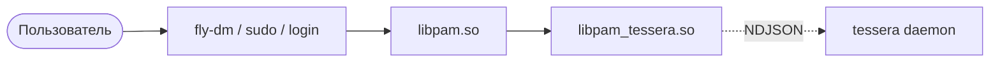

# Tessera — аутентификация по сертификату на USB-носителе

> **Примечание:** ранее проект назывался `pam_certauth`.

Tessera — это PAM-модуль для Linux, который заменяет
парольную аутентификацию пользователя проверкой X.509-сертификата,
лежащего на USB-носителе или аппаратном PKCS#11-токене (Рутокен ЭЦП,
JaCarta ГОСТ). Модуль рассчитан на защищённые контуры, терминальные
станции и автоматизированные рабочие места операторов АСУ ТП.

## Возможности

- Аутентификация по X.509-сертификату на USB-носителе (`.p12`) или на
  PKCS#11-токене (Рутокен ЭЦП 2.0/3.0, JaCarta ГОСТ-2).
- Поддержка ГОСТ Р 34.10-2012 (256/512) и ГОСТ Р 34.11-2012 (Streebog)
  через `gost-engine`, поставляемый в Astra Linux SE.
- Поддержка RSA и ECDSA через штатный OpenSSL (для смешанных контуров).
- Привязка пользователя к машине через X.509 v3 расширения в самом
  сертификате — украденный токен на чужой машине не работает.
- Явный выбор роли на логине (суффикс `user+role` или PAM-prompt, без
  дефолтной роли), авторизуется расширением `pam_cert_allowed_roles`.
- Мониторинг извлечения USB-носителя через udev и настраиваемое
  действие (`lock` / `logout` / `hook` / `shutdown`) через D-Bus к
  `systemd-logind`.
- Корректная обработка `suspend` / `resume` через D-Bus к `systemd-logind`
  с настраиваемой grace-политикой.
- Интеграция с `fly-dm`, `sudo`, `login`, `gdm` через стандартный PAM-stack.
- Точка отзыва — CRL и/или OCSP, с офлайн-кэшем для контуров без
  Интернета.
- Reproducible build: бинарно-идентичная пересборка `.deb`.

## Поддерживаемые операционные системы

| ОС             | Версия        | Статус                                                      |
|----------------|---------------|-------------------------------------------------------------|
| Astra Linux SE | 1.8           | Целевая платформа, протестировано на VM.                    |
| Ubuntu         | 22.04 LTS     | Best-effort, без ГОСТ (нет сертифицированного gost-engine). |
| Debian         | 12 «bookworm» | Best-effort, без ГОСТ.                                      |

ГОСТ-функционал требует `gost-engine`, поставляемого в составе
сертифицированного Astra Linux. На Ubuntu/Debian модуль работает в
RSA-/ECDSA-режиме.

## Поддерживаемые токены и носители

- **Рутокен ЭЦП 2.0 / 3.0** — PKCS#11 модуль `librtpkcs11ecp.so`
  (по умолчанию `/usr/lib/librtpkcs11ecp.so`).
- **JaCarta ГОСТ-2** — PKCS#11 модуль `libjcPKCS11.so`.
- **eToken Pro / 5110** — best-effort, без ГОСТ.
- **USB-носитель FAT32 / ext4 + `.p12`** — режим `mode = "pkcs12"`,
  без аппаратной защиты ключа; ключ защищён только парольной фразой.

## Архитектура одной картинкой



Подробности: [docs/architecture.md](docs/architecture.md).

## Установка

Установка из `.deb` на Astra Linux SE:

```bash
sudo apt install ./tessera_0.3.0-1_amd64.deb
```

Зависимости (`gost-engine`, `pcsc-lite`, `libssl3`, `lsb-base` —
для SysV init на хостах без systemd) подтягиваются APT'ом автоматически.
Полный пошаговый сценарий — в [docs/install.md](docs/install.md).

## Модель авторизации

Авторизация «какой пользователь на каком хосте» живёт в самом
end-entity сертификате — в двух X.509 v3 расширениях:

| Расширение              | OID                                            | Кодирование             |
|-------------------------|------------------------------------------------|-------------------------|
| `pam_cert_host_binding` | `2.25.183976554325829274683049824615098`        | `SEQUENCE OF UTF8String` |
| `pam_cert_user_binding` | `2.25.215438916728501023845629178354627`        | `SEQUENCE OF UTF8String` |

Когда оба расширения присутствуют — они и только они определяют, на
каких хостах и под каким PAM-пользователем сертификат может работать.
Список `[[user_mapping]]` в `config.toml` оставлен как
**legacy fallback** для сертификатов, выпущенных без расширения
`pam_cert_user_binding`. Подробности и готовые рецепты `openssl.cnf`
— в [docs/cert-issuance.md](docs/cert-issuance.md).

## Режимы аутентификации

Поставляются три PAM-сниппета; режим выбирается через
`integrate-pam.sh --mode=...`:

| Режим        | Сниппет (`/etc/pam.d/`)   | Control                              | Поведение                                |
|--------------|---------------------------|--------------------------------------|-------------------------------------------|
| `2fa`        | `tessera` (по умолчанию) | `auth required`                      | Cert И пароль (классический 2FA).         |
| `optional`   | `tessera-optional`       | `auth sufficient`                    | Cert ИЛИ пароль — миграционный режим.     |
| `cert-only`  | `tessera-only`           | `auth [success=done default=die]`    | Cert — единственный фактор, **lockout-strict**. |

```bash
sudo /usr/share/tessera/integrate-pam.sh --mode=2fa       /etc/pam.d/sudo
sudo /usr/share/tessera/integrate-pam.sh --mode=optional  /etc/pam.d/sudo
sudo /usr/share/tessera/integrate-pam.sh --mode=cert-only /etc/pam.d/sudo
```

Старые флаги `--strict` / `--optional` сохранены как deprecated-aliases
для `--mode=2fa` / `--mode=optional`. Перед включением `cert-only`
прочитать [docs/install.md §8](docs/install.md) и
[docs/operations.md §3.6](docs/operations.md) — потеря или блокировка
токена в этом режиме означает полную потерю доступа.

## Журналирование

PAM-cdylib `pam_tessera.so` пишет события `tracing` в syslog
(facility `LOG_AUTH`, ident `tessera`) — они появляются в
`/var/log/auth.log` (классический syslog) или в journald с префиксом
`tessera[<pid>]:`. Демон `tessera` пишет в journald через
`Type=notify`.

## Быстрый старт за 10 минут (тестовый стенд)

> Сценарий рассчитан на чистую виртуальную машину Astra Linux SE 1.7.5.
> Используются исключительно тестовые ключи и тестовый CA. На
> промышленные машины этот сценарий **не переносить**.

1. Установить пакет:

   ```bash
   sudo apt install ./tessera_0.3.0-1_amd64.deb
   ```

2. Сгенерировать тестовый CA (пример под ГОСТ; полные RSA/ECDSA-варианты —
   в [docs/install.md](docs/install.md)):

   ```bash
   mkdir -p /tmp/ca && cd /tmp/ca
   openssl genpkey -engine gost -algorithm gost2012_256 \
       -pkeyopt paramset:A -out ca.key
   openssl req -new -x509 -engine gost -key ca.key -out ca.pem \
       -subj "/CN=tessera Test CA" -days 3650
   ```

3. Сгенерировать тестовый сертификат для пользователя `alice`:

   ```bash
   openssl genpkey -engine gost -algorithm gost2012_256 \
       -pkeyopt paramset:A -out alice.key
   openssl req -new -engine gost -key alice.key -out alice.csr \
       -subj "/CN=Alice"
   openssl x509 -req -engine gost -in alice.csr -CA ca.pem -CAkey ca.key \
       -out alice.pem -days 365 -CAcreateserial \
       -extfile <(printf "extendedKeyUsage=clientAuth")
   openssl pkcs12 -export -engine gost -inkey alice.key -in alice.pem \
       -out alice.p12 -name alice -passout pass:test
   ```

4. Скопировать `alice.p12` и `ca.pem` на USB-носитель в каталог
   `certs/` под именами `user.p12` и `chain.pem` соответственно.

5. Подготовить `/etc/tessera/config.toml` (можно начать с поставочного
   примера):

   ```bash
   sudo cp /etc/tessera/config.toml.example /etc/tessera/config.toml
   sudo "$EDITOR" /etc/tessera/config.toml
   ```

   Минимально: переключить `mode = "pkcs12"`, проверить `[trust].anchors`,
   указать `[[user_mapping]]` для `alice`.

6. Уложить корневой сертификат:
   `sudo install -m 0640 -o root -g root /tmp/ca/ca.pem /etc/tessera/ca/bundle.pem`.

7. Сертификаты должны нести X.509 v3 расширения `pam_cert_host_binding`
   и `pam_cert_user_binding` (см. [`docs/cert-issuance.md`](docs/cert-issuance.md)).
   Для теста можно выпустить cert с обоими `["*"]` (wildcard).

8. Включить службу `tessera`:

   ```bash
   sudo systemctl enable --now tessera
   sudo systemctl status tessera
   ```

9. Подключить модуль к `sudo` в режиме 2FA (по умолчанию):

   ```bash
   sudo /usr/share/tessera/integrate-pam.sh --mode=2fa /etc/pam.d/sudo
   ```

   Скрипт делает резервную копию `/etc/pam.d/sudo.bak.<UTC-timestamp>`
   и вставляет строку `@include tessera` перед первой `auth`-строкой.
   Альтернативные режимы — `--mode=optional` (миграция) и
   `--mode=cert-only` (lockout-strict; см. предупреждение в
   `docs/install.md §8` и `docs/operations.md §3.6`).

10. Smoke-тест:

    ```bash
    pamtester sudo alice authenticate
    ```

    Ожидание: при вставленном USB-носителе с корректным `.p12` —
    `Authentication successful`.

11. Если что-то пошло не так:

    ```bash
    sudo journalctl -u tessera -n 100
    sudo tail -n 100 /var/log/auth.log
    ```

12. Полный production-сценарий:
    [docs/install.md](docs/install.md) +
    [docs/configuration.md](docs/configuration.md) +
    [docs/operations.md](docs/operations.md).

## Структура проекта

```
.
├─ Cargo.toml                 # workspace manifest
├─ README.md                  # английский (primary)
├─ README.ru.md               # этот файл (русский)
├─ crates/
│   ├─ pam_tessera/      # cdylib libpam_tessera.so
│   ├─ tessera_core/     # синхронное ядро
│   ├─ tessera_proto/    # IPC wire protocol
│   └─ tessera_cli/      # бинарь tessera
├─ debian/                    # Debian packaging
├─ dist/                      # пример-конфиги, systemd-юнит, integrate-pam.sh
├─ docs/                      # документация
└─ scripts/                   # скрипты сборки и контрольных сумм
```

Документация:

- [docs/index.md](docs/index.md) — оглавление документации.
- [docs/install.md](docs/install.md) — пошаговая установка.
- [docs/configuration.md](docs/configuration.md) — справочник по `config.toml`.
- [docs/cert-issuance.md](docs/cert-issuance.md) — выпуск сертификатов с расширениями.
- [docs/architecture.md](docs/architecture.md) — архитектура и IPC.
- [docs/threat-model.md](docs/threat-model.md) — модель угроз.
- [docs/operations.md](docs/operations.md) — runbook эксплуатации.
- [docs/development.md](docs/development.md) — гид контрибьютора.
- [docs/changelog.md](docs/changelog.md) — история изменений.

## Лицензия

Двойная лицензия: [GNU AGPL-3.0](LICENSE) ИЛИ
[коммерческая](LICENSE.commercial). Релизы до v0.3.19 включительно
(под именем `pam_certauth`) опубликованы под Apache-2.0 и остаются
доступными под ней.

## Контакты сопровождения

- Репозиторий: <https://github.com/TesseraLabs/tessera>.
- Баг-трекер: GitHub Issues.
