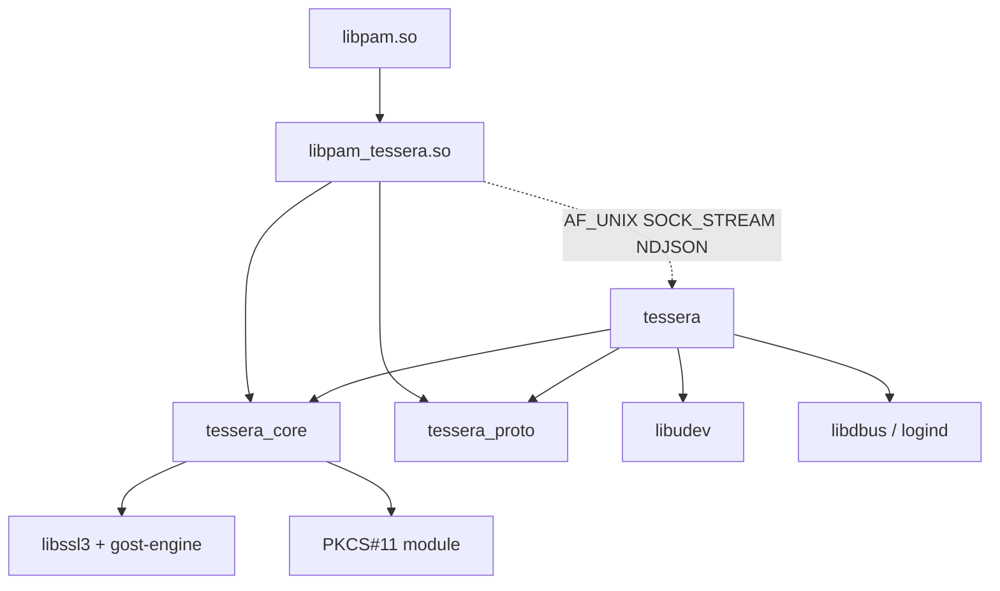
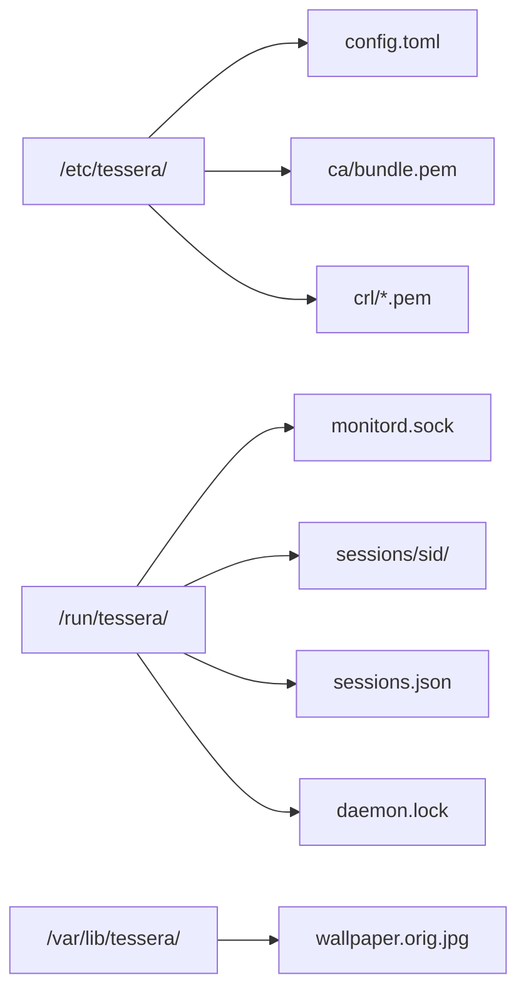
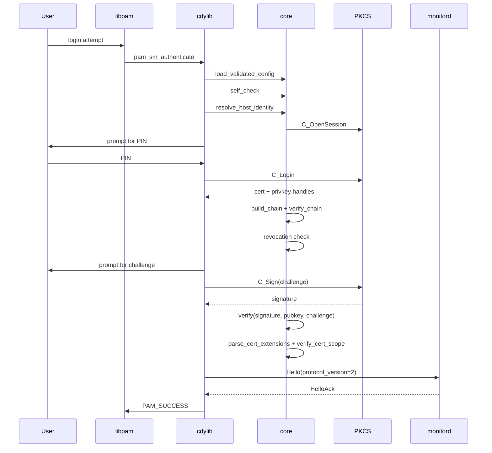
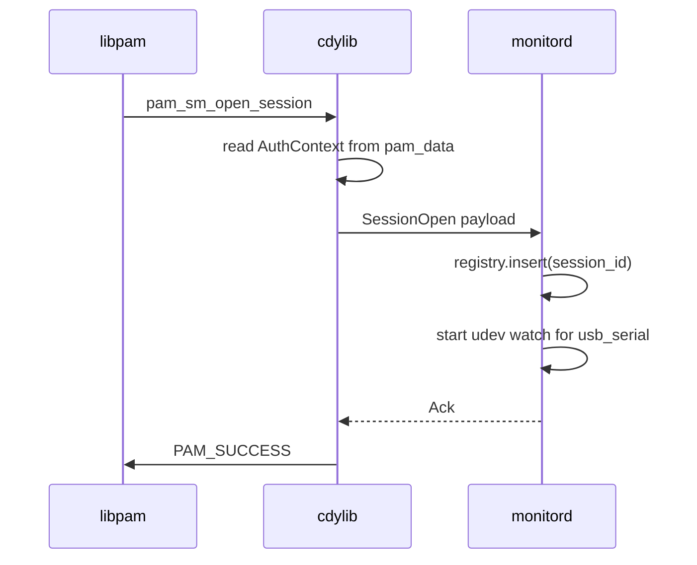
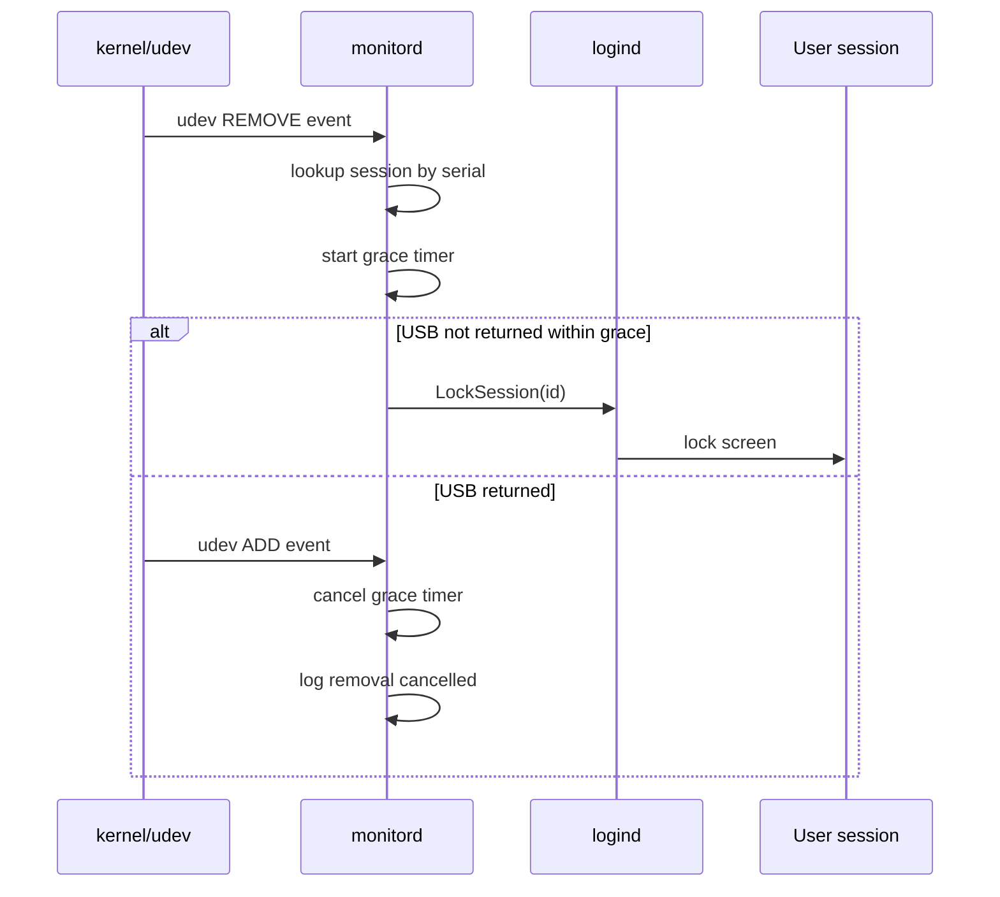
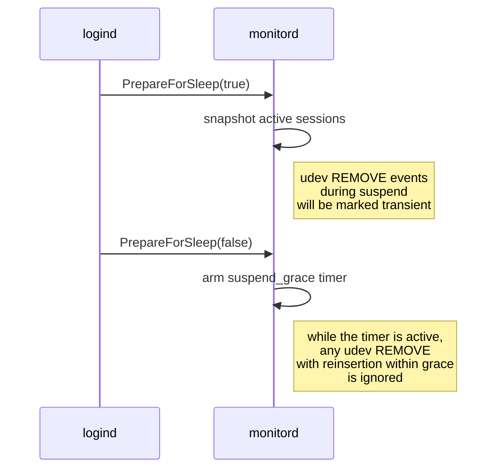

# Tessera architecture

This document is the single reference architecture for version 0.4.0. After
reading it, an engineer should be able to answer correctly:

- what happens when `pam_sm_authenticate` is called?
- what lives in `/run/tessera/`?
- what does `monitord` do on a udev REMOVE event?
- how is the IPC serialized, and which messages flow between the PAM module
  and `monitord`?

## 1. Goals and non-goals

### 1.1 What Tessera does

- Authenticates a local UNIX user with an X.509 certificate on a USB medium
  or a PKCS#11 token.
- Binds the user to the machine (host binding) through the X.509 v3
  extensions `pam_cert_host_binding` and `pam_cert_user_binding`, embedded in
  the leaf certificate itself.
- Monitors the state of the USB medium throughout the session and reacts to
  its removal (lock / logout / hook / shutdown).
- Handles suspend/resume correctly.
- Delegates GOST cryptography to the certified `gost-engine`.

### 1.2 What Tessera does NOT do

- Does not implement its own cryptography (everything goes through OpenSSL and
  `gost-engine`).
- Does not manage the CA lifecycle (certificate issuance/revocation is the job
  of an external CA).
- Does not manage token PINs (that is the job of the administrator and the
  user).
- Does not protect against compromise of the root account or the OS kernel
  (outside the TOE).
- Performs network requests only on the revocation path in OCSP modes
  (`mode ∈ {ocsp, crl_then_ocsp}`): a synchronous HTTP POST to the
  config-supplied `ocsp_responder_url`, with a hard timeout and an on-disk
  cache. In the `none`/`crl` modes there is no network at all (offline CRL).
  Zero-egress environments (terminals) stay on `none`/`crl`.

The full description of the TOE boundaries is in
[docs/threat-model.md](threat-model.md).

## 2. Components

`tessera` is a workspace of four crates plus one OS integration
(systemd, udev, logind).

### 2.1 `tessera_core` (rlib)

The synchronous core. It contains:

- Loading and validation of the configuration (`config::raw::RawConfig` →
  `config::validated::ValidatedConfig`).
- X.509 parsing and verification (`x509/`).
- Trust chains and CRL checking (`trust/`, `crl/`).
- Challenge-response (`challenge/`).
- GOST delegation via `gost-engine` (`gost/`).
- PKCS#12 and PKCS#11 (`pkcs12/`, `token/`).
- USB mount and the MountGuard RAII (`usb/`, `mount/`).
- Hooks (`hooks/`).
- Host identity chain (`host_identity/`).
- Cert-scope verification — parsing of the `pam_cert_host_binding` /
  `pam_cert_user_binding` extensions and matching their entries against
  `host_id_hash` and `pam_user` (`x509/`, `verify_cert_scope`).
- IPC client side (`ipc/`).

No `tokio`, no async. All operations are blocking — and this is justified: the
PAM module is called from the synchronous libpam context.

### 2.2 `tessera_proto` (rlib)

The wire protocol for the IPC between the PAM module and the daemon. It
contains:

- `ClientMessage` and `ServerMessage` — the message variants
  (`crates/tessera_proto/src/client.rs`, `.../server.rs`).
- `WireError` and the encode/decode functions (`wire.rs`).
- `framing::FramingError` — NDJSON framing.
- `SessionTarget` — encodes the tty/display/logind-id for a specific session.
- `PROTOCOL_VERSION` — the current value is `2`.

`#![forbid(unsafe_code)]` — the crate is purely safe.

### 2.3 `pam_tessera` (cdylib `libpam_tessera.so`)

The PAM service module. It contains:

- The PAM entry points: `pam_sm_authenticate`, `pam_sm_setcred`,
  `pam_sm_acct_mgmt`, `pam_sm_open_session`, `pam_sm_close_session`
  (see [`crates/pam_tessera/src/entry.rs`](../../crates/pam_tessera/src/entry.rs)).
- Panic guard (`panic_guard.rs`) — every C boundary is protected by
  `catch_unwind`; a panic maps to `PAM_AUTHINFO_UNAVAIL`.
- DI wiring (`di.rs`) — assembles the core dependencies from the config.
- Flow orchestrator (`flow.rs`) — the main authorization pipeline.
- PAM conversation helpers (`pam_conv.rs`).
- Persistent data between `pam_sm_*` calls (`data_handle.rs`).

It is built into `/lib/security/pam_tessera.so` (see
[`debian/rules`](../../debian/rules)).

### 2.4 `tessera_cli` (binary `tessera`)

A multi-command CLI: `tessera daemon` (the long-running daemon, unit
`tessera.service` with the launch line `/usr/bin/tessera daemon`),
`tessera check`, `tessera dump-host-id`, `tessera role`, `tessera tags`,
`tessera enroll`. The daemon owns:

- The IPC socket (`/run/tessera/monitord.sock`).
- udev monitoring of USB devices (`udev_monitor.rs`).
- The D-Bus connection to `systemd-logind` (`logind.rs`).
- The registry of active sessions (`registry.rs`, `state.rs`).

It is built on `tokio` multi-thread (see `main.rs`). It uses `sd_notify` to
integrate with systemd `Type=notify`. It is built into `/usr/bin/tessera` and
shipped by the unit
[`tessera.service`](../../dist/systemd/tessera.service).

### 2.5 External dependencies

| Component             | Source                                | Trust                                          |
|-----------------------|---------------------------------------|------------------------------------------------|
| `libpam0g`            | system, Astra/Debian repo             | yes                                            |
| `libssl3`             | system, Astra/Debian repo             | yes                                            |
| `gost-engine`         | Astra SE 1.7+ (FSB-certified CSP)     | yes (part of the certified OS)                 |
| `librtpkcs11ecp.so`   | Rutoken, shipped separately           | yes (FSB-certified CSP)                        |
| `libjcPKCS11.so`      | JaCarta, shipped separately           | yes (FSB-certified CSP)                        |
| `libudev1`            | system, Astra/Debian repo             | yes                                            |
| `libdbus-1-3`         | system, Astra/Debian repo             | yes                                            |
| `libsystemd0`         | system, Astra/Debian repo             | yes                                            |

> **GOST and PKCS#11.** Signing with GOST algorithms works only on the
> PKCS#12 path — through `gost-engine` in OpenSSL. On the PKCS#11 path
> (`librtpkcs11ecp.so`, `libjcPKCS11.so`), GOST mechanisms are **not
> supported** (the `cryptoki` crate does not cover GOST mechanisms);
> Rutoken/JaCarta over PKCS#11 are usable for RSA/ECDSA certificates.
> GOST-over-PKCS#11 support is the proposal `openspec/changes/gost-pkcs11`.

## 3. Crate dependency diagram



## 4. PAM call lifecycle

The PAM stack makes several calls in the order `auth → account → session`.
`tessera` handles all of them, but the real work is in
`pam_sm_authenticate`. The rest read the stored `AuthContext` from PAM data.

### 4.1 `pam_sm_authenticate`

1. Unpack the module arguments (`config=...`).
2. Load and validate `config.toml` (via
   `tessera_core::config::load_validated_config`). On error —
   `PAM_AUTHINFO_UNAVAIL`.
3. Run `self_check` (engine, paths, hooks placeholders). On error —
   `PAM_AUTHINFO_UNAVAIL`.
4. Read `PAM_USER`, `PAM_SERVICE`, `PAM_TTY` from libpam.
5. Assemble the DI graph via `di::wire` (mount, trust, token).
6. Resolve `host_id` through the chain of sources from the config and compute
   `host_id_hash = sha256(host_id)`.
7. Run `flow::authenticate(ctx)`:
   - mount the USB or open a PKCS#11 session;
   - find the certificate, verify the chain and revocation;
   - challenge-response with the private key;
   - extract the `pam_cert_host_binding` and `pam_cert_user_binding`
     extensions from the leaf certificate and match them against
     `host_id_hash` and `pam_user` via `verify_cert_scope`.
     **When `pam_cert_user_binding` is present, it is the sole source of
     authorization for the PAM user**; the `[[user_mapping]]` list from
     `config.toml` is not read in that case. If `pam_cert_user_binding` is
     absent, the module falls back to the legacy comparison via
     `[[user_mapping]]`. This behavior is pinned by a test in
     `crates/pam_tessera/tests/negative_auth.rs` on the fixture
     `leaf_no_user_binding` (see also the unit test in
     `crates/pam_tessera/src/flow.rs`).
8. On success — build the `AuthContext` and store it via `pam_set_data`.
9. Send `Hello` + `SessionOpen` to monitord (receive `Ack`).
10. Return `PAM_SUCCESS`. Any error maps to
    `PAM_AUTHINFO_UNAVAIL` / `PAM_PERM_DENIED` / `PAM_MAXTRIES` /
    `PAM_AUTH_ERR` / `PAM_SYSTEM_ERR` per the semantics of
    [`flow::FlowError::pam_code`](../../crates/pam_tessera/src/flow.rs)
    (the table is in §13).

### 4.2 `pam_sm_setcred`

Does nothing beyond `PAM_SUCCESS`. Certificates are not placed in the user's
keyring.

### 4.3 `pam_sm_acct_mgmt`

Reads the `AuthContext` and checks that:

- the certificate's `notAfter` has not yet expired (with a tolerance of
  `clock_skew_seconds`; the value is taken from the config at the moment of
  `pam_sm_authenticate` and stored in the `AuthContext`).

On a mismatch it returns `PAM_ACCT_EXPIRED`.

### 4.4 `pam_sm_open_session`

Reads the `AuthContext`. Sends `SessionOpen` to monitord with the full
payload (see `client.rs::SessionOpenPayload`):

- `session_id` (UUID);
- `pam_user`, `pam_service`;
- `target` (Tty / Display / LogindSession);
- `usb_serial` — the serial of the medium that authorized the session;
- `host_id_hash` — hex SHA-256 of `host_id`;
- `opened_at` — wall-clock unix time;
- `cert_cn`, `cert_serial`.

Monitord adds the session to the registry and starts monitoring the USB.

### 4.5 `pam_sm_close_session`

Sends `SessionClose { session_id, closed_at }`. Monitord removes the session
from the registry and does **not** trigger `on_usb_removed` — the user
explicitly ended the session.

## 5. Runtime file layout



| Path                                         | Written by               | Read by                        | Permissions            |
|----------------------------------------------|--------------------------|--------------------------------|------------------------|
| `/etc/tessera/config.toml`              | administrator            | cdylib + monitord              | `0640 root:root`       |
| `/etc/tessera/ca/bundle.pem`            | administrator            | cdylib + monitord              | `0640 root:root`       |
| `/run/tessera/monitord.sock`            | monitord                 | cdylib                         | `0660 root:tessera` |
| `/run/tessera/sessions/<sid>/`          | cdylib                   | removed by MountGuard on drop  | `0700 root:root`       |
| `/run/tessera/sessions.json`            | monitord                 | monitord (between daemon restarts within a boot; tmpfs, volatile) | `0600 tessera:tessera` |
| `/run/tessera/daemon.lock`              | monitord (flock singleton; next to `sessions.json`, fallback `/var/lib/tessera/`) | monitord | —             |
| `/var/cache/tessera/ocsp/*.der`         | cdylib (auth path, OCSP cache) | cdylib (with re-verification before use) | `0640 root:root` (directory `0750 root:root`) |

`/run/tessera/` and `/var/lib/tessera/` are created by systemd
through the `RuntimeDirectory` and `StateDirectory` directives of the unit
(see [`tessera.service`](../../dist/systemd/tessera.service)
and [`dist/tmpfiles/tessera.conf`](../../dist/tmpfiles/tessera.conf)).
`/var/cache/tessera/ocsp/` is created by the package's postinst
([`debian/postinst`](../../debian/postinst)).

## 6. Sequence diagram — `pam_sm_authenticate` happy path with PKCS#11



## 7. Sequence diagram — `pam_sm_open_session` + IPC `SessionOpen`



## 8. Sequence diagram — USB removal → grace → lock



Behavior of `on_usb_removed`:

- `"lock"` — `LockSession` (default).
- `"logout"` — `TerminateSession`.
- `"hook"` — runs the `usb_removed` hook.
- `"shutdown"` — `PowerOff` via D-Bus to logind.

## 9. Sequence diagram — suspend / resume



With `monitor_fail_mode = "strict"`, the cdylib waits for an `Ack` from
monitord until the timeout; with `"permissive"` it survives brief
unavailability.

## 10. IPC wire protocol

### 10.1 Transport

- `AF_UNIX` SOCK_STREAM.
- Socket path: `/run/tessera/monitord.sock`.
- Permissions: `0660 root:tessera` (see tmpfiles + systemd
  RuntimeDirectory).
- Peer authentication: `SO_PEERCRED` — monitord checks that `uid == 0`. Any
  other peer is closed.
- Implementation: [`crates/tessera_cli/src/peercred.rs`](../../crates/tessera_cli/src/peercred.rs).

### 10.2 Framing

Newline-delimited JSON (NDJSON):

- each frame is a single UTF-8 JSON line;
- the terminator is a single `\n` byte;
- the maximum frame size is `MAX_FRAME_BYTES = 64 KiB` (see
  [`crates/tessera_proto/src/wire.rs`](../../crates/tessera_proto/src/wire.rs)).

Rationale for choosing NDJSON:

- standard tools (jq, the journalctl formatter) can process it without special
  support;
- framing is trivial — the `\n` delimiter;
- the cost of parsing JSON is justified by the low message rate (≤ 10 per
  second on a typical day).

### 10.3 Versioning

- `PROTOCOL_VERSION: u32 = 2` (see
  [`crates/tessera_proto/src/version.rs`](../../crates/tessera_proto/src/version.rs)).
  Version 2 added `GetActiveSessionByUid` / `ActiveSession`, the optional
  `SessionOpen` fields (`engineer_ski`, `engineer_cert_sha256`, `uid`) and the
  error code `NO_ACTIVE_SESSION` (1200); frames from a v1 client without the
  new fields still deserialize.
- The first frame on any connection is `Hello { protocol_version }`.
- If `protocol_version` does not equal the server's, monitord replies with
  `Error { code: 1000 (PROTOCOL_MISMATCH) }` and closes the connection.
- Version semantics: a MAJOR mismatch → disconnect; MINOR (if any appear) —
  best-effort backward compatibility.

### 10.4 Messages

#### Client → Server (`ClientMessage`)

From [`crates/tessera_proto/src/client.rs`](../../crates/tessera_proto/src/client.rs):

```json
{"type": "hello", "protocol_version": 2, "agent": "libpam_tessera/0.4.0"}
```

```json
{"type": "session_open", "session_id": "1c5e8a90-3b6f-4a1d-9c2e-77f0b1c2d3e4", "pam_user": "alice", "pam_service": "sudo", "target": {"kind": "logind_session", "id": "12"}, "usb_serial": "RUTOKEN-001", "host_id_hash": "ee0bd4f3a3c8e21d4a2b1c0d9e8f7a6b5c4d3e2f1a0b9c8d7e6f5a4b3c2d1e0f", "opened_at": 1735689600, "cert_cn": "Alice", "cert_serial": "01a2b3c4d5e6f70809"}
```

```json
{"type": "session_close", "session_id": "1c5e8a90-3b6f-4a1d-9c2e-77f0b1c2d3e4", "closed_at": 1735689700}
```

```json
{"type": "ping"}
```

#### Server → Client (`ServerMessage`)

From [`crates/tessera_proto/src/server.rs`](../../crates/tessera_proto/src/server.rs):

```json
{"type": "hello_ack", "server_version": "0.4.0", "protocol_version": 2}
```

```json
{"type": "ack"}
```

```json
{"type": "pong"}
```

```json
{"type": "error", "code": 1000, "message": "protocol version mismatch"}
```

### 10.5 The "initiator → recipient → response → timeout" table

| Initiator | Message           | Recipient  | Expected response      | Timeout | Action on timeout            |
|-----------|-------------------|------------|------------------------|---------|------------------------------|
| client    | `Hello`           | server     | `HelloAck` or `Error`  | 2 s     | close the connection         |
| client    | `SessionOpen`     | server     | `Ack` or `Error`       | 2 s     | per `monitor_fail_mode`      |
| client    | `SessionClose`    | server     | `Ack`                  | 1 s     | log + continue               |
| client    | `Ping`            | server     | `Pong`                 | 1 s     | log + continue               |

### 10.6 Error codes

From [`crates/tessera_proto/src/server.rs`](../../crates/tessera_proto/src/server.rs):

| Code | Name               | Semantics                                                     | cdylib action                  |
|------|--------------------|---------------------------------------------------------------|--------------------------------|
| 1000 | PROTOCOL_MISMATCH  | The protocol versions did not match.                          | fail-closed                    |
| 1001 | DEVICE_GONE        | The USB device with `usb_serial` is absent.                   | fail-closed                    |
| 1003 | UNAUTHORIZED       | The peer is not uid=0 (per `SO_PEERCRED`).                    | disconnect                     |
| 1100 | BAD_REQUEST        | Invalid frame (schema violation).                             | disconnect + log               |
| 1101 | PROTOCOL_VIOLATION | Wire-protocol violation: an oversize frame, an idle timeout, etc. The server closes the connection after sending. | disconnect + log |
| 1200 | NO_ACTIVE_SESSION  | No active session for the requested uid (a v2 daemon's reply to `GetActiveSessionByUid`). | ordinary "not found" |
| 1500 | INTERNAL           | Internal daemon error.                                        | per `monitor_fail_mode`        |

`DEVICE_GONE` and `UNAUTHORIZED` are always fatal — they change the
authentication verdict and are propagated even in `permissive`
(`ipc/failmode.rs`). The other errors are governed by the
`monitor_fail_mode` policy at the specific call-site; on the auth path a
failure to notify monitord does not undo an authentication success that has
already happened (see §13).

### 10.7 JSON schema of `SessionOpenPayload`

```json
{
  "title": "SessionOpenPayload",
  "type": "object",
  "properties": {
    "session_id":   {"type": "string", "format": "uuid"},
    "pam_user":     {"type": "string"},
    "pam_service":  {"type": "string"},
    "target":       {"type": "object"},
    "usb_serial":   {"type": ["string", "null"]},
    "host_id_hash": {"type": "string", "pattern": "^[0-9a-f]{64}$"},
    "opened_at":    {"type": "integer"},
    "cert_cn":      {"type": "string"},
    "cert_serial":  {"type": "string", "pattern": "^[0-9a-f]+$"}
  },
  "required": ["session_id", "pam_user", "pam_service", "target", "host_id_hash", "opened_at", "cert_cn", "cert_serial"]
}
```

## 11. Threading and concurrency model

### 11.1 cdylib

- Fully synchronous, no `tokio`.
- The connection to monitord is single per `pam_sm_*` call; it is closed after
  the response.
- No shared mutable state: each PAM call has its own `flow::Context`.

### 11.2 monitord

- `tokio` multi-thread runtime (the number of worker threads is tokio's
  system default by default).
- One dedicated task per incoming connection
  (`server.rs::handle_connection`).
- The session registry is a `Mutex<RegistryStore>` (see `registry.rs`).
- udev and logind have their own dedicated long-running tasks.
- Writing `/run/tessera/sessions.json` is an atomic rename via a tempfile
  (no flock; a separate singleton lock `daemon.lock` guards against a double
  start of the daemon). The file lives on tmpfs (`RuntimeDirectory=tessera`),
  intentionally volatile: the registry is needed only between daemon restarts
  within a single boot — all the processes holding these sessions
  (sshd/login/sudo) die on reboot anyway.

### 11.3 Shared access to `/run/tessera/sessions/`

- The cdylib creates the `<sid>` directory via `MountGuard::new` (RAII).
- It removes the directory in `Drop` (or in `pam_sm_close_session`).
- monitord does not write to this directory directly — it only reads it for
  diagnostics.

## 12. Host identity chain

`host_id` is computed at the moment of `pam_sm_authenticate` through a chain
of sources from the `[host_identity]` section. The implementation is
[`crates/tessera_core/src/host_identity/chain.rs`](../../crates/tessera_core/src/host_identity/chain.rs).

The sources in order of preference:

1. `machine_id` — `/etc/machine-id` (stable across reboots, changes on
   reinstall).
2. `dmi_board_serial` — `/sys/class/dmi/id/board_serial` (stable at the
   hardware level, changes when the motherboard is replaced).
3. `dmi_system_uuid` / `dmi_system_serial` — the system's DMI identifiers
   (stability depends on the vendor/hypervisor).
4. `hostname` — `/etc/hostname` (unstable, easily spoofed; OK for tests).
5. `custom_command` — an administrator's script.
6. `override` — a fixed value from the config (bootstrap/tests).

The chain is traversed in the order given in `sources`. The first non-empty
result wins. If all sources are empty:

- `fallback = "deny"` → `PAM_AUTH_ERR` (production default);
- `fallback = "warn"` → `PAM_SUCCESS` with a warning log (test environment);
- `fallback = "allow"` → `PAM_SUCCESS` silently (dangerous, do not use).

## 13. Fail-closed rules

| #  | Condition                                                     | Return                 |
|----|---------------------------------------------------------------|------------------------|
| 1  | panic in any `pam_sm_*`                                        | `PAM_AUTHINFO_UNAVAIL` (9) |
| 2  | loading `config.toml` failed                                  | `PAM_AUTHINFO_UNAVAIL` (9) |
| 3  | `self_check` failed (engine, paths, hooks)                    | `PAM_AUTHINFO_UNAVAIL` (9) |
| 4  | USB/mount/discovery produced no medium, the PKCS#11 module did not load | `PAM_AUTHINFO_UNAVAIL` (9) |
| 5  | the certificate fails chain verification                      | `PAM_PERM_DENIED` (6)  |
| 6  | revocation check failed (`crl`: serial in the CRL, CRL absent/stale; `ocsp`/`crl_then_ocsp`: responder unreachable, timeout, status `unknown`/`revoked`, invalid response signature) | `PAM_PERM_DENIED` (6) |
| 7  | challenge-response did not match                              | `PAM_PERM_DENIED` (6)  |
| 8  | legacy `[[user_mapping]]` produced no match                   | `PAM_PERM_DENIED` (6)  |
| 9  | PIN attempt limit exhausted (`MaxTries`, `PinLocked`)         | `PAM_MAXTRIES` (8)     |
| 10 | the `pam_cert_host_binding` extension is absent or invalid    | `PAM_AUTH_ERR` (7)     |
| 11 | host_id_hash is not among the `pam_cert_host_binding` entries | `PAM_AUTH_ERR` (7)     |
| 12 | the `pam_cert_user_binding` extension is absent or invalid    | `PAM_AUTH_ERR` (7)     |
| 13 | `pam_user` is not among the `pam_cert_user_binding` entries   | `PAM_AUTH_ERR` (7)     |
| 14 | a single PIN error, a PAM conversation error, a hook refusal  | `PAM_AUTH_ERR` (7)     |
| 15 | a violation of internal invariants (`Internal`)               | `PAM_SYSTEM_ERR` (4)   |
| 16 | an `Error` from monitord with `code = DEVICE_GONE` / `UNAUTHORIZED` | propagated always, even in `permissive` |

The full mapping table of `FlowError` → PAM code is the doc-comment on
`FlowError::pam_code` in
[`crates/pam_tessera/src/flow.rs`](../../crates/pam_tessera/src/flow.rs).

Principles:

- panics and infrastructure errors → `PAM_AUTHINFO_UNAVAIL` (which tells the
  PAM stack: "the next module may try").
- Failures of a cryptographic check (chain, revocation, challenge-response,
  mapping) → `PAM_PERM_DENIED`; cert-scope failures
  (`pam_cert_host_binding` / `pam_cert_user_binding`) and other auth errors →
  `PAM_AUTH_ERR`; an exhausted PIN budget → `PAM_MAXTRIES`.
- **Monitord being unavailable does not make auth fail-closed**, even with
  `monitor_fail_mode = "strict"`: only `DEVICE_GONE` and `UNAUTHORIZED` are
  fatal (they change the verdict)
  (`crates/tessera_core/src/ipc/failmode.rs`); IPC transport errors on the
  auth path are logged as non-fatal — the notification to monitord happens
  after an authentication success that has already occurred. `strict` /
  `permissive` control only whether the `FailModeWrapper` wrapper propagates
  non-fatal IPC errors to the calling code.

## 14. Logging: `tracing` → syslog / journald

The `tracing` subscriber of the cdylib `pam_tessera.so` is built at the moment
of the first `pam_sm_*` call and sends records to **syslog** through the
`LOG_AUTH` facility with the ident `tessera`. On systems with journald these
lines are visible via `journalctl -t tessera` and land in
`/var/log/auth.log` (on a plain syslog stack) with the prefix
`tessera[<pid>]:`. This behavior appeared in 0.1.1 (`fix(pam): wire syslog
backend for tracing subscriber`) — in 0.1.0 the cdylib wrote to stderr, which
libpam discarded, and production diagnostics were effectively impossible.

`tessera` uses `tracing-journald` and writes to journald through the native
`Type=notify` channel. On SysV-init hosts without journald, `tracing` records
go to the daemon's stderr; where they end up next is determined by how the
init script redirects stderr (in the standard distribution
`start-stop-daemon` hands stderr to the system syslog via `logger`).

The full semantics of what is logged and at which level is in
[docs/operations.md §6](operations.md).

## 15. Further reading

- [docs/threat-model.md](threat-model.md) — which threats each of these
  fail-closed rules covers.
- [docs/configuration.md](configuration.md) — which fields affect the
  behavior described here.
- [docs/operations.md](operations.md) — how to read the log and diagnose
  anomalies.
