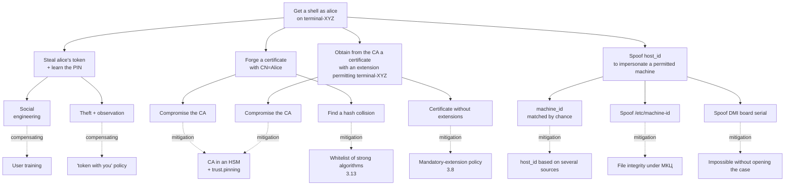

# Tessera Threat Model

Each threat is accompanied by a reference to its evidence: a path to code, the
name of a config field, or a link to a test that proves the claimed property.

## 1. Introduction

### 1.1 Target of evaluation (TOE)

By `tessera` we mean:

- the PAM module `libpam_tessera.so` (cdylib);
- the `tessera` daemon (binary);
- the core crate `tessera_core` and the protocol crate `tessera_proto`;
- the shipped configuration files `dist/config/*.example`;
- the systemd unit and the tmpfiles snippet;
- the integration script `dist/scripts/integrate-pam.sh`.

The TOE **does not include:**

- the Astra Linux SE kernel;
- libpam, libssl3, libudev, libdbus, libsystemd;
- `gost-engine` (a separate FSB-certified cryptographic module);
- vendor PKCS#11 modules for tokens (separate FSB-certified cryptographic modules);
- user hooks configured in `[[hooks]]`;
- Inkscape, fly-dm, gdm, and other PAM consumers.

## 2. Deployment assumptions

| #   | Assumption                                                                                  | Why it matters                                                                            |
|-----|--------------------------------------------------------------------------------------------|------------------------------------------------------------------------------------------|
| 2.1 | The machine is physically protected (Astra's mandatory integrity control, МКЦ, or equivalent). | Without МКЦ, a root compromise → the module is useless.                                  |
| 2.2 | System integrity at install time is controlled (МКЦ + verified boot, if available).        | Replacing `gost-engine.so` or `libpam_tessera.so` bypasses the module.                   |
| 2.3 | The CA infrastructure works correctly: keys in an HSM, issuance governed by policy.        | Compromise of the CA private key → catastrophic compromise of the whole perimeter.       |
| 2.4 | User PINs are not disclosed and not written on paper next to the computer.                  | The PIN is the token's only protection under physical access.                            |
| 2.5 | Certificates are issued by the CA with the mandatory `pam_cert_host_binding` and `pam_cert_user_binding` extensions. | Without the extensions, a certificate authorizes no user on any host — fail-closed. |
| 2.6 | The administrator has a "backup tty" while editing the PAM stack.                          | Protection against lockout on misconfiguration.                                          |
| 2.7 | A backup user with password authentication has not been removed.                          | Lockout prevention if `tessera` fails.                                                    |

## 3. Threats the module DOES protect against

Each threat follows the schema: description → STRIDE category →
mitigation → evidence (code, config, test).

### 3.1 Password guessing

- **Description:** an attacker tries to brute-force a local user's
  password.
- **STRIDE:** Spoofing.
- **Mitigation:** `tessera` implements no password authentication.
  Any attempt to enter a password fails at the `pam_conv` stage.
- **Evidence:** [`crates/pam_tessera/src/entry.rs`](../../crates/pam_tessera/src/entry.rs)
  contains no call to `pam_authtok_get`. Authentication proceeds via
  challenge-response with the private key
  ([`crates/tessera_core/src/challenge/`](../../crates/tessera_core/src/challenge/)).

### 3.2 Password leakage via shoulder-surfing / phishing

- **Description:** plain text password leakage.
- **STRIDE:** Information Disclosure.
- **Mitigation:** there is no password (see 3.1). The token PIN is not
  passed into the PAM stack or into logs.
- **Evidence:** [`crates/tessera_core/src/secret.rs`](../../crates/tessera_core/src/secret.rs)
  — the `Secret<T: Zeroize>` wrapper zeroes the PIN on `Drop`.
  The PIN is never passed as a format argument to a tracing macro
  (see also [`crates/tessera_core/src/pkcs12/`](../../crates/tessera_core/src/pkcs12/)).

### 3.3 Copying a certificate from USB media

- **Description:** an attacker copies a `.p12` from someone else's USB and
  tries to use it on their own machine.
- **STRIDE:** Spoofing.
- **Mitigation (Mode A):** the `.p12` is encrypted with a passphrase;
  without the passphrase decryption is impossible. Mode A is considered a
  "medium" protection mode — production uses Mode B.
- **Mitigation (Mode B):** the key is non-extractable. The test checks the
  `CKA_EXTRACTABLE = false` attributes.
- **Evidence:** test
  [`crates/tessera_core/tests/pkcs11_hardware_negative.rs`](../../crates/tessera_core/tests/pkcs11_hardware_negative.rs)
  + [`pkcs11_integration.rs`](../../crates/tessera_core/tests/pkcs11_integration.rs).

### 3.4 Using someone else's token without knowing the PIN

- **Description:** the attacker obtained the token (stole it / picked it up
  from a chair) but does not know the PIN.
- **STRIDE:** Spoofing.
- **Mitigation:** PIN prompt via the PAM conversation; after `N`
  failed attempts (`pkcs11_max_pin_attempts`, default `3`) the module
  denies access. After `N` attempts on the token itself, it is locked at
  the level of the hardware counter.
- **Evidence:** test
  [`crates/tessera_core/tests/pin_loop.rs`](../../crates/tessera_core/tests/pin_loop.rs)
  checks the attempt limit.

### 3.5 Using a valid token on someone else's machine

- **Description:** the attacker legitimately owns the token (or stole it) but
  tries to use it on a machine where this token is not permitted.
- **STRIDE:** Spoofing + Elevation of Privilege.
- **Mitigation:** verification of the X.509 `pam_cert_host_binding`
  extension — its entries (`*` / `sha256:<HEX>` / raw `machine_id`) are
  compared against the `host_id_hash = sha256(host_id)` of the requesting
  machine. If no entry matches — `PAM_AUTH_ERR` (`HostNotAllowed`). The
  extension itself is protected by the CA's certificate signature — it
  cannot be changed without compromising the CA.
- **Evidence:**
  - implementation — the `x509::host_binding_ext` and
    `verify_cert_scope` modules in `tessera_core::x509/`;
  - end-to-end —
    [`crates/pam_tessera/tests/auth_e2e_p12.rs`](../../crates/pam_tessera/tests/auth_e2e_p12.rs).

### 3.6 Using a session after the user leaves

- **Description:** the user stepped away from the workstation without removing
  the token; or removed it but forgot to close the session.
- **STRIDE:** Tampering + Elevation of Privilege.
- **Mitigation:** monitoring of udev REMOVE events via monitord;
  on a confirmed removal (accounting for `usb_removed_grace_seconds`)
  — `LockSession` or `TerminateSession` via D-Bus to logind.
- **Evidence:**
  - implementation —
    [`crates/tessera_cli/src/udev_monitor.rs`](../../crates/tessera_cli/src/udev_monitor.rs),
    [`logind.rs`](../../crates/tessera_cli/src/logind.rs),
    [`actions.rs`](../../crates/tessera_cli/src/actions.rs);
  - tests — [`udev_simulation.rs`](../../crates/tessera_cli/tests/udev_simulation.rs),
    [`udev_event_parse.rs`](../../crates/tessera_cli/tests/udev_event_parse.rs);
  - suspend/resume tests —
    [`suspend_grace.rs`](../../crates/tessera_cli/tests/suspend_grace.rs).

### 3.6.1 Astra ЗПС (DIGSIG) and binary signing

- **Description:** an attacker with file-write privileges replaces
  `pam_tessera.so` or `tessera` with a forged binary.
- **STRIDE:** Tampering.
- **Mitigation:**
  - On Astra Linux SE the production mode is `astra-digsig-control` in
    `enforce`. ELF files from the `tessera` package must be
    signed by the build CI of the Astra partner (`bsign` with a GPG key
    from the trusted keyring `/etc/digsig/keys/`); a substituted binary
    without a corresponding signature is rejected by the kernel at
    `execve(2)` / `mmap(2)`.
  - If ЗПС — the closed software environment (Astra's signed-executables
    enforcement) — is switched to `logging-only`, protection drops to
    `dpkg --verify` and `0755 root:root` permissions on the binary — this
    mode is acceptable only on dev machines. A production deploy without
    signing is forbidden by operational policy.
- **Evidence:** see install.md §1.5 "Preflight: USBGuard and Astra ЗПС
  (DIGSIG)" — it describes both the enforcement mode and the diagnostic
  commands.

### 3.7 Private-key leakage from process memory

- **Description:** an attacker reads process memory (via ptrace,
  /proc/pid/mem, a minidump) and tries to extract the PIN or the private key.
- **STRIDE:** Information Disclosure.
- **Mitigation:**
  - The PIN is stored in `Secret<T: Zeroize>` — zeroed on `Drop`.
  - In Mode B the private key never leaves the token (PKCS#11
    non-extractable).
  - In Mode A the decryption passphrase is used once and zeroed after
    `flow::authenticate`.
  - The systemd unit sets `NoNewPrivileges=yes`, `ProtectKernelTunables=yes`,
    `RestrictNamespaces=yes` — making ptrace from outside harder.
- **Evidence:**
  - [`crates/tessera_core/src/secret.rs`](../../crates/tessera_core/src/secret.rs)
    + Cargo.toml `zeroize = { version = "1.7", features = ["derive"] }`;
  - [`dist/systemd/tessera.service`](../../dist/systemd/tessera.service)
    — all hardening directives are present.

### 3.8 Certificate without extensions or with a forged extension

- **Description:** an attacker tries to use a certificate that has no
  `pam_cert_host_binding` / `pam_cert_user_binding` extensions at all,
  or attempts to embed "forged" entries bypassing the CA.
- **STRIDE:** Tampering + Spoofing.
- **Mitigation:**
  - **Mandatory-extension policy:** the absence of either extension in the
    leaf certificate is an unconditional denial
    (`HostExtensionMissing` / `UserExtensionMissing` →
    `PAM_AUTH_ERR`). There are no "soft" fallbacks.
  - **Protection by the CA signature:** the extension content is covered by
    the certificate signature. Changing an entry without the CA private key
    is impossible; forging the whole certificate is the task of compromising
    the CA (see 4.8).
  - **Chain verification:** issuing a certificate by a rogue "trusted" CA
    is caught by `[trust].anchors` + optionally `[trust.pinning]`.
  - **Corrupted DER encoding** (garbage in `extnValue`) →
    `*ExtensionMalformed` → `PAM_AUTH_ERR`.
- **Evidence:**
  - implementation — `tessera_core::x509::{host_binding_ext,
    user_binding_ext}` + `verify_cert_scope`;
  - semantics table — [docs/cert-issuance.md](cert-issuance.md).

### 3.9 Substituting `config.toml`

- **Description:** an attacker with file-write privileges replaces
  `config.toml` with a configuration that has a weakened `[trust]` or
  disabled revocation.
- **STRIDE:** Tampering.
- **Mitigation:**
  - `config.toml` is not signed but is protected by `0640
    root:root` permissions (see [`debian/postinst`](../../debian/postinst));
  - `dpkg --verify tessera` detects changes to the shipped files (but not
    user edits to `config.toml` after installation);
  - changing the config requires root access — which is already outside the
    PAM-level threat model.
- **Evidence:** [`debian/postinst`](../../debian/postinst) +
  [`dist/tmpfiles/tessera.conf`](../../dist/tmpfiles/tessera.conf).

### 3.10 MITM in IPC

- **Description:** an attacker tries to connect to
  `/run/tessera/monitord.sock` and substitute responses.
- **STRIDE:** Tampering + Spoofing.
- **Mitigation:**
  - the socket in `/run/tessera/` has `0660 root:tessera` permissions
    (see systemd `RuntimeDirectoryMode=0750`);
  - monitord checks the peer via `SO_PEERCRED` —
    `uid != 0` → `Error { code: 1003 (UNAUTHORIZED) }` + disconnect.
- **Evidence:**
  - [`crates/tessera_cli/src/peercred.rs`](../../crates/tessera_cli/src/peercred.rs);
  - test [`crates/tessera_cli/tests/peercred.rs`](../../crates/tessera_cli/tests/peercred.rs)
    + [`ipc_auth.rs`](../../crates/tessera_cli/tests/ipc_auth.rs).

### 3.11 Replay attacks on challenge-response

- **Description:** an attacker who intercepted a challenge and a signature
  tries to present them again on a new authentication attempt.
- **STRIDE:** Spoofing.
- **Mitigation:** a fresh challenge is generated for every attempt
  via `getrandom` (16 bytes) inside the cdylib (see
  `entry.rs::fresh_session_id` and `challenge/`).
- **Evidence:**
  - [`crates/tessera_core/src/challenge/`](../../crates/tessera_core/src/challenge/);
  - tests — [`challenge_dispatch.rs`](../../crates/tessera_core/tests/challenge_dispatch.rs),
    [`challenge_rsa.rs`](../../crates/tessera_core/tests/challenge_rsa.rs),
    [`challenge_ecdsa.rs`](../../crates/tessera_core/tests/challenge_ecdsa.rs),
    [`gost_challenge_real.rs`](../../crates/tessera_core/tests/gost_challenge_real.rs).

### 3.12 Argv injection in hooks

- **Description:** an attacker slips special characters into `pam_user`
  (or another placeholder) in order to invoke a command in a hook with forged
  arguments.
- **STRIDE:** Elevation of Privilege.
- **Mitigation:** placeholders (`${pam_user}`, `${cert_cn}`, ...)
  are substituted as separate argv elements, not via interpolation in a
  shell. Implementation — `fork+execve`, without `system(3)`.
- **Evidence:**
  - [`crates/tessera_core/src/hooks/placeholder.rs`](../../crates/tessera_core/src/hooks/placeholder.rs)
    + [`fork_exec.rs`](../../crates/tessera_core/src/hooks/fork_exec.rs);
  - tests — [`hook_security_integration.rs`](../../crates/tessera_core/tests/hook_security_integration.rs),
    [`hook_executor_integration.rs`](../../crates/tessera_core/tests/hook_executor_integration.rs).

### 3.13 Weak-signature-algorithm attack

- **Description:** an attacker issues (or finds an existing)
  certificate signed with SHA-1/MD5/RSA-1024.
- **STRIDE:** Tampering.
- **Mitigation:** the `[trust].allowed_signature_algorithms` whitelist
  (see the field in [`crates/tessera_core/src/config/raw.rs`](../../crates/tessera_core/src/config/raw.rs)).
  An OID not in the whitelist → `TrustError::DisallowedSignatureAlgorithm` →
  `PAM_AUTH_ERR`.
- **Evidence:**
  - [`crates/tessera_core/src/x509/`](../../crates/tessera_core/src/x509/)
    + [`crates/tessera_core/src/error.rs`](../../crates/tessera_core/src/error.rs);
  - tests — [`chain_verify.rs`](../../crates/tessera_core/tests/chain_verify.rs),
    [`gost_chain_verify.rs`](../../crates/tessera_core/tests/gost_chain_verify.rs).

## 4. Threats the module does NOT protect against

| #   | Threat                                                                                       | Recommended compensating control                              |
|-----|----------------------------------------------------------------------------------------------|-----------------------------------------------------------------|
| 4.1 | Rootkit / kernel compromise                                                                  | Astra МКЦ, IMA, EDR.                                            |
| 4.2 | Physical access to an unlocked session before grace fires.                                   | Reduce `usb_removed_grace_seconds`; admin policy.              |
| 4.3 | Extracting the key from the token given a compromised PIN + physical access to the token + special equipment. | The token's hardware measures (in-chip anti-tamper).           |
| 4.4 | Mode A with a `.p12` without a password or with a weak password.                            | Do not use Mode A in production. Use Mode B.                   |
| 4.5 | Vulnerabilities in `gost-engine`.                                                            | Timely Astra updates; the FSB-certified module is responsible for patches. |
| 4.6 | Side-channel attacks on the token (electromagnetic, power, timing).                          | Hardware anti-tamper measures.                                 |
| 4.7 | Social engineering (handing over the token and disclosing the PIN).                          | Training, policy.                                              |
| 4.8 | CA compromise (CA private key leaked).                                                        | HSM for the CA, separation of roles; `[trust.pinning]` limits the blast radius to the pinned-roots level. |
| 4.9 | Vulnerabilities in `libpam`, `libssl3`, the kernel.                                          | apt updates, CVE monitoring.                                   |

### 4.10. Host identity: multi-source matching is NOT performed

`[host_identity].sources` is defined as an **ordered fallback**, not as
"accept if it matched any of the sources". `resolve()` takes the first
successful source and computes only its `host_id_hash`; the cert must encode
exactly this value (via `pam_cert_host_binding`).

This is intentional. Multi-source "matched at least one" matching is
equivalent to "weakest source wins": an attacker with root privileges
substitutes the most writable source (for example
`/sys/class/dmi/id/board_serial` under qemu, or `custom_command` via a
shim), and host binding is bypassed. Therefore matching is checked
ONLY against the resolved source per the fallback policy.

Effect for administrators: after changing `[host_identity].sources`,
the cert must be re-issued (new source → new
`host_id_hash`). Drift between the issuance script and the deployed
configuration is caught via `journalctl -t tessera | grep 'host_id resolved'`
(see [install.md](install.md#host_binding-mismatch)).

## 5. Attack surface

| #   | Surface                                | Protection                                                                          |
|-----|----------------------------------------|--------------------------------------------------------------------------------------|
| 5.1 | PAM stack (`/etc/pam.d/*`)             | Standard PAM security; integrated via `@include tessera`.                            |
| 5.2 | `libssl3` / `libcrypto`                | System updates via apt.                                                               |
| 5.3 | PKCS#11 module (Rutoken / JaCarta)     | FSB-certified cryptographic module; closed-source; trusted while its certification is valid. |
| 5.4 | udev events                            | Not authenticated, but we are inside the kernel namespace and trust udev.            |
| 5.5 | IPC socket `/run/tessera/monitord.sock`| `SO_PEERCRED uid=0` + `0660` permissions. If root is already compromised, the module is already useless. |
| 5.6 | Hooks in `[[hooks]]`                   | Placeholder whitelist, fork+execve, timeouts. The hook itself is the administrator's responsibility. |
| 5.7 | Config files `/etc/tessera/config.toml` and trust anchors | `0640 root:root` permissions. Manual management. |

## 5.1 Process privilege model

| Process              | Context / UID                                              | Hardening                                                                                                  | Known residual risk                             |
|----------------------|-------------------------------------------------------------|------------------------------------------------------------------------------------------------------------|--------------------------------------------------|
| `pam_tessera.so`    | UID of the PAM caller (`sudo`/`login`/`fly-dm` — usually `root` at the `auth` stage); an architectural requirement of PAM. | `#![forbid(unsafe_code)]` on `tessera_proto`; `panic_guard` at every C boundary → `PAM_AUTHINFO_UNAVAIL`; `Secret<T: Zeroize>` for the PIN. | Loading into the address space of a rooted process — compromise of the host compromises the module too (outside the TOE, see 4.1). |
| `tessera` | `User=tessera` / `Group=tessera` — a dedicated system account without a shell, created by `debian/postinst`. | `ProtectSystem=strict` + `ReadWritePaths=…`, `ProtectHome=yes`, `PrivateTmp=yes`, `NoNewPrivileges=yes`, `ProtectKernelTunables/Modules/ControlGroups=yes`, `RestrictNamespaces=yes`, `RestrictRealtime=yes`, `LockPersonality=yes`, `CapabilityBoundingSet=CAP_DAC_READ_SEARCH`, `AmbientCapabilities=CAP_DAC_READ_SEARCH`. Privileged D-Bus calls to logind are gated by a polkit rule. | `MemoryDenyWriteExecute=no` (left off due to the W^X relaxation in OpenSSL/`gost-engine`); full W^X sandboxing is a task for after the benchmarking stage (see the systemd unit and the backlog for 0.1.2). |

`pam_tessera.so` runs in the context of the PAM caller — this is an
architectural constraint of the PAM stack, not an implementation choice;
the cdylib's privileges cannot be lowered without redesigning the PAM
protocol. As of 0.1.1, `tessera` is already split into a separate
system account — root privileges for D-Bus actions on logind are granted
narrowly via a polkit rule shipped with the package.

## 5.2 Lockout-resilience model

The PAM stack into which `tessera` is integrated turns the USB token
into a **hard** second factor (or the only factor, see `cert-only`). This is
a deliberate security choice; the price of that choice is that resilience to
token loss falls on operations, not on the module itself:

| Mode       | Token loss                                 | USBGuard blocks the token                 | Astra ЗПС in `enforce` without a signed binary |
|------------|--------------------------------------------|-------------------------------------------|-------------------------------------------|
| `2fa`      | You can log in with a password.            | Same — the password works.                | The PAM module will not load → fallback to the password (`auth required` will break the login). |
| `optional` | You can log in with a password.            | Same.                                     | Same.                                     |
| `cert-only`| **Lockout.** Even local root cannot get in. | **Lockout.**                             | **Lockout** — `auth [success=done default=die]`. |

Compensating controls for `cert-only` (mandatory before deploy):

- a backup access channel without `tessera` (see install.md §8) —
  a separate sshd stack with `UsePAM=no` or a sudoers rule for an
  emergency account;
- a spare token with the same `pam_cert_user_binding` for every
  privileged user;
- a documented rescue-recovery procedure (see install.md §10
  "Lockout after a failed PAM edit").

## 6. Adversary model

| Level | Description                                                                | Module's expectation           |
|---------|---------------------------------------------------------------------------|--------------------------------|
| A1      | External adversary without physical access, without a token, without a PIN. | Zero successes.                |
| A2      | External adversary who obtained a token but does not know the PIN.        | Zero (PIN protection + attempt limit). |
| A3      | Internal adversary: a legitimate user tries to use the token on a forbidden machine or for another PAM user. | Zero (host_binding + user_binding in the extensions, protected by the CA signature). |
| A4      | Internal adversary: an administrator with root access.                   | **Not modeled** — the admin is trusted by construction. |

## 7. Attack tree for threat 3.5 "using a valid token on someone else's machine"

## 8. List of tests proving the claimed protections

| Threat | Test(s)                                                | File                                                                    |
|--------|--------------------------------------------------------|-------------------------------------------------------------------------|
| 3.3    | non-extractable check                                   | `crates/tessera_core/tests/pkcs11_hardware_negative.rs`             |
| 3.3    | PKCS#12 wrong password                                  | `crates/tessera_core/tests/pkcs12.rs`                                |
| 3.4    | PIN attempt limit                                       | `crates/tessera_core/tests/pin_loop.rs`                              |
| 3.5    | host_binding mismatch (sha256 entry did not match)      | `crates/tessera_core/tests/verify_cert_scope.rs`                     |
| 3.5    | end-to-end auth with host/user binding extensions        | `crates/pam_tessera/tests/auth_e2e_p12.rs`                               |
| 3.6    | USB removal → grace → lock                              | `crates/tessera_cli/tests/udev_simulation.rs`                  |
| 3.6    | suspend/resume ignores transient REMOVE                 | `crates/tessera_cli/tests/suspend_grace.rs`                    |
| 3.7    | Secret zeroization on Drop                               | unit tests in `crates/tessera_core/src/secret.rs`                  |
| 3.8    | certificate without extensions → denial                 | `crates/tessera_core/tests/verify_cert_scope.rs` (negative cases)  |
| 3.10   | uid≠0 peer is rejected                                  | `crates/tessera_cli/tests/peercred.rs` + `ipc_auth.rs`         |
| 3.11   | challenge is not repeated                               | `crates/tessera_core/tests/challenge_dispatch.rs`                   |
| 3.12   | argv injection is impossible                             | `crates/tessera_core/tests/hook_security_integration.rs`            |
| 3.13   | weak signature → DisallowedSignatureAlgorithm           | `crates/tessera_core/tests/chain_verify.rs`                          |
| 3.13   | GOST chain verify (real engine)                         | `crates/tessera_core/tests/gost_chain_verify_real.rs`                |
| Reproducibility / supply-chain | reproducible build (double build) | `scripts/verify-reproducible-build.sh` |

## 9. МКЦ (Astra strict mode, 0.3.0+)

### 9.1 Threats

- **9.1.1 Privilege-escalation via MAC label.** The certificate
  declares an excessively high `MAX_INTEGRITY`; without runtime control the
  user raises the session level above the host's ceiling.
- **9.1.2 Bypass through missing extension.** A certificate issued
  before МКЦ was deployed does not contain `MAX_INTEGRITY` — without
  `cert_integrity = "required"` the session opens without a label and
  gets "transparent" access.
- **9.1.3 DER-tampering.** An attacker controlling the CA puts
  broken/non-standard DER into the extension, counting on a parser failure
  and "accept-by-default" fallback behavior.
- **9.1.4 sessions.json TOCTOU.** The state file is overwritten
  atomically. Previously the irelax label on a new inode was restored by a
  separate syscall → a race window in which the daemon with MAC=0 cannot
  read the just-written file. Fixed in 0.3.0: the file lives on the
  tmpfs `/run/tessera/` (`RuntimeDirectory=`), the parent directory gets
  `iinh`, the label is applied to the fd before the name is published via
  `pdp_set_fd` (see §9.2.4); a reboot clears the state entirely.
- **9.1.5 host_id rebind.** By spoofing `host_id`, the attacker
  rebinds the certificate to a different host.

### 9.1.6 `irelax` + UID 0 = forge (in-scope, out-of-mitigation)

monitord and pam_tessera.so apply `irelax` to their own files
(`/run/tessera/monitord.sock`, `/run/tessera/sessions.json`)
via the `PARSEC_CAP_CHMAC` privilege of the `tessera` user. This is
necessary: an engineer at integrity level 1 (integrity mask = 1) must be able to write
receipts into the lvl=0 daemon through a socket that is itself labeled
`irelax`.

A hostile UID-0 process (root-equivalent) with the same `PARSEC_CAP_CHMAC`
capability can attach identical `irelax` labels to its own files and forge
entries in `sessions.json`, or connect to the socket from an arbitrary
integrity level. **Not blocked in code**: the defense is the UID
boundary (root-equivalence axiomatically wins under МКЦ), not
integrity.

Mitigations beyond the scope of this threat:

- DAC `0600 root:root` on `sessions.json` + parent dir
  `0750 tessera:tessera` restrict write access for non-CHMAC
  processes.
- digsig verification on the `tessera(-monitord)` binaries detects
  runtime tampering.
- An audit log entry on every `mac_apply_failed` / `mac_caps_missing`
  exposes unexpected backend behavior.

The trust boundary of this design is **UID 0 vs non-root**, not the integrity
level. The threat is acknowledged as in-scope and explicitly
out-of-mitigation for the PAM layer: protection against UID-0 forgery is the
OS's job (digsig, ЗПС, a hardware root of trust), not the authentication
module's.

### 9.2 Protections

- **9.2.1** The effective label is always intersected with the user's
  ceiling from the backend (the user integrity ceiling, МНКЦ,
  `get_user_mnkc`) — the ceiling is set by the system, not the certificate.
  See the free function `compute_effective_label` (`mac/orchestrator.rs`).
- **9.2.2** `cert_integrity = "required"` rejects certificates without the
  extension; the stub backend refuses to start with `required`.
- **9.2.3** The `IntegrityLabel::from_der` parser is strict: length checks,
  no trailing bytes, BIT STRING `unused-bits ≤ 7`. Broken DER
  → denial + the audit event `cert_max_integrity_parse_failed`.
- **9.2.4** Writing `sessions.json` goes through `openat(O_TMPFILE)` →
  `fchmod` → `pdp_set_fd(label)` → `linkat`/`rename` atomically; the label
  is applied **to the fd before the name is published**. The kernel does not
  accept `irelax` through the fd-based API (EINVAL) — the relax semantics for
  `sessions.json` are provided by `iinh` inheritance from the parent dir
  `/run/tessera/` (tmpfs).
- **9.2.5** postinst applies `chattr +i` to `host_id` after the
  first write; the file itself lives in the dir `/var/lib/tessera/`
  (0750 root:tessera).

### 9.3 Open risks

- The libparsec `parsec_capget` symbol soname is not fixed
  publicly; build.rs does not link `libparsec-base3` by default. If,
  on a particular Astra release, the build produces an "undefined symbol",
  you need to add `libparsec-base3` to `debian/control` and
  `cargo:rustc-link-lib=parsec-base` to build.rs.
- `libpdp.so.3` is proprietary, without public fuzzing coverage.
  Protection: `LD_LIBRARY_PATH` is fixed, the ABI is wrapped in a
  return-pointer signature (see `5337fea`), all calls run under
  `panic=abort`.

### 9.4 Tests

| Threat | Test                                                  | File                                                                         |
|--------|--------------------------------------------------------|------------------------------------------------------------------------------|
| 9.1.1  | intersect(cert, caps) capping level                    | `crates/tessera_core/tests/mac_orchestrator.rs`                          |
| 9.1.2  | `cert_integrity=required` rejects no-ext leaf          | `crates/pam_tessera/tests/mac_open_session.rs::open_session_fails_when_required_but_cert_lacks_ext` |
| 9.1.3  | malformed DER → parse-failed event                     | `crates/tessera_core/tests/cert_extensions_parse.rs`                     |
| 9.1.4  | fd-based irelax label on atomic write                  | `crates/tessera_core/tests/mount_guard_tmpfs.rs`                         |
| 9.1.5  | host_id immutability after install                     | E2E manual: `vagrant/scripts/test-mac.sh` T12                                 |

## 10. Threat registry (systematic pass 2026-06)

The result of a full bootstrap pass over the code @ 14b828e (a research swarm
over docs/surfaces/assets/infrastructure/git-history, then clustering and
STRIDE gap-fill) refined with the owner. The format is compatible with the
THREAT_MODEL.md schema (downstream tools parse the table by regex). A threat is
a class that survives the patch of a specific bug; the bugs found are listed in
`evidence` and only raise likelihood.

A static triage pass (2026-06-06, 25 raw findings → 5 confirmed) verified
instances of this registry. An important axis: `impact`/`likelihood` in the
registry are an estimate of the **class** of threat in the worst-case scenario;
a specific instance, given a stack of preconditions, may be instance-severity
**LOW** while the class-impact is **critical**. Both numbers are needed: the
class drives investment priority in mitigations, the instance drives patch
urgency. The pass also uncovered two classes absent from the bootstrap: false
revocation via issuer scope (added to T1/T8) and path confusion on mounted
media (the new T12).

This section complements §3–§6: §3 describes protection mechanisms per threat;
here is a single ranked registry (impact × likelihood, descending).

### 10.1 Threats

| id | threat | actor | surface | asset | impact | likelihood | status | controls | evidence |
|---|---|---|---|---|---|---|---|---|---|
| T1 | Login with a revoked credential: residual revocation degradation (an expired CRL is skipped when crl_strict=false — "revocation is not forever"; a CRL without nextUpdate is bounded only by the opt-in `crl_max_age_hours`) | insider | CRL processing | Authentication decision, revocation state | critical | possible | partially_mitigated | short credential TTL limits the window; the CRL signature is verified mandatorily (fail-closed, `crl/store.rs`); OCSP is implemented (`ocsp`/`crl_then_ocsp`, nonce, issuer-signer check); an empty CRL store with mode=crl is rejected at verifier construction (2026-07); crl_strict=true is opt-in; issuer-DN binding in check_revocation (RFC 5280 §6.3.3) — a CRL applies only to certificates from its own issuer | 14b828e, openspec/revocation, F-001/F-002 (closed) |
| T2 | Bypassing the authorization policy via fail-open defaults and silent fallback paths: malformed user_binding → fallback to legacy mapping | insider | Chain verification and challenge-response; X.509/PKCS#12 parsing from media; config.toml | Authentication decision, fail-closed invariant | critical | possible | partially_mitigated | mandatory-extension policy (host/user_binding); strict DER parsing of МКЦ labels; since 2026-06 an empty/omitted sig-whitelist is replaced by a safe default (SHA-256/384/512 RSA + ECDSA, without SHA-1/GOST) during config validation — the accept-all default is eliminated; since 2026-06 an extractable PKCS#11 key is rejected by default (`ExtractableKeyRejected`), a WARN remains only under the explicit opt-in `pkcs11_allow_extractable_keys = true`; since 2026-07 omitting the `[trust.revocation]` section or the `mode` key is a config validation error (the silent "revocation not checked" default is eliminated; `none` must be chosen explicitly) | pre_validate.rs:28, flow.rs:662, key_lookup.rs, config/validated.rs, F-002 (closed) |
| T3 | RCE/memory corruption in the root login process while parsing malicious media: DER/PKCS#12 in OpenSSL before verification, and the filesystem image in the kernel at mount(2) | local_user | X.509/PKCS#12 parsing from media; USB mount | Host process integrity | critical | possible | partially_mitigated | Rust wrapping; panic guard (does not save from UB in C); mount with nosuid,nodev,noexec; the CVE history of ASN.1 parsers / filesystem drivers as precedent | |
| T4 | Evil-maid outside Astra: substitution of config.toml, native .so files (PKCS#11/gost-engine), host_id — without МКЦ labels, DIGSIG, and the immutable bit, Debian/Ubuntu are protected only by DAC | local_user | Dynamic loading of native code; config.toml; Host identity resolution; Package install/removal | Host process integrity, configuration, host identity | critical | possible | partially_mitigated | on Astra: МКЦ ilevel=63, chattr +i, DIGSIG/ЗПС; outside Astra: 0640/0750 root:tessera | |
| T5 | Build/supply-chain compromise: a backdoor in the login-stack .so across the whole fleet via an unpinned builder-image base, tools without checksums, unsigned .deb, a crates.io dependency | supply_chain | CI / build supply chain; Cargo dependencies | Integrity of release artifacts, Host process integrity | critical | possible | partially_mitigated | reproducible build (.buildinfo), rust-cache pinned by hash, cargo-deny, draft releases; Astra DIGSIG will reject an unsigned .so; GPG signing of .deb and an apt repository are planned | |
| T6 | Memory-safety violation at the PAM FFI boundary: manual ownership of AuthContext (Box::into_raw), conv pointers, unsafe blocks in the cdylib | local_user | PAM ABI (pam_sm_*); PAM data (AuthContext between phases) | Host process integrity | critical | rare | partially_mitigated | Rust; panic_guard → PAM_AUTHINFO_UNAVAIL; forbid(unsafe) in proto; no-alloc between fork/execve | |
| T7 | The session survives media removal: the monitoring path is not fail-closed (a SessionOpen error is not fatal under strict) | local_user | monitord IPC socket; udev events; sessions.json persistence | Active session, media-removal control | high | likely | partially_mitigated | udev REMOVE → grace → lock/logout/hook/shutdown; race-check on SessionOpen; fix of the XDG_SESSION_ID path in 0.3.13; since 2026-06 Lock/Logout without a logind id is fail-closed: an error log + host reboot (the session is destroyed, the machine returns to the login screen) instead of silently dropping the action | flow.rs:742, actions.rs:51, F-006 (closed) |
| T8 | Device unavailability (DoS/lockout): cert-only without a rescue channel, deliberate blocking of someone else's token (3 PIN attempts), USB timeout, monitord strict, false expiry on clock drift, false revocation of a valid credential on a cross-CA serial-number collision (issuer-DN not checked, F-001) | local_user | PAM ABI (pam_sm_*); monitord IPC socket; udev events; CRL processing | Authentication decision (availability) | high | likely | partially_mitigated | 2fa/optional modes with password fallback; a rescue channel for cert-only is documented but not enforced; grace windows; clock_skew tolerance in acct_mgmt (lib.rs acct_mgmt_core) | F-001 |
| T9 | Incorrect PAM stack after install/upgrade/removal: bypass (leftovers of optional mode, uncleaned @include) or full lockout | local_admin | Package install/removal (postinst/postrm, integrate-pam.sh, finish-bootstrap.sh); PAM ABI | The system PAM stack, Authentication decision | high | possible | unmitigated | backup bak.<ts>; interactive y/N in finish-bootstrap; there is no syntactic PAM validation after editing | |
| T10 | Privilege escalation via the hook mechanism: PAM-derived variables in the child process's environment | local_user | Hooks fork+execve | Host process integrity, active session | high | rare | partially_mitigated | placeholders as separate argv (no shell), setuid/setgid in the child, timeouts; since 2026-06 a pre-exec check of the permissions of the hook file and all parent directories (like sudo/ssh): S_IWOTH — always denied, S_IWGRP — denied except for the root/egid group, an unreadable stat — denied (fail-closed); the residual TOCTOU window stat→execve is equivalent to sudo/ssh | F-004 (closed), validator.rs:71, child_setup.rs:335 |
| T11 | Reconnaissance via state disclosure: the session registry (who is logged in), diagnostics on the login screen, the audit log | local_user | sessions.json persistence; PAM ABI | Session registry, audit events | low | possible | partially_mitigated | 0660/0750, tmpfs; the "issued for another device" diagnostic is a deliberate UX trade-off | |
| T12 | Path confusion on mounted USB media: a symlink in ext4 (or another symlink-capable FS) on the USB → reading host files as root; MS_NOSYMFOLLOW is not set in the mount flags | physical_user | USB mount; tessera_core/discovery.rs | Confidentiality of host files (partial) | medium | rare | partially_mitigated | since 2026-06 discover_credentials does canonicalize + boundary check (starts_with the canonical mountpoint) for p12 and chain.pem; escaping the mountpoint → denial (EscapesMount, fail-closed); this closes both mid-path symlinks and `..`; MS_NOSYMFOLLOW is still not set in the mount flags (defense-in-depth, open) | F-016 (closed), discovery.rs:92, usb.rs:85 |

### 10.2 Deprioritized

| threat | reason |
|---|---|
| Spoofing/Tampering of network channels | Devices are offline, there are no network login interfaces |
| Root on the device, full offline disk access | Out of the model by construction — the environment integrity layer (see §2, §4.1) |
| Repudiation of multi-user actions | Partially covered by structured audit; correlation with the server-side session is the server side's job, not the PAM module's |
| Forging udev events | Requires root or CAP_NET_ADMIN on netlink — equivalent to a root adversary |
| Side-channel / hardware attacks on the token | A property of the certified token (FSB-certified crypto), outside the TOE (see §4.3, §4.6) |
| Timing attacks on challenge-response | The signature is performed by OpenSSL/the token; no secret-dependent comparisons were found in the tessera code |
| DoS by physical damage to the device | Out of the model (physical protection of the environment) |

### 10.3 Recommended mitigations (class-level)

| mitigation | threat_ids | closes_class | effort | status |
|---|---|---|---|---|
| New CRL semantics: revocation is permanent for serial numbers from an expired CRL; expiry affects only trust in the completeness of the list + an audit event | T1 | yes | M | partially closed 2026-06/07: verify_signature is mandatory, OCSP is implemented, an empty store with mode=crl is fail-closed; ONLY "revocation is permanent for an expired CRL" remains OPEN (a stale CRL is skipped when crl_strict=false) |
| Fail-closed config invariant: an empty sig-whitelist = a validation error; a missing revocation mode = a validation error; a malformed binding extension = denial (not fallback); CKA_EXTRACTABLE=true = block under hardware policy | T2 | yes | S | sig-whitelist implemented 2026-06 (variant: a safe default instead of a validation error — does not break existing configs); revocation mode required since 2026-07 (omitting the section/key = a validation error, the silent `none` default eliminated); EXTRACTABLE implemented 2026-06; binding fallback — open |
| Align the code with the docs in monitoring: strict → a SessionOpen error is fatal; a session without a logind id degrades to a tty target instead of dropping the action | T7 | yes | S | the logind-id part implemented 2026-06 (variant: fail-closed reboot instead of tty degradation); strict→fatal — open |
| Sign .deb (GPG) + pin the builder base image by digest + checksums for curl-downloaded tools | T5 | yes | S | open |
| Post-validation of the PAM config after each edit (syntax check, smoke test) + atomic rollback in integrate-pam.sh | T9 | yes | M | open |
| Debian integrity profile: dpkg-statoverride on critical paths, AIDE/IMA recommendation, checking hook-file permissions at daemon startup | T4, T10 | partial | M | hook permissions implemented 2026-06 (variant: pre-exec check in fork_exec, stricter than at daemon startup); the rest of the profile — open |
| Isolate media parsing: a privilege-separated helper for PKCS#12/DER before verification; size limits | T3 | partial | L | open (p12/chain limits exist) |
| Check the rescue channel in finish-bootstrap.sh for cert-only (clock_skew tolerance in acct_mgmt — done) | T8 | partial | S | open |
| MS_NOSYMFOLLOW in mount(2) + canonicalize/boundary check in discover_credentials before fs::read | T12 | yes | S | canonicalize/boundary check implemented 2026-06; MS_NOSYMFOLLOW — open (defense-in-depth) |
| CRL issuer-DN binding in check_revocation: compare the cert's issuer_dn_der with the CRL issuer before matching by serial number (RFC 5280 §6.3.3) | T1, T8 | yes | S | implemented 2026-06 |

## 11. Issuance tooling (`tessera_issuer`, issuer-tooling 2026-07)

TOE extension: the client-side certificate issuance tooling — the
`tessera_issuer` core, the `issuer` CLI, the static web cabinet (WASM) and the
local `issuer serve` agent (browser ↔ signing-backend bridge). The tool is not
a custodian: with the `pkcs11` and `vault` backends private keys live in the
token/HSM/Vault Transit and never pass through the issuance code. The exception
is the explicit file backend (`file`): the key from a PKCS#8 file is loaded
into the issuance process memory (see 11.1.7 and 11.3). The requirements canon
is the openspec specs `cert-issuance`, `issuer-signing`, `issuer-cabinet`,
`issuance-journal`.

### 11.1 Attack surface

| #      | Surface                               | Threat                                                                              | Mitigation                                                                                                                                                                              |
|--------|---------------------------------------|--------------------------------------------------------------------------------------|--------------------------------------------------------------------------------------------------------------------------------------------------------------------------------------------|
| 11.1.1 | `issuer serve` HTTP agent (127.0.0.1) | CSRF / DNS rebinding from the operator's browser; an arbitrary local process asks for a signature | binds strictly to 127.0.0.1; a paired session token (CSPRNG, constant-time comparison) is the primary gate: a request without a valid token is rejected before the signing module is touched; Origin is secondary — a present Origin must be in the allowlist (a foreign Origin and DNS-rebind are cut off), an absent one (a legitimate same-origin GET) is gated by the token; a cross-origin page cannot read the injected token nor set its header without a preflight; no PIN over HTTP — the protocol has no such field; per-operation operator confirmation in the agent's interface showing the parsed TBS fields (the agent is the trusted display; the token authenticates the cabinet, the confirmation authorises the operation) |
| 11.1.2 | Issuing-key PIN                       | leak via logs, argv, the journal, error messages                                       | entered only on the agent side (terminal/pinentry); `Secret`+`zeroize` for the duration of the operation; absent from error `Debug`/`Display` and from the issuance journal                 |
| 11.1.3 | Web-cabinet static assets (SPA + WASM) | artifact substitution during delivery                                                  | the cabinet is an external static bundle the agent serves from `--cabinet-dir` same-origin on `127.0.0.1` (or by separate static hosting in an air-gapped environment); the bundle's integrity rests on its own delivery (a `SHA256SUMS` manifest, a trusted delivery channel), not on the agent binary's signature; keys are unreachable even from a substituted SPA (signing sits behind the agent + token). Residual risk — see 11.3 |
| 11.1.4 | Vault/OpenBao Transit                 | Transit signs whatever TBS it is sent                                                  | every issuance check runs client-side before signing; Vault policy restricts who may call `sign`; the Vault token is never logged                                                           |
| 11.1.5 | Inventory snapshot feeding the forms  | a forged snapshot plants foreign devices/roles into the forms                          | the snapshot signature is verified, a broken one → rejection; an unsigned snapshot is explicitly marked as manual, its age is displayed                                                     |
| 11.1.6 | Issuance journal                      | hiding/rewriting the fact of an issuance                                               | hash chain with a fixed genesis + signed head; the record is written before the artifact is released (fail-closed); secondary to the primary truth — the login audit on the devices          |
| 11.1.7 | File-based CA key (`--backend file`)  | theft of the key file from disk; offline passphrase cracking; passphrase leak          | file permissions are checked before reading (group/other access → refusal); the recommendation is encrypted PKCS#8 (PBES2), an unencrypted key is accepted only with a warning on every start; the passphrase comes from pinentry/env, `Secret`+`zeroize`, never in argv/logs; the decrypted buffer is zeroized after loading. The protection class is below a token/HSM/Vault — see 11.3 |

### 11.2 What bounds the damage of issuance abuse

Monotonic narrowing of the delegation envelope is checked on the issuance side
by the same shared code (`tessera_ext`) as the Engine's enforcement: even a
fully compromised issuance tool cannot produce a certificate wider than the
parent CA's envelope — the Engine rejects it on the device (AND/MIN envelope
semantics, §3.8). Serials are random 128-bit — no serial coordination between
operators is needed, and serials cannot serve as a channel.

### 11.3 What it does NOT protect against

- **Operator machine compromise** = compromise of the issuance session: an
  attacker with the operator's privileges can issue certificates within the
  envelope of the presented CA (but cannot steal the key — it is in the
  token/HSM; and cannot escape the envelope — see 11.2). Parity with 4.1
  (host compromise is outside the TOE).
- **A file-based key under host compromise**: with `--backend file` the CA key,
  unlike a token/HSM/Vault key, is extractable — an attacker with access to the
  file (and the passphrase or the process memory) walks away with the key
  itself, not just the issuance session. The file backend is an accepted risk
  for test benches, CI and small installations; the production recommendation
  is PKCS#11 or Vault Transit. The delegation envelope still holds: a stolen
  organisation-CA key cannot escape its envelope (11.2); a stolen root is a
  catastrophe of the same class as 2.3.
- **A substituted cabinet slips in a different TBS** — closed by the mandatory
  per-operation confirmation (11.1.1): the agent parses the TBS and displays
  subject/validity/roles/envelope in the trusted channel before the PIN
  prompt; the operator confirms what is actually being signed. What remains is
  operator inattention (confirming without reading) — an organisational
  control.
- **Four-eyes on a pure client**: the standalone issuance path provides no
  second signature by construction; this is explicitly the organisation's
  responsibility (the server-side path is out of scope for the open part).
- **A withheld CRL**: the tool issues CRLs but does not deliver them; the
  backstop is short leaf TTLs (`revocation` semantics).
