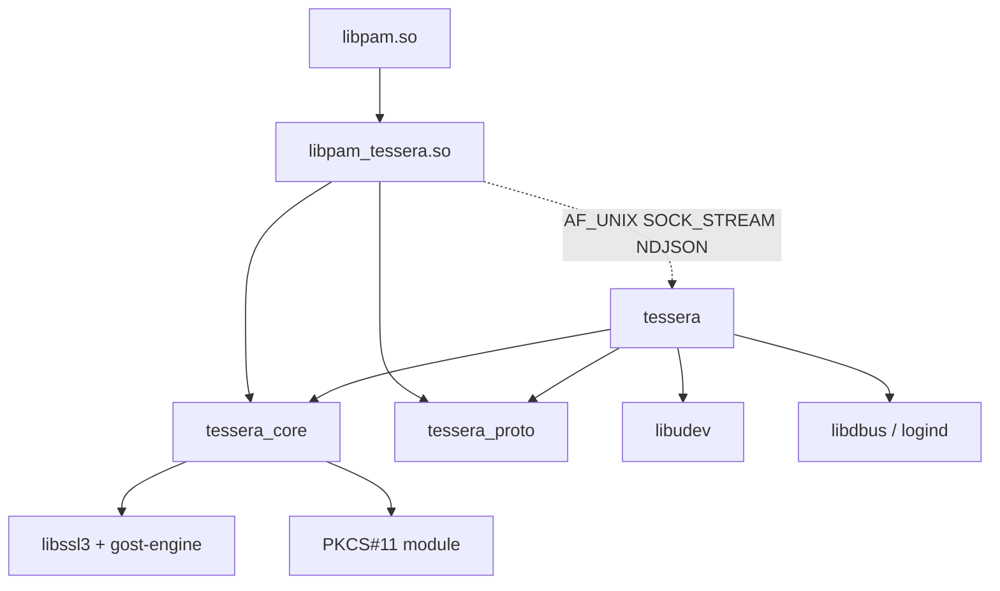
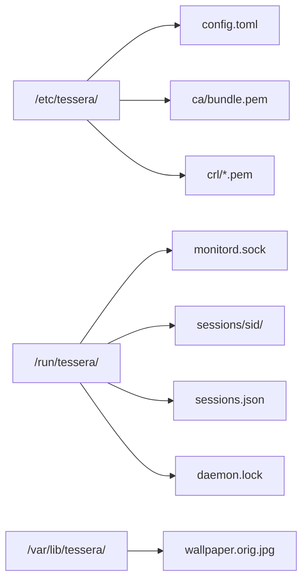
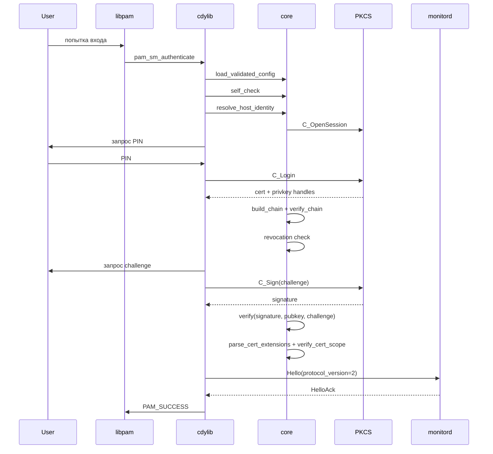
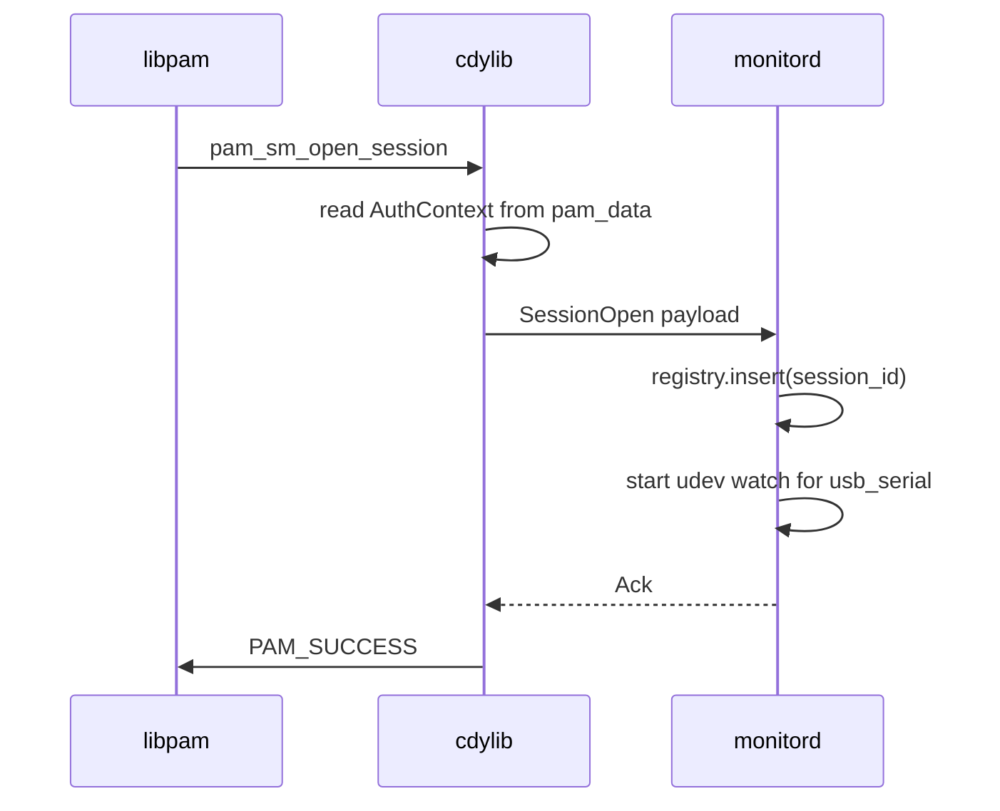
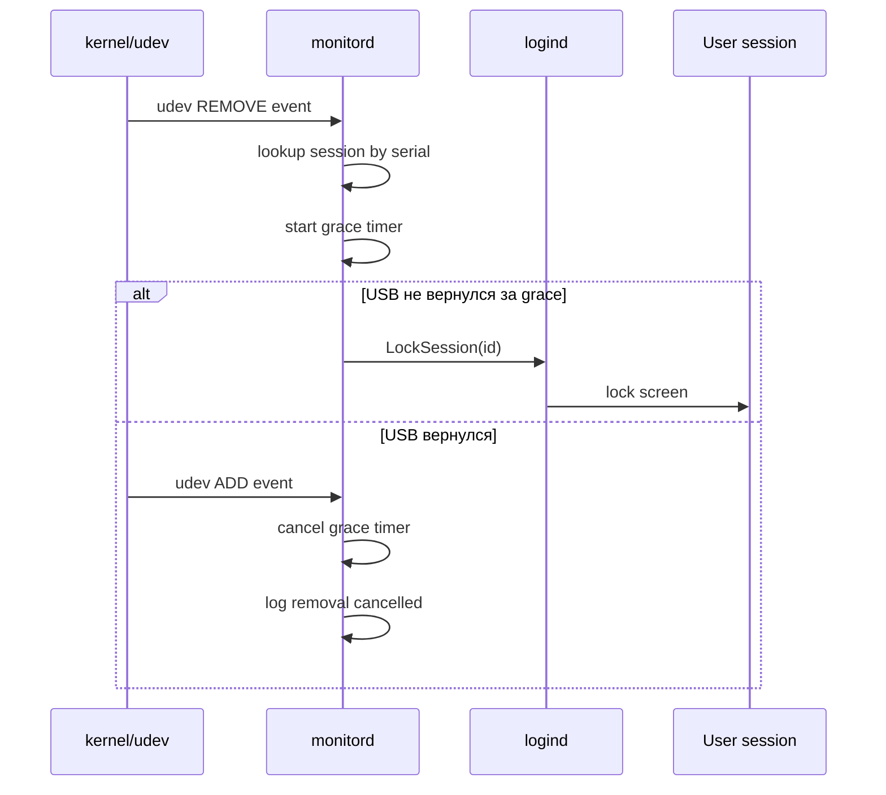
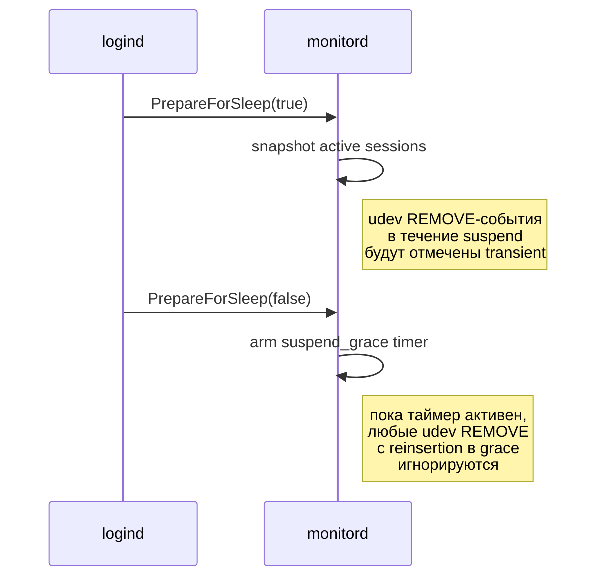

# Архитектура Tessera

Этот документ — единая ссылочная архитектура версии 0.4.0. После
прочтения инженер должен корректно отвечать на вопросы:

- что происходит при вызове `pam_sm_authenticate`?
- что лежит в `/run/tessera/`?
- что делает `monitord` при udev REMOVE-событии?
- как сериализуется IPC и какие сообщения проходят между PAM-модулем
  и `monitord`?

## 1. Цели и не-цели

### 1.1 Что Tessera делает

- Аутентифицирует локального UNIX-пользователя по X.509-сертификату на
  USB-носителе или PKCS#11-токене.
- Привязывает пользователя к машине (host-binding) через X.509 v3
  расширения `pam_cert_host_binding` и `pam_cert_user_binding`,
  встроенные в сам leaf-сертификат.
- Мониторит состояние USB-носителя в течение сессии и реагирует на
  его извлечение (lock / logout / hook / shutdown).
- Корректно обрабатывает suspend/resume.
- Делегирует ГОСТ-криптографию сертифицированному `gost-engine`.

### 1.2 Что Tessera НЕ делает

- Не реализует свою криптографию (всё через OpenSSL и `gost-engine`).
- Не управляет жизненным циклом CA (выпуск/отзыв сертификатов — задача
  внешнего УЦ).
- Не управляет PIN-кодами токенов (это задача администратора и
  пользователя).
- Не защищает от компрометации учётной записи root или ядра ОС (вне TOE).
- Сетевые запросы выполняет только на revocation-пути в OCSP-режимах
  (`mode ∈ {ocsp, crl_then_ocsp}`): синхронный HTTP POST на заданный
  конфигом `ocsp_responder_url`, с жёстким таймаутом и дисковым кэшем.
  В режимах `none`/`crl` сети нет вовсе (offline CRL). Zero-egress
  контуры (терминалы) остаются на `none`/`crl`.

Полное описание границ TOE — в [docs/threat-model.md](threat-model.md).

## 2. Компоненты

`tessera` — это workspace из шести крейтов и одна ОС-интеграция
(systemd, udev, logind). Ниже — четыре runtime-крейта, работающие на
устройстве. Остальные два относятся к выпуску сертификатов:
`tessera_ext` — общие определения X.509-расширений Tessera (OID,
DER-кодеки), используется и ядром, и инструментами выпуска;
`tessera_issuer` — инструменты выпуска; его ядро pure-Rust собирается и
под `wasm32` (внешний веб-кабинет линкует его как WASM-ядро), описано в
[issuer.md](issuer.md).

### 2.1 `tessera_core` (rlib)

Синхронное ядро. Содержит:

- Загрузку и валидацию конфигурации (`config::raw::RawConfig` →
  `config::validated::ValidatedConfig`).
- Парсинг и проверку X.509 (`x509/`).
- Цепочки доверия и проверку CRL (`trust/`, `crl/`).
- Challenge-response (`challenge/`).
- ГОСТ-делегацию через `gost-engine` (`gost/`).
- PKCS#12 и PKCS#11 (`pkcs12/`, `token/`).
- USB-mount и MountGuard RAII (`usb/`, `mount/`).
- Хуки (`hooks/`).
- Host identity chain (`host_identity/`).
- Cert-scope verification — парсинг расширений
  `pam_cert_host_binding` / `pam_cert_user_binding` и сверка их
  записей с `host_id_hash` и `pam_user` (`x509/`, `verify_cert_scope`).
- IPC client side (`ipc/`).

Без `tokio`, без асинхронности. Все операции блокирующие — это
оправдано: PAM-модуль вызывается из синхронного контекста libpam.

### 2.2 `tessera_proto` (rlib)

Wire-протокол IPC между PAM-модулем и демоном. Содержит:

- `ClientMessage` и `ServerMessage` — варианты сообщений
  (`crates/tessera_proto/src/client.rs`, `.../server.rs`).
- `WireError` и encode/decode-функции (`wire.rs`).
- `framing::FramingError` — кадрирование NDJSON.
- `SessionTarget` — кодирует tty/display/logind-id для конкретной
  сессии.
- `PROTOCOL_VERSION` — текущее значение `2`.

`#![forbid(unsafe_code)]` — крейт чисто-safe.

### 2.3 `pam_tessera` (cdylib `libpam_tessera.so`)

PAM service module. Содержит:

- PAM entry points: `pam_sm_authenticate`, `pam_sm_setcred`,
  `pam_sm_acct_mgmt`, `pam_sm_open_session`, `pam_sm_close_session`
  (см. [`crates/pam_tessera/src/entry.rs`](../../crates/pam_tessera/src/entry.rs)).
- Panic guard (`panic_guard.rs`) — каждая C-граница защищена
  `catch_unwind`, panic → `PAM_AUTHINFO_UNAVAIL`.
- DI wiring (`di.rs`) — собирает зависимости ядра из конфига.
- Flow orchestrator (`flow.rs`) — основной авторизационный пайплайн.
- PAM conversation helpers (`pam_conv.rs`).
- Persistent data между `pam_sm_*` вызовами (`data_handle.rs`).

Билдится в `/lib/security/pam_tessera.so` (см.
[`debian/rules`](../../debian/rules)).

### 2.4 `tessera_cli` (бинарь `tessera`)

Мульти-командный CLI: `tessera daemon` (долгоживущий демон, юнит
`tessera.service` со строкой запуска
`/usr/bin/tessera daemon --config /etc/tessera/config.toml`),
`tessera check`, `tessera dump-host-id`, `tessera role`, `tessera tags`,
`tessera enroll`. Демон владеет:

- Сокетом IPC (`/run/tessera/monitord.sock`).
- udev-мониторингом USB-устройств (`udev_monitor.rs`).
- D-Bus подключением к `systemd-logind` (`logind.rs`).
- Реестром активных сессий (`registry.rs`, `state.rs`).

Основан на `tokio` multi-thread (см. `main.rs`). Использует
`sd_notify` для интеграции с systemd `Type=notify`. Билдится в
`/usr/bin/tessera` и поставляется юнитом
[`tessera.service`](../../dist/systemd/tessera.service).

### 2.5 Внешние зависимости

| Компонент             | Источник                              | Доверие                                       |
|-----------------------|---------------------------------------|-----------------------------------------------|
| `libpam0g`            | системный, Astra/Debian repo          | да                                            |
| `libssl3`             | системный, Astra/Debian repo          | да                                            |
| `gost-engine`         | Astra SE 1.7+ (СКЗИ ФСБ)              | да (в составе сертифицированной ОС)           |
| `librtpkcs11ecp.so`   | Рутокен, поставляется отдельно        | да (СКЗИ ФСБ)                                 |
| `libjcPKCS11.so`      | JaCarta, поставляется отдельно        | да (СКЗИ ФСБ)                                 |
| `libudev1`            | системный, Astra/Debian repo          | да                                            |
| `libdbus-1-3`         | системный, Astra/Debian repo          | да                                            |
| `libsystemd0`         | системный, Astra/Debian repo          | да                                            |

> **ГОСТ и PKCS#11.** Подпись ГОСТ-алгоритмами работает только на
> PKCS#12-пути — через `gost-engine` в OpenSSL. На PKCS#11-пути
> (`librtpkcs11ecp.so`, `libjcPKCS11.so`) ГОСТ-механизмы **не
> поддержаны** (crate `cryptoki` не покрывает GOST mechanisms);
> Рутокен/JaCarta на PKCS#11 применимы для RSA/ECDSA-сертификатов.
> Поддержка GOST-на-PKCS#11 — proposal `openspec/changes/gost-pkcs11`.

## 3. Диаграмма зависимостей крейтов



## 4. Жизненный цикл PAM-вызовов

PAM-стек делает несколько вызовов в порядке `auth → account → session`.
`tessera` обрабатывает их все, но реальная работа — в
`pam_sm_authenticate`. Остальные читают сохранённый
`AuthContext` из PAM data.

### 4.1 `pam_sm_authenticate`

1. Распаковать аргументы модуля (`config=...`).
2. Загрузить и валидировать `config.toml` (через
   `tessera_core::config::load_validated_config`). При ошибке —
   `PAM_AUTHINFO_UNAVAIL`.
3. Запустить `self_check` (engine, paths, hooks placeholders). При
   ошибке — `PAM_AUTHINFO_UNAVAIL`.
4. Прочитать `PAM_USER`, `PAM_SERVICE`, `PAM_TTY` из libpam.
5. Через `di::wire` собрать DI-граф (mount, trust, token).
6. Резолвить `host_id` через цепочку источников из конфига и вычислить
   `host_id_hash = sha256(host_id)`.
7. Запустить `flow::authenticate(ctx)`:
   - смонтировать USB или открыть PKCS#11-сессию;
   - найти сертификат, проверить цепь и revocation;
   - challenge-response с приватным ключом;
   - извлечь расширения `pam_cert_host_binding` и
     `pam_cert_user_binding` из leaf-сертификата и сверить их с
     `host_id_hash` и `pam_user` через `verify_cert_scope`.
     **Когда `pam_cert_user_binding` присутствует, это единственный
     источник авторизации для PAM-пользователя** — список
     `[[user_mapping]]` из `config.toml` тогда не читается; при
     отсутствии расширения модуль откатывается на legacy-сравнение
     через `[[user_mapping]]` (коды отказов обоих путей — в §13).
8. При успехе — построить `AuthContext` и сохранить через
   `pam_set_data`.
9. Отправить `Hello` + `SessionOpen` в monitord (получить `Ack`).
10. Вернуть `PAM_SUCCESS`. Любая ошибка маппится в
    `PAM_AUTHINFO_UNAVAIL` / `PAM_PERM_DENIED` / `PAM_MAXTRIES` /
    `PAM_AUTH_ERR` / `PAM_SYSTEM_ERR` по семантике
    [`flow::FlowError::pam_code`](../../crates/pam_tessera/src/flow.rs)
    (таблица — в §13).

### 4.2 `pam_sm_setcred`

Не делает ничего сверх `PAM_SUCCESS`. Сертификаты не размещаются в
keyring пользователя.

### 4.3 `pam_sm_acct_mgmt`

Читает `AuthContext`, проверяет, что:

- `notAfter` сертификата ещё не истёк (с допуском
  `clock_skew_seconds`; значение берётся из конфига в момент
  `pam_sm_authenticate` и сохраняется в `AuthContext`).

При несоответствии возвращает `PAM_ACCT_EXPIRED`.

### 4.4 `pam_sm_open_session`

Читает `AuthContext`. Отправляет в monitord `SessionOpen` с полным
payload'ом (см. `client.rs::SessionOpenPayload`):

- `session_id` (UUID);
- `pam_user`, `pam_service`;
- `target` (Tty / Display / LogindSession);
- `usb_serial` — серийник носителя, авторизовавшего сессию;
- `host_id_hash` — hex SHA-256 от `host_id`;
- `opened_at` — wall-clock unix-время;
- `cert_cn`, `cert_serial`;
- `engineer_ski` — lowercase-hex `SubjectKeyIdentifier` сертификата
  инженера (v2; пустая строка на кадрах v1-клиента);
- `engineer_cert_sha256` — lowercase-hex `SHA-256(cert DER)` leaf'а
  инженера (v2);
- `uid` — Unix-uid, который аутентифицировал PAM-модуль (v2; `0` при
  отсутствии в кадре v1-клиента);
- `role`, `role_version` — id роли и версия среза роли, с которыми
  открыта сессия (опциональные NDJSON-поля v2; сериализуются только
  когда роль выбрана, при `[roles].enforce = false` отсутствуют).

Monitord добавляет сессию в реестр и начинает мониторинг USB.

### 4.5 `pam_sm_close_session`

Отправляет `SessionClose { session_id, closed_at }`. Monitord удаляет
сессию из реестра и **не** триггерит `on_usb_removed` — пользователь
явно завершил сессию.

## 5. Файловая раскладка во время работы

Что `tessera` держит на диске во время работы, кто пишет и кто читает
каждый путь. Схема ниже — общая карта, таблица — точные владельцы и
права доступа.



| Путь                                         | Кто пишет                | Кто читает                     | Права                  |
|----------------------------------------------|--------------------------|--------------------------------|------------------------|
| `/etc/tessera/config.toml`              | администратор            | cdylib + monitord              | `0640 root:root`       |
| `/etc/tessera/ca/bundle.pem`            | администратор            | cdylib + monitord              | `0640 root:root`       |
| `/run/tessera/monitord.sock`            | monitord                 | cdylib                         | `0660 tessera:tessera` |
| `/run/tessera/sessions/<sid>/`          | cdylib                   | удаляет MountGuard на drop     | `0700 root:root`       |
| `/run/tessera/sessions.json`            | monitord                 | monitord (между перезапусками демона в пределах boot; tmpfs, эфемерный) | `0600 tessera:tessera` |
| `/run/tessera/daemon.lock`              | monitord (flock-singleton; рядом с `sessions.json`, fallback `/var/lib/tessera/`) | monitord | —             |
| `/var/cache/tessera/ocsp/*.der`         | cdylib (auth-путь, OCSP-кэш) | cdylib (с ре-верификацией перед использованием) | `0640 root:root` (каталог `0750 root:root`) |

`/run/tessera/` и `/var/lib/tessera/` создаются systemd
через директивы `RuntimeDirectory` и `StateDirectory` юнита
(см. [`tessera.service`](../../dist/systemd/tessera.service)
и [`dist/tmpfiles/tessera.conf`](../../dist/tmpfiles/tessera.conf)).
`/var/cache/tessera/ocsp/` создаёт postinst пакета
([`debian/postinst`](../../debian/postinst)).

## 6. Диаграмма последовательности — `pam_sm_authenticate`, успешный путь с PKCS#11



## 7. Диаграмма последовательности — `pam_sm_open_session` + IPC `SessionOpen`



## 8. Диаграмма последовательности — извлечение USB → grace → lock



Поведение `on_usb_removed`:

- `"lock"` — `LockSession` (по умолчанию).
- `"logout"` — `TerminateSession`.
- `"hook"` — выполняется хук `usb_removed`.
- `"shutdown"` — `PowerOff` через D-Bus к logind.

## 9. Диаграмма последовательности — suspend / resume



При `monitor_fail_mode = "strict"` cdylib ожидает `Ack` от monitord
по таймауту; при `"permissive"` — переживает кратковременную
недоступность.

## 10. IPC wire protocol

### 10.1 Транспорт

- `AF_UNIX` SOCK_STREAM.
- Путь сокета: `/run/tessera/monitord.sock`.
- Права: `0660 tessera:tessera` (см. tmpfiles + systemd
  RuntimeDirectory).
- Аутентификация peer'а: `SO_PEERCRED` — monitord проверяет, что
  `uid == 0`. Любой иной peer закрывается.
- Реализация: [`crates/tessera_cli/src/peercred.rs`](../../crates/tessera_cli/src/peercred.rs).

### 10.2 Кадрирование

Newline-delimited JSON (NDJSON):

- каждый кадр — единственная строка UTF-8 JSON;
- терминатор — единственный байт `\n`;
- максимальный размер кадра — `MAX_FRAME_BYTES = 64 KiB` (см.
  [`crates/tessera_proto/src/wire.rs`](../../crates/tessera_proto/src/wire.rs)).

Обоснование выбора NDJSON:

- стандартные tools (jq, journalctl-форматер) умеют обрабатывать его
  без специальной поддержки;
- кадрирование тривиально — `\n`-разделитель;
- расходы на парсинг JSON оправданы низкой частотой сообщений (≤ 10
  в секунду в типовом дне).

### 10.3 Версионирование

- `PROTOCOL_VERSION: u32 = 2` (см.
  [`crates/tessera_proto/src/version.rs`](../../crates/tessera_proto/src/version.rs)).
  Версия 2 добавила `GetActiveSessionByUid` / `ActiveSession`,
  дополнительные поля `SessionOpen` (`engineer_ski`,
  `engineer_cert_sha256`, `uid`, а также опциональные `role` /
  `role_version`) и код ошибки `NO_ACTIVE_SESSION`
  (1200); кадры v1-клиента без новых полей десериализуются.
- Первый кадр на любом соединении — `Hello { protocol_version }`.
- Если `protocol_version` не равен серверному, monitord отвечает
  `Error { code: 1000 (PROTOCOL_MISMATCH) }` и закрывает соединение.
- Семантика версий: MAJOR-mismatch → разрыв; MINOR (если появятся) —
  best-effort обратная совместимость.

### 10.4 Сообщения

#### Client → Server (`ClientMessage`)

Из [`crates/tessera_proto/src/client.rs`](../../crates/tessera_proto/src/client.rs):

```json
{"type": "hello", "protocol_version": 2, "agent": "libpam_tessera/0.4.0"}
```

```json
{"type": "session_open", "session_id": "1c5e8a90-3b6f-4a1d-9c2e-77f0b1c2d3e4", "pam_user": "alice", "pam_service": "sudo", "target": {"kind": "logind_session", "id": "12"}, "usb_serial": "RUTOKEN-001", "host_id_hash": "ee0bd4f3a3c8e21d4a2b1c0d9e8f7a6b5c4d3e2f1a0b9c8d7e6f5a4b3c2d1e0f", "opened_at": 1735689600, "cert_cn": "Alice", "cert_serial": "01a2b3c4d5e6f70809"}
```

```json
{"type": "session_close", "session_id": "1c5e8a90-3b6f-4a1d-9c2e-77f0b1c2d3e4", "closed_at": 1735689700}
```

```json
{"type": "ping"}
```

#### Server → Client (`ServerMessage`)

Из [`crates/tessera_proto/src/server.rs`](../../crates/tessera_proto/src/server.rs):

```json
{"type": "hello_ack", "server_version": "0.4.0", "protocol_version": 2}
```

```json
{"type": "ack"}
```

```json
{"type": "pong"}
```

```json
{"type": "error", "code": 1000, "message": "protocol version mismatch"}
```

### 10.5 Таймаут и ожидаемые ответы

Раздельных пофреймовых таймаутов нет. Клиент применяет единый
конфигурируемый `monitor.timeout_ms` (дефолт 2000 мс, диапазон
100..=60000 мс) ко всему соединению целиком — значение ставится через
`set_read_timeout` / `set_write_timeout` на сокете в момент
`MonitordClient::connect` (см.
[`crates/tessera_core/src/ipc/client.rs`](../../crates/tessera_core/src/ipc/client.rs))
и покрывает и хендшейк, и все последующие RPC на этом соединении.

| Инициатор | Сообщение      | Получатель | Ожидаемый ответ        | Действие при timeout         |
|-----------|----------------|------------|------------------------|------------------------------|
| client    | `Hello`        | server     | `HelloAck` или `Error` | разрыв соединения            |
| client    | `SessionOpen`  | server     | `Ack` или `Error`      | согласно `monitor_fail_mode` |
| client    | `SessionClose` | server     | `Ack`                  | log + продолжить             |
| client    | `Ping`         | server     | `Pong`                 | log + продолжить             |

### 10.6 Коды ошибок

Из [`crates/tessera_proto/src/server.rs`](../../crates/tessera_proto/src/server.rs):

| Код  | Имя                | Семантика                                                     | Действие cdylib                |
|------|--------------------|---------------------------------------------------------------|--------------------------------|
| 1000 | PROTOCOL_MISMATCH  | Версии протокола не совпали.                                   | fail-closed                    |
| 1001 | DEVICE_GONE        | USB-устройство по `usb_serial` отсутствует.                    | fail-closed                    |
| 1003 | UNAUTHORIZED       | Peer не uid=0 (по `SO_PEERCRED`).                              | разрыв                         |
| 1100 | BAD_REQUEST        | Невалидный кадр (нарушение схемы).                             | разрыв + log                   |
| 1101 | PROTOCOL_VIOLATION | Нарушение wire-протокола: oversize-кадр, idle-таймаут и т.п. Сервер закрывает соединение после отправки. | разрыв + log |
| 1200 | NO_ACTIVE_SESSION  | Нет активной сессии для запрошенного uid (ответ v2-демона на `GetActiveSessionByUid`). | штатный «не найдено» |
| 1500 | INTERNAL           | Внутренняя ошибка демона.                                      | по `monitor_fail_mode`         |

`DEVICE_GONE` и `UNAUTHORIZED` фатальны всегда — они меняют вердикт
аутентификации и пробрасываются даже в `permissive`
(`ipc/failmode.rs`). Остальные ошибки — по политике
`monitor_fail_mode` на конкретном call-site; на auth-пути сбой
уведомления monitord не отменяет уже состоявшийся успех
аутентификации (см. §13).

### 10.7 JSON-схема `SessionOpenPayload`

```json
{
  "title": "SessionOpenPayload",
  "type": "object",
  "properties": {
    "session_id":   {"type": "string", "format": "uuid"},
    "pam_user":     {"type": "string"},
    "pam_service":  {"type": "string"},
    "target":       {"type": "object"},
    "usb_serial":   {"type": ["string", "null"]},
    "host_id_hash": {"type": "string", "pattern": "^[0-9a-f]{64}$"},
    "opened_at":    {"type": "integer"},
    "cert_cn":      {"type": "string"},
    "cert_serial":  {"type": "string", "pattern": "^[0-9a-f]+$"},
    "engineer_ski":         {"type": "string", "pattern": "^[0-9a-f]*$"},
    "engineer_cert_sha256": {"type": "string", "pattern": "^[0-9a-f]*$"},
    "uid":                  {"type": "integer"},
    "role":                 {"type": ["string", "null"]},
    "role_version":         {"type": ["integer", "null"]}
  },
  "required": ["session_id", "pam_user", "pam_service", "target", "host_id_hash", "opened_at", "cert_cn", "cert_serial"]
}
```

Поля `engineer_ski`, `engineer_cert_sha256`, `uid` — из версии 2:
v2-клиент их всегда сериализует, а кадр v1-клиента без них
десериализуется в значения по умолчанию (пустая строка / `0`), поэтому
в `required` они не вынесены. `role` / `role_version` присутствуют
только когда сессия открыта с ролью.

## 11. Threading и concurrency model

### 11.1 cdylib

- Полностью синхронный, без `tokio`.
- Соединение с monitord — единственное per `pam_sm_*` вызов;
  закрывается после ответа.
- Без shared mutable state: каждый PAM-вызов имеет собственный
  `flow::Context`.

### 11.2 monitord

- `tokio` multi-thread runtime (количество worker threads —
  по умолчанию системный default tokio).
- На каждое входящее соединение — отдельная задача
  (`server.rs::handle_connection`).
- Реестр сессий — `Mutex<RegistryStore>` (см. `registry.rs`).
- udev и logind — свои dedicated long-running tasks.
- Запись `/run/tessera/sessions.json` — atomic-rename через
  tempfile (без flock; от двойного запуска демона защищает
  отдельный singleton-замок `daemon.lock`). Файл лежит на tmpfs
  (`RuntimeDirectory=tessera`),
  намеренно эфемерный: реестр нужен только между перезапусками демона
  в пределах одного boot — все процессы, держащие эти сессии (sshd/login/
  sudo), всё равно умирают на reboot.

### 11.3 Совместный доступ к `/run/tessera/sessions/`

- cdylib создаёт каталог `<sid>` через `MountGuard::new` (RAII).
- Удаляет каталог в `Drop` (или в `pam_sm_close_session`).
- monitord не пишет в этот каталог напрямую — только читает при
  диагностике.

## 12. Host identity chain

`host_id` вычисляется в момент `pam_sm_authenticate` через цепочку
источников из секции `[host_identity]`. Реализация —
[`crates/tessera_core/src/host_identity/chain.rs`](../../crates/tessera_core/src/host_identity/chain.rs).

Источники в порядке предпочтения:

1. `machine_id` — `/etc/machine-id` (стабилен между перезагрузками,
   меняется при переустановке).
2. `dmi_board_serial` — `/sys/class/dmi/id/board_serial` (стабилен на
   уровне железа, меняется при замене материнской платы).
3. `dmi_system_uuid` / `dmi_system_serial` — DMI-идентификаторы
   системы (стабильность зависит от вендора/гипервизора).
4. `hostname` — `/etc/hostname` (нестабилен, легко подменяется; OK для
   тестов).
5. `custom_command` — администраторский скрипт.
6. `override` — фиксированное значение из конфига (bootstrap/тесты).

Цепочка обходится в указанном `sources` порядке. Первый непустой
результат — победитель. Если все источники пустые:

- `fallback = "deny"` → `PAM_AUTH_ERR` (production по умолчанию);
- `fallback = "warn"` → `PAM_SUCCESS` с warning-логом (тестовое окружение);
- `fallback = "allow"` → `PAM_SUCCESS` молча (опасно, не использовать).

## 13. Fail-closed правила

Модуль спроектирован fail-closed: отказ любой проверки сертификата
(цепочка доверия, отзыв, challenge-response, привязка host/user) ведёт
к отказу во входе, а не к пропуску. Таблица ниже перечисляет условия и
PAM-коды, которые получает стек; единственное осознанное исключение —
недоступность monitord не отменяет уже состоявшийся успех
аутентификации — вынесено в «Принципы» под таблицей.

| #  | Условие                                                       | Возврат                |
|----|---------------------------------------------------------------|------------------------|
| 1  | panic в любом `pam_sm_*`                                       | `PAM_AUTHINFO_UNAVAIL` (9) |
| 2  | загрузка `config.toml` упала                                   | `PAM_AUTHINFO_UNAVAIL` (9) |
| 3  | `self_check` упал (engine, paths, hooks)                       | `PAM_AUTHINFO_UNAVAIL` (9) |
| 4  | USB/mount/discovery не дали носителя, PKCS#11-модуль не загрузился | `PAM_AUTHINFO_UNAVAIL` (9) |
| 5  | сертификат не проходит chain verification                      | `PAM_PERM_DENIED` (6)  |
| 6  | revocation check провалился (`crl`: серийник в CRL, CRL отсутствует/несвежа; `ocsp`/`crl_then_ocsp`: responder недоступен, таймаут, статус `unknown`/`revoked`, подпись ответа невалидна) | `PAM_PERM_DENIED` (6) |
| 7  | challenge-response не сошёлся                                  | `PAM_PERM_DENIED` (6)  |
| 8  | legacy `[[user_mapping]]` не дал совпадения                    | `PAM_PERM_DENIED` (6)  |
| 9  | исчерпан лимит попыток PIN (`MaxTries`, `PinLocked`)           | `PAM_MAXTRIES` (8)     |
| 10 | расширение `pam_cert_host_binding` отсутствует или невалидно   | `PAM_AUTH_ERR` (7)     |
| 11 | host_id_hash не входит в записи `pam_cert_host_binding`        | `PAM_AUTH_ERR` (7)     |
| 12 | расширение `pam_cert_user_binding` отсутствует или невалидно   | `PAM_AUTH_ERR` (7)     |
| 13 | `pam_user` не входит в записи `pam_cert_user_binding`          | `PAM_AUTH_ERR` (7)     |
| 14 | единичная ошибка PIN, ошибка PAM conversation, отказ хука      | `PAM_AUTH_ERR` (7)     |
| 15 | нарушение внутренних инвариантов (`Internal`)                  | `PAM_SYSTEM_ERR` (4)   |
| 16 | `Error` из monitord с `code = DEVICE_GONE` / `UNAUTHORIZED`    | пробрасывается всегда, даже в `permissive` |

Полная таблица соответствия `FlowError` → PAM-код — doc-comment
`FlowError::pam_code` в
[`crates/pam_tessera/src/flow.rs`](../../crates/pam_tessera/src/flow.rs).

Принципы:

- panic'и и инфраструктурные ошибки → `PAM_AUTHINFO_UNAVAIL`
  (сообщает PAM-стеку: «следующий модуль может попробовать»).
- Отказы криптографической проверки (цепь, revocation,
  challenge-response, mapping) → `PAM_PERM_DENIED`; отказы
  cert-scope (`pam_cert_host_binding` / `pam_cert_user_binding`) и
  прочие auth-ошибки → `PAM_AUTH_ERR`; исчерпанный PIN-бюджет →
  `PAM_MAXTRIES`.
- **Недоступность monitord не делает auth fail-closed** даже при
  `monitor_fail_mode = "strict"`: фатальны (меняют вердикт) только
  `DEVICE_GONE` и `UNAUTHORIZED`
  (`crates/tessera_core/src/ipc/failmode.rs`); транспортные ошибки
  IPC на auth-пути логируются как non-fatal — уведомление monitord
  идёт после уже состоявшегося успеха аутентификации. `strict` /
  `permissive` управляют лишь тем, пробрасывает ли обёртка
  `FailModeWrapper` нефатальные ошибки IPC вызывающему коду.

## 14. Журналирование `tracing` → syslog / journald

cdylib `pam_tessera.so` логирует в **syslog**, а не в stderr: libpam
отбрасывает stderr модуля, поэтому на stderr production-диагностика
недоступна. `tracing`-подписчик строится в момент первого вызова
`pam_sm_*` и шлёт записи в syslog через `LOG_AUTH` facility с ident
`tessera`. На системах с journald эти строки видны через
`journalctl -t tessera` и попадают в `/var/log/auth.log` (на обычном
syslog-стеке) с префиксом `tessera[<pid>]:`. (Переход с stderr на
syslog — 0.1.1, см. [changelog.md](changelog.md).)

`tessera` использует `tracing-journald` и пишет в
journald через нативный `Type=notify`-канал. На SysV-init хостах без
journald записи `tracing` уходят в stderr демона; куда они попадут
дальше — определяется тем, как init-скрипт перенаправляет stderr
(в стандартной поставке `start-stop-daemon` отдаёт stderr системному
syslog'у через `logger`).

Полная семантика того, что и на каком уровне логируется, — в
[docs/operations.md §6](operations.md).

## 15. Дальнейшее чтение

- [docs/threat-model.md](threat-model.md) — какие угрозы покрывает
  каждый из этих fail-closed правил.
- [docs/configuration.md](configuration.md) — какие поля влияют на
  поведение, описанное здесь.
- [docs/operations.md](operations.md) — как читать журнал и
  диагностировать аномалии.
