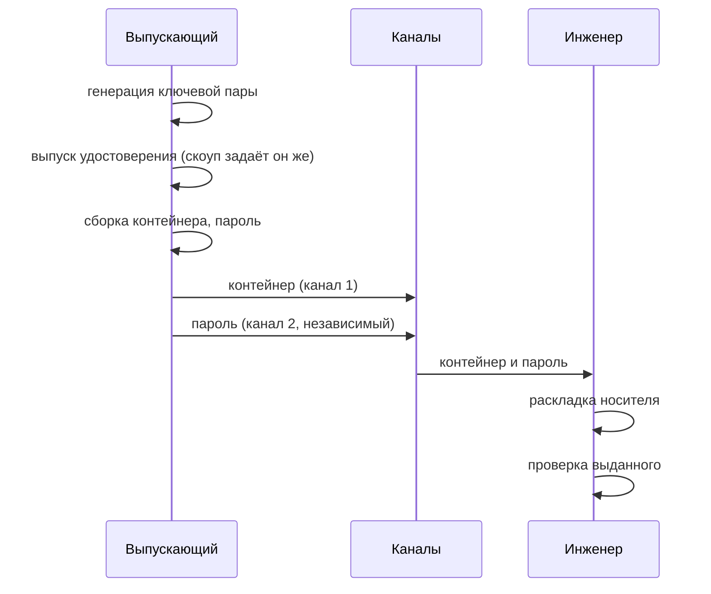

# Выпуск с ключом на стороне выпускающего (П1, П3)

Выпускающий порождает ключевую пару, выпускает удостоверение, собирает контейнер
и передаёт инженеру контейнер и пароль к нему — разными каналами. Инженер кладёт
контейнер на носитель.

От инженера не требуется ни инструмента, ни квалификации. Цена — закрытый ключ
известен двум сторонам и пересекает границу между ними: доказать, что действия
совершил именно инженер, в этом процессе нельзя.

Процесс П3 отличается от П1 только последним шагом: контейнер кладётся не на
флешку, а на пассивный токен.

## Кто что делает



## Шаг 1. Выпуск с генерацией ключа

Выпускающий выполняет на своём рабочем месте:

```sh
issuer issue-leaf \
    --backend pkcs11 --module /usr/lib/librtpkcs11ecp.so --key org-ca \
    --parent org-ca.pem \
    --generate-key --key-type ecdsa-p256 \
    --subject "CN=ivanov,O=Org" \
    --host-binding sha256:3f2a... \
    --role operator \
    --not-before 1767225600 --not-after 1767239999 \
    --out-p12 ivanov.p12
```

Что происходит:

- порождается ключевая пара; закрытый ключ существует только в памяти и в
  итоговом контейнере — отдельным файлом он не сохраняется;
- собирается и подписывается удостоверение; рамки делегирования проверяются на
  монотонность и пригодность **до** подписи;
- собирается контейнер: закрытый ключ в зашифрованной части, сертификат — в
  незашифрованной (от этого зависит диагностика на экране входа, отличающая
  «не тот носитель» от «неверный пароль»);
- контейнер перечитывается и сверяется с исходными ключом и сертификатом;
- выдача записывается в журнал выпусков с пометкой, что ключ породил
  выпускающий.

Пароль контейнера по умолчанию порождает сам инструмент и показывает **один
раз** — повторно он не восстанавливается. Свой пароль задаётся интерактивно или
неинтерактивным источником — см. [issuer.md](issuer.md); значением аргумента
командной строки пароль не передаётся, потому что аргументы видны в списке
процессов.

## Шаг 2. Передача инженеру

Контейнер и пароль доставляются **разными каналами**. Например, контейнер —
через файловый обмен организации, пароль — по другому каналу связи. Письмо,
содержащее и то и другое, обесценивает защиту контейнера полностью.

Ни контейнер, ни пароль не хранятся у выпускающего после передачи: инструмент не
ведёт хранилища выданных контейнеров.

## Шаг 3. Раскладка носителя

Инженер (или выпускающий, если носитель готовит он) раскладывает артефакты:

```sh
# П1 — флешка
issuer prepare-carrier --p12 ivanov.p12 --chain chain.pem --media /mnt/usb

# П3 — пассивный токен
issuer prepare-carrier --p12 ivanov.p12 \
    --module /usr/lib/librtpkcs11ecp.so --object-label tessera-credential
```

Артефакты кладутся туда, где их ищет проверка на устройстве: `certs/user.p12` и
`certs/chain.pem` на флешке, приватный объект данных на токене. Правка
конфигурации устройства при этом не требуется.

Для токена запись проверяется обратным чтением: превышение размера объекта на
пассивных токенах не сообщается кодом возврата — подробности в
[carriers.md](carriers.md#пассивный-токен). Перезапись существующего контейнера
требует подтверждения: на носителе может лежать действующее удостоверение
другого инженера.

## Шаг 4. Проверка перед выездом

```sh
issuer accept --verify-only --media /mnt/usb --chain chain.pem
```

Проверяется соответствие сертификата ключу, сходимость цепочки до корня парка,
срок действия, наличие роли, версия профиля и обязательные расширения. Значение
привязки к устройству показывается, но проверенным не считается — инженер
работает не на том устройстве, для которого выпущено удостоверение. Если
ожидаемая привязка известна, её передают явно:

```sh
issuer accept --verify-only --media /mnt/usb --chain chain.pem \
    --expect-host sha256:3f2a...
```

## Когда этот процесс уместен

Когда инженеров много, состав их меняется, а ставить инструмент на их рабочие
места некому. Взамен принимаются два свойства: закрытый ключ известен
выпускающему, и авторство действий инженера недоказуемо.

Если эти свойства неприемлемы, смотрите
[issuance-engineer-key.md](issuance-engineer-key.md) — там ключ не покидает
инженера, — или [issuance-token-key.md](issuance-token-key.md), где ключ вообще
не покидает устройства.

## См. также

- [issuance-workflows.md](issuance-workflows.md) — сравнение процессов
- [cert-issuance.md](cert-issuance.md) — привязки, роли, потолок уровня целостности
- [issuer.md](issuer.md) — бэкенды подписи, журнал выпусков, источники секретов
