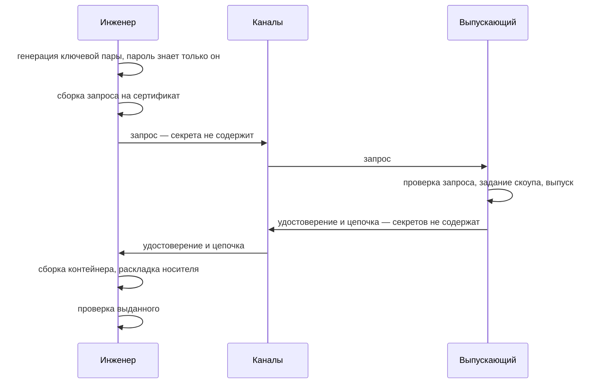

# Выпуск по запросу инженера, программный ключ (П2, П4)

Инженер порождает ключевую пару на своём рабочем месте и отправляет выпускающему
запрос на сертификат. Выпускающий задаёт скоуп и выпускает удостоверение.
Инженер собирает контейнер и раскладывает носитель.

Закрытый ключ не покидает рабочее место инженера. По каналам не передаётся ни
одного секрета.

Процесс П4 отличается от П2 только последним шагом: контейнер кладётся не на
флешку, а на пассивный токен. Ключ при этом всё равно рождается на рабочем месте
инженера — пассивный токен добавляет PIN поверх контейнера, но не делает ключ
неизвлекаемым.

## Кто что делает



## Шаг 1. Запрос на сертификат

Инженер выполняет на своём рабочем месте:

```sh
issuer request \
    --key-type ecdsa-p256 \
    --subject "CN=ivanov,O=Org" \
    --key-out ivanov.key.p8 \
    --out ivanov.csr.pem
```

Ключевая пара порождается тут же, запрос подписывается ею же — доказательство
владения ключом верно по построению. Закрытый ключ сохраняется **только
зашифрованным**, под паролем, который знает лишь инженер; права на файл
закрываются для группы и остальных.

Инструмент печатает отпечаток запроса — он понадобится на шаге 2.

## Шаг 2. Передача запроса и подлинность

Запрос на сертификат не содержит секретов: в нём открытый ключ, имя и подпись,
доказывающая владение закрытым ключом. Поэтому канал передачи **не обязан быть
защищённым от прослушивания** — подойдёт корпоративная почта, мессенджер,
файлообменник, тикет в системе заявок.

Из этого следует главное организационное свойство процесса: **носитель инженера
никуда не везут**. Ни флешку, ни токен не нужно приносить к машине выпускающего
или в офис — инженер может находиться в другом городе, а обмен идти обычной
перепиской.

Конфиденциальность каналу не нужна, а вот подлинность — нужна. Перехвативший
переписку не получает ничего, но подменивший запрос своим добьётся того, что
удостоверение с рамками инженера будет выпущено на чужой ключ. Поэтому
выпускающий убеждается, что запрос пришёл от того, от кого должен: сверяет
отпечаток запроса с инженером по независимому каналу либо полагается на канал,
подтверждающий отправителя (система заявок с аутентификацией, подписанное
письмо).

## Шаг 3. Выпуск

Выпускающий выполняет:

```sh
issuer issue-leaf \
    --backend pkcs11 --module /usr/lib/librtpkcs11ecp.so --key org-ca \
    --parent org-ca.pem \
    --csr ivanov.csr.pem \
    --host sha256:3f2a... \
    --role operator \
    --not-before 1767225600 --not-after 1767239999 \
    --out ivanov.crt.pem
```

Из запроса берутся только открытый ключ и субъект. Скоуп — привязки, роли,
потолок уровня целостности, срок — задаёт выпускающий. Если в запросе что-то
запрошено, инструмент это покажет с пометкой «запрошено в запросе», но на состав
расширений не повлияет: иначе запрос стал бы каналом «инженер сам назначил себе
права».

Подпись запроса проверяется до выпуска; запрос с испорченной подписью
отвергается.

Выпущенное удостоверение и цепочку отправляют инженеру — снова любым каналом, они
секретов не содержат.

## Шаг 4. Приём и раскладка носителя

```sh
# П2 — флешка
issuer accept \
    --cert ivanov.crt.pem --chain chain.pem \
    --key ivanov.key.p8 \
    --media /mnt/usb

# П4 — пассивный токен
issuer accept \
    --cert ivanov.crt.pem --chain chain.pem \
    --key ivanov.key.p8 \
    --module /usr/lib/librtpkcs11ecp.so --object-label tessera-credential
```

До записи на носитель проверяется: соответствует ли сертификат имеющемуся
закрытому ключу, сходится ли цепочка до корня парка, не истёк ли срок, есть ли
роль, поддерживается ли версия профиля, на месте ли обязательные расширения.
Непрошедшая проверка прерывает операцию — на носитель ничего не пишется.

Значение привязки к устройству показывается, но проверенным не считается: инженер
работает не на том устройстве. Ожидаемое значение передаётся явно флагом
`--expect-host`, и тогда расхождение прерывает операцию.

После записи артефакты перечитываются с носителя и сверяются с исходными.

## Когда этот процесс уместен

Когда на рабочие места инженеров можно поставить инструмент, а аппаратных токенов
нет или они не нужны. Ключ не покидает инженера, обмен идёт обычной перепиской,
носители никуда не возят.

Ограничение процесса: ключ остаётся извлекаемым — контейнер можно скопировать
вместе с ключом, зная пароль. Если это неприемлемо, смотрите
[issuance-token-key.md](issuance-token-key.md).

## См. также

- [issuance-workflows.md](issuance-workflows.md) — сравнение процессов
- [carriers.md](carriers.md) — свойства флешки и пассивного токена
- [issuer.md](issuer.md) — бэкенды подписи, журнал выпусков
- [Tessera Access](https://tessera-access.ru/access/) — обзор продукта:
  делегирование, отзыв, работа без постоянной сети
