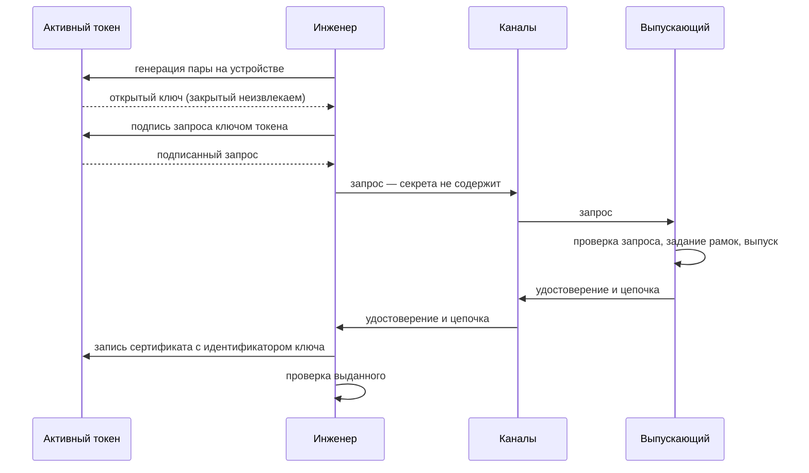

# Выпуск по запросу инженера, ключ на активном токене (П5)

Ключевая пара порождается внутри активного токена и закрытая часть не покидает
устройство никогда. Инженер отправляет выпускающему запрос на сертификат,
подписанный ключом токена, получает удостоверение и записывает его на тот же
токен.

Это единственный процесс, в котором закрытый ключ не покидает устройство:
скопировать удостоверение вместе с ключом нельзя, потому что ключ физически не
извлекается. Найденный токен нельзя размножить — им можно только пользоваться,
и то лишь зная PIN. Контейнера и пароля к нему в этом процессе нет вовсе.

## Кто что делает



## Шаг 1. Генерация ключа и запрос

Инженер выполняет на своём рабочем месте, с подключённым токеном:

```sh
issuer request \
    --module /usr/lib/librtpkcs11ecp.so \
    --key-label ivanov-shift --key-type ecdsa-p256 \
    --subject "CN=ivanov,O=Org" \
    --out ivanov.csr.pem
```

Пара порождается на устройстве с атрибутами, делающими закрытый ключ
неизвлекаемым и непрочитываемым. Фактически установленные атрибуты **читаются
обратно с устройства** и сверяются с запрошенными: провайдеры токенов известны
тем, что сообщают об успехе операции, выполнив её не полностью. Если устройство
проигнорировало шаблон и ключ оказался извлекаемым, операция прерывается — до
того, как на такой ключ будет выпущено удостоверение.

Иначе ошибка обнаружилась бы на экране входа: проверка на устройстве отвергает
извлекаемый ключ, и вход не состоялся бы у самого терминала.

Запрос подписывается тем же ключом, который только что порождён, поэтому
доказательство владения верно по построению. Если на токене уже есть ключ с
такой меткой, генерация потребует подтверждения.

Токен без криптографии (пассивный, например Рутокен Lite) для этого процесса не
годится: у него нет механизмов подписи. Операция откажет с указанием, что
устройство пригодно только как носитель контейнера — см.
[carriers.md](carriers.md#пассивный-токен).

## Шаг 2. Передача запроса и подлинность

Запрос секретов не содержит: открытый ключ, имя, подпись. Канал **не обязан быть
защищённым от прослушивания** — годятся корпоративная почта, мессенджер,
файлообменник, система заявок.

Отсюда главное организационное следствие: **токен инженера никуда не везут**. Его
не нужно приносить к машине выпускающего, в офис или в удостоверяющий центр.
Инженер может находиться в другом городе; токен всё время остаётся у него, а
обмен идёт обычной перепиской. Ключ, который никогда не покидал устройство,
не покидает его и во время выпуска.

Конфиденциальность каналу не нужна, подлинность — нужна. Перехвативший переписку
не получает ничего, но подменивший запрос добьётся выпуска удостоверения с
рамками инженера на чужой ключ. Поэтому выпускающий убеждается в отправителе:
сверяет отпечаток запроса по независимому каналу либо использует канал,
подтверждающий отправителя.

## Шаг 3. Выпуск

Выпускающий выполняет то же, что и для программного ключа:

```sh
issuer issue-leaf \
    --backend pkcs11 --module /usr/lib/librtpkcs11ecp.so --key org-ca \
    --parent org-ca.pem \
    --csr ivanov.csr.pem \
    --host sha256:3f2a... \
    --role operator \
    --not-before 1767225600 --not-after 1767239999 \
    --out ivanov.crt.pem
```

Из запроса берутся только открытый ключ и субъект; рамки задаёт выпускающий.
Подробнее — [issuance-engineer-key.md](issuance-engineer-key.md#шаг-3-выпуск).

## Шаг 4. Запись удостоверения на токен

```sh
issuer accept \
    --cert ivanov.crt.pem --chain chain.pem \
    --module /usr/lib/librtpkcs11ecp.so --key-label ivanov-shift
```

До записи проверяется: соответствует ли сертификат ключу на токене, сходится ли
цепочка до корня парка, не истёк ли срок, есть ли роль, поддерживается ли версия
профиля, на месте ли обязательные расширения. Непрошедшая проверка прерывает
операцию — на токен ничего не пишется.

Сертификат записывается с тем же идентификатором, что у ключа: проверка на
устройстве ищет сертификат, а закрытый ключ — по идентификатору этого
сертификата. Разойдись они, вход не найдёт ключ. После записи объект
перечитывается и сверяется с исходным.

Значение привязки к устройству показывается, но проверенным не считается; для
сверки передают ожидаемое значение флагом `--expect-host`.

## Что даёт этот процесс

- Закрытый ключ не существует вне токена ни в один момент времени.
- Потерянный или украденный токен нельзя скопировать: ключ из него не
  извлекается. Воспользоваться им можно, только зная PIN, а неверный PIN
  блокирует устройство аппаратным счётчиком; отзыв прекращает доступ.
- Второй фактор аппаратный, а не «файл плюс пароль».
- Доказуемость авторства: подписать могло только само устройство.

Ограничения: нужны активные токены и инструмент на рабочем месте инженера. Подпись
ключом ГОСТ на входе сейчас не поддерживается — используются RSA и кривые P-256
и P-384.

## См. также

- [issuance-workflows.md](issuance-workflows.md) — сравнение процессов
- [carriers.md](carriers.md#активный-токен) — свойства активных токенов
- [issuer.md](issuer.md) — бэкенды подписи, журнал выпусков
- [Tessera Access](https://tessera-access.ru/access/) — обзор продукта;
  [Tessera Codes](https://tessera-access.ru/codes/) — вариант без носителя,
  когда выдавать токены нецелесообразно
