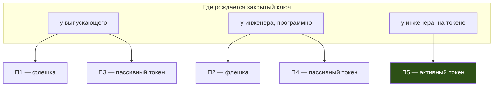

# Процессы выпуска: какой выбрать

Удостоверение инженера можно выпустить пятью разными способами. Они отличаются
не удобством, а тем, кто в итоге знает закрытый ключ и что едет по каналам
связи. Эта страница помогает выбрать; пошаговые инструкции — на отдельных
страницах, ссылки ниже.

Обзор продукта целиком — [Tessera Access](https://tessera-access.ru/access/);
вход по одноразовым кодам вместо носителя, если токенов нет вовсе, —
[Tessera Codes](https://tessera-access.ru/codes/).

## Две оси

Процесс определяется двумя независимыми признаками.

**Где рождается закрытый ключ** — главный признак. Он задаёт, сколько секретов
передаётся между людьми и можно ли потом доказать, что удостоверением
пользовался именно тот инженер, которому оно выдано.

**Носитель** — второй признак. Он определяет только то, кто может физически
добраться до удостоверения. Носитель не делает ключ неизвлекаемым: у пассивного
токена ключ такой же извлекаемый, как на флешке.

## Пять процессов

| Процесс | Ключ рождается | Носитель | Ключ извлекаем | Страница |
| --- | --- | --- | --- | --- |
| П1 | у выпускающего | флешка | да | [issuance-central-key.md](issuance-central-key.md) |
| П3 | у выпускающего | пассивный токен | да | [issuance-central-key.md](issuance-central-key.md) |
| П2 | у инженера, программно | флешка | да | [issuance-engineer-key.md](issuance-engineer-key.md) |
| П4 | у инженера, программно | пассивный токен | да | [issuance-engineer-key.md](issuance-engineer-key.md) |
| П5 | у инженера, на активном токене | активный токен | **нет** | [issuance-token-key.md](issuance-token-key.md) |

## Что различается на самом деле

| | Ключ у выпускающего (П1, П3) | Ключ у инженера (П2, П4) | Ключ на токене (П5) |
| --- | --- | --- | --- |
| Секретов в каналах | закрытый ключ и пароль | ни одного | ни одного |
| Кто знает ключ | выпускающий и инженер | только инженер | никто, ключ не покидает токен |
| Доказуемость авторства | недостижима | достижима | достижима |
| Если носитель потерян | ключ утёк, нужен отзыв | ключ утёк, нужен отзыв | ключ не утёк, отзыв по регламенту |
| Если скомпрометирован выпускающий | утекают все выданные ключи | утекает право выпускать новые | утекает право выпускать новые |
| Что нужно инженеру | получить два артефакта | инструмент на рабочем месте | инструмент и активный токен |

Права во всех пяти процессах назначает выпускающий. Инженер не может расширить
себе роли или привязки, даже если запросит их в запросе на сертификат: запрошенное
показывается, но не применяется. Выбор процесса — это решение о владении ключом,
а не о том, кто управляет правами.

Роль в удостоверении — это имя учётной записи входа на устройстве. Сами ролевые
учётные записи, группы и `sudoers` на парке приводит к единой подписанной
декларации отдельный продукт — [Census](https://tessera-access.ru/census/); он
работает вне пути входа и удостоверений не выпускает.

## Что едет по каналам

| Артефакт | Содержит секрет | Требование к каналу |
| --- | --- | --- |
| Запрос на сертификат | нет | целостность |
| Выпущенное удостоверение | нет | целостность |
| Цепочка доверия, список отзыва | нет | целостность |
| Контейнер PKCS#12 | **да** — закрытый ключ | конфиденциальность и целостность |
| Пароль контейнера, PIN | **да** | канал, отличный от канала контейнера |

В процессах П1 и П3 контейнер и пароль к нему доставляются **разными каналами**.
Письмо, в котором лежит и то и другое, сводит защиту контейнера к нулю: тот, кто
прочитал письмо, получил рабочее удостоверение.

В процессах П2, П4 и П5 по каналам не передаётся ни одного секрета — перехват
переписки не даёт ничего.

## Как выбирать

**П1 и П3** подходят, когда инженеров много, они меняются, а ставить им
инструмент на рабочие места некому. Цена — два секрета в каналах и невозможность
доказать авторство действий.

**П2 и П4** подходят, когда инструмент на рабочем месте инженера поставить можно,
но аппаратных токенов нет. Ключ не покидает инженера, по каналам не идёт ничего
секретного.

**П5** — единственный процесс, где потеря носителя не означает утечки ключа.
Он же единственный, где второй фактор аппаратный. Требует активных токенов и
инструмента у инженера.

Процесс П4 — частный случай П2: ключ всё равно рождается на рабочем месте
инженера, а пассивный токен добавляет только PIN поверх контейнера. Он описан
на той же странице, что и П2.

## Проверка выданного до выезда

Во всех процессах инженер проверяет выданное удостоверение на рабочем месте:
соответствует ли оно ключу, сходится ли цепочка, не истёк ли срок, есть ли роль,
на месте ли обязательные расширения. Без этого шага непригодное удостоверение
обнаружится на экране входа — у устройства, где исправить его нечем.

Привязку к устройству на рабочем месте инженера проверить нельзя: он работает не
на том устройстве, для которого выпущено удостоверение. Инструмент показывает
значение привязки, а сверяет его только с тем, что задано явно.

## Учёт выдачи

Каждая выдача попадает в журнал выпусков со сцепленной хеш-цепочкой — независимо
от процесса. По журналу видно, кому, когда и с какими рамками выдано
удостоверение, без обращения к самим носителям. Подробности —
[issuer.md](issuer.md).

## См. также

- [carriers.md](carriers.md) — виды носителей, их свойства и ограничения
- [cert-issuance.md](cert-issuance.md) — расширения сертификата, привязки и роли
- [issuer.md](issuer.md) — инструменты выпуска и бэкенды подписи
- [compliance-mapping.md](compliance-mapping.md) — какие меры стандартов
  поддерживают процессы выпуска
- [tessera-access.ru](https://tessera-access.ru/) — обзор продуктов Tessera;
  [Access](https://tessera-access.ru/access/) — вход по удостоверениям,
  [Codes](https://tessera-access.ru/codes/) — вход по одноразовым кодам,
  [Census](https://tessera-access.ru/census/) — приведение парка к декларации
