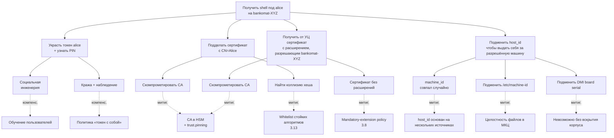

# Модель угроз Tessera

Каждая угроза сопровождается ссылкой на источник evidence: путь к коду,
имя поля в конфиге или ссылка на тест, доказывающий заявленное свойство.

## 1. Введение

### 1.1 Целевой объект (TOE)

Под `tessera` понимается:

- PAM-модуль `libpam_tessera.so` (cdylib);
- демон `tessera` (бинарь);
- крейты ядра `tessera_core` и протокола `tessera_proto`;
- поставочные конфигурационные файлы `dist/config/*.example`;
- systemd-юнит и tmpfiles-сниппет;
- скрипт интеграции `dist/scripts/integrate-pam.sh`.

В TOE **не входят:**

- ядро Astra Linux SE;
- libpam, libssl3, libudev, libdbus, libsystemd;
- `gost-engine` (отдельное СКЗИ ФСБ);
- PKCS#11-модули вендоров токенов (отдельные СКЗИ ФСБ);
- пользовательские хуки, прописанные в `[[hooks]]`;
- Inkscape, fly-dm, gdm и прочие потребители PAM.

## 2. Допущения о развёртывании

| #   | Допущение                                                                                  | Почему важно                                                                            |
|-----|--------------------------------------------------------------------------------------------|------------------------------------------------------------------------------------------|
| 2.1 | Машина физически защищена (МКЦ Astra или эквивалент).                                       | Без МКЦ root-компрометация → бесполезность модуля.                                       |
| 2.2 | Целостность системы на момент установки контролируется (МКЦ + verified boot, если есть).   | Подмена `gost-engine.so` или `libpam_tessera.so` обходит модуль.                         |
| 2.3 | CA-инфраструктура работает корректно: ключи в HSM, выпуск контролируется регламентом.      | Компрометация CA private key → катастрофическая компрометация контура.                  |
| 2.4 | PIN-коды пользователей не разглашаются, не записываются на бумаге у компьютера.            | PIN — единственная защита токена при физическом доступе.                                |
| 2.5 | Сертификаты выпускаются УЦ с обязательными расширениями `pam_cert_host_binding` и `pam_cert_user_binding`. | Без расширений сертификат не авторизует ни одного пользователя ни на одном хосте — fail-closed. |
| 2.6 | Администратор имеет «backup-tty» во время правки PAM-стека.                                | Защита от lockout при ошибочной конфигурации.                                            |
| 2.7 | Резервный пользователь с парольной аутентификацией не удалён.                              | Lockout-prevention при сбое в `tessera`.                                            |

## 3. Угрозы, ОТ КОТОРЫХ модуль защищает

Каждая угроза описана по схеме: описание → STRIDE-категория →
mitigation → evidence (код, конфиг, тест).

### 3.1 Подбор пароля

- **Описание:** атакующий пытается перебрать пароль локального
  пользователя.
- **STRIDE:** Spoofing.
- **Mitigation:** парольной аутентификации `tessera` не
  реализует. Любая попытка ввода пароля проваливается на этапе
  `pam_conv`.
- **Evidence:** в [`crates/pam_tessera/src/entry.rs`](../crates/pam_tessera/src/entry.rs)
  отсутствует вызов `pam_authtok_get`. Аутентификация идёт через
  challenge-response с приватным ключом
  ([`crates/tessera_core/src/challenge/`](../crates/tessera_core/src/challenge/)).

### 3.2 Утечка пароля при подсматривании / фишинге

- **Описание:** plain text password leakage.
- **STRIDE:** Information Disclosure.
- **Mitigation:** пароля нет (см. 3.1). PIN токена не передаётся в
  PAM-стек и в журналы.
- **Evidence:** [`crates/tessera_core/src/secret.rs`](../crates/tessera_core/src/secret.rs)
  — обёртка `Secret<T: Zeroize>` зануляет PIN при `Drop`.
  PIN никогда не передаётся как форматный аргумент tracing-макроса
  (см. также [`crates/tessera_core/src/pkcs12/`](../crates/tessera_core/src/pkcs12/)).

### 3.3 Копирование сертификата с USB-носителя

- **Описание:** атакующий копирует `.p12` с чужого USB и пытается
  использовать его на своей машине.
- **STRIDE:** Spoofing.
- **Mitigation (Mode A):** `.p12` зашифрован парольной фразой; без
  фразы дешифровка невозможна. Mode A считается режимом «средней»
  защиты — для production применяется Mode B.
- **Mitigation (Mode B):** ключ non-extractable. Тест проверяет
  атрибуты `CKA_EXTRACTABLE = false`.
- **Evidence:** тест
  [`crates/tessera_core/tests/pkcs11_hardware_negative.rs`](../crates/tessera_core/tests/pkcs11_hardware_negative.rs)
  + [`pkcs11_integration.rs`](../crates/tessera_core/tests/pkcs11_integration.rs).

### 3.4 Использование чужого токена без знания PIN

- **Описание:** атакующий получил токен (украл/подобрал на стуле), но
  PIN не знает.
- **STRIDE:** Spoofing.
- **Mitigation:** PIN-prompt через PAM conversation; после `N`
  неудачных попыток (`pkcs11_max_pin_attempts`, default `3`) модуль
  отказывает. После `N` попыток на самом токене — он блокируется на
  уровне аппаратного счётчика.
- **Evidence:** тест
  [`crates/tessera_core/tests/pin_loop.rs`](../crates/tessera_core/tests/pin_loop.rs)
  проверяет лимит попыток.

### 3.5 Использование валидного токена на чужой машине

- **Описание:** атакующий легально владеет токеном (или украл его), но
  пытается использовать на машине, где данный токен не разрешён.
- **STRIDE:** Spoofing + Elevation of Privilege.
- **Mitigation:** проверка X.509-расширения `pam_cert_host_binding` —
  записи в нём (`*` / `sha256:<HEX>` / raw `machine_id`) сравниваются
  с `host_id_hash = sha256(host_id)` запрашивающей машины. Если ни
  одна запись не совпала — `PAM_AUTH_ERR` (`HostNotAllowed`). Само
  расширение защищено подписью сертификата CA — изменить его без
  компрометации CA нельзя.
- **Evidence:**
  - реализация — модули `x509::host_binding_ext` и
    `verify_cert_scope` в `tessera_core::x509/`;
  - end-to-end —
    [`crates/pam_tessera/tests/auth_e2e_p12.rs`](../crates/pam_tessera/tests/auth_e2e_p12.rs).

### 3.6 Использование сессии после ухода пользователя

- **Описание:** пользователь отошёл от рабочего места, не извлекая
  токен; либо извлёк, но забыл закрыть сессию.
- **STRIDE:** Tampering + Elevation of Privilege.
- **Mitigation:** мониторинг udev REMOVE-событий через monitord;
  по подтверждённому removal (с учётом `usb_removed_grace_seconds`)
  — `LockSession` или `TerminateSession` через D-Bus к logind.
- **Evidence:**
  - реализация —
    [`crates/tessera_cli/src/udev_monitor.rs`](../crates/tessera_cli/src/udev_monitor.rs),
    [`logind.rs`](../crates/tessera_cli/src/logind.rs),
    [`actions.rs`](../crates/tessera_cli/src/actions.rs);
  - тесты — [`udev_simulation.rs`](../crates/tessera_cli/tests/udev_simulation.rs),
    [`udev_event_parse.rs`](../crates/tessera_cli/tests/udev_event_parse.rs);
  - тесты suspend/resume —
    [`suspend_grace.rs`](../crates/tessera_cli/tests/suspend_grace.rs).

### 3.6.1 Astra ЗПС (DIGSIG) и подпись бинарей

- **Описание:** атакующий с file-write правами заменяет `pam_tessera.so`
  или `tessera` подделанным бинарём.
- **STRIDE:** Tampering.
- **Mitigation:**
  - На Astra Linux SE production-режим — `astra-digsig-control` в
    `enforce`. ELF-файлы из пакета `tessera` должны быть
    подписаны через сборочный CI Astra-партнёра (`bsign` GPG-ключом
    из доверенной связки `/etc/digsig/keys/`); подмена бинаря без
    соответствующей подписи отвергается ядром на `execve(2)` /
    `mmap(2)`.
  - Если ЗПС переведён в `logging-only`, защита снижается до
    `dpkg --verify` и прав `0755 root:root` на бинарь — этот режим
    допустим только на dev-машинах. Production-deploy без подписи
    запрещён регламентом эксплуатации.
- **Evidence:** см. install.md §1.5 «Preflight: USBGuard и Astra ЗПС
  (DIGSIG)» — там описан и режим проверки, и команды диагностики.

### 3.7 Утечка приватного ключа из памяти процесса

- **Описание:** атакующий читает память процесса (через ptrace,
  /proc/pid/mem, минидамп) и пытается извлечь PIN или приватный ключ.
- **STRIDE:** Information Disclosure.
- **Mitigation:**
  - PIN хранится в `Secret<T: Zeroize>` — зануляется при `Drop`.
  - Приватный ключ в Mode B никогда не покидает токен (PKCS#11
    non-extractable).
  - В Mode A парольная фраза дешифровки используется единожды и
    обнуляется после `flow::authenticate`.
  - systemd unit ставит `NoNewPrivileges=yes`, `ProtectKernelTunables=yes`,
    `RestrictNamespaces=yes` — затрудняет ptrace со стороны.
- **Evidence:**
  - [`crates/tessera_core/src/secret.rs`](../crates/tessera_core/src/secret.rs)
    + Cargo.toml `zeroize = { version = "1.7", features = ["derive"] }`;
  - [`dist/systemd/tessera.service`](../dist/systemd/tessera.service)
    — все hardening-директивы в наличии.

### 3.8 Сертификат без расширений или с подделанным расширением

- **Описание:** атакующий пытается использовать сертификат, в котором
  расширений `pam_cert_host_binding` / `pam_cert_user_binding` нет
  совсем, либо пробует встраивать «подделанные» записи в обход УЦ.
- **STRIDE:** Tampering + Spoofing.
- **Mitigation:**
  - **Mandatory-extension policy:** отсутствие любого из расширений
    в leaf-сертификате — это безусловный отказ
    (`HostExtensionMissing` / `UserExtensionMissing` →
    `PAM_AUTH_ERR`). Никаких «мягких» fallback'ов нет.
  - **Защита подписью CA:** содержимое расширения покрыто подписью
    сертификата. Изменить запись без приватного ключа CA невозможно;
    подделать сертификат полностью — задача компрометации УЦ
    (см. 4.8).
  - **Проверка цепочки:** при выпуске сертификата нештатным
    «доверенным» CA срабатывает `[trust].anchors` + опционально
    `[trust.pinning]`.
  - **Повреждённое DER-кодирование** (мусор в `extnValue`) →
    `*ExtensionMalformed` → `PAM_AUTH_ERR`.
- **Evidence:**
  - реализация — `tessera_core::x509::{host_binding_ext,
    user_binding_ext}` + `verify_cert_scope`;
  - таблица семантики — [docs/cert-issuance.md](cert-issuance.md).

### 3.9 Подмена `config.toml`

- **Описание:** атакующий с file-write правами заменяет `config.toml`
  на конфигурацию с ослабленным `[trust]` или отключённой revocation.
- **STRIDE:** Tampering.
- **Mitigation:**
  - `config.toml` не подписывается, но защищён правами `0640
    root:root` (см. [`debian/postinst`](../debian/postinst));
  - `dpkg --verify tessera` обнаруживает изменение поставочных
    файлов (но не пользовательских правок `config.toml` после
    установки);
  - изменение конфига требует root-доступа — это уже вне модели угроз
    PAM-уровня.
- **Evidence:** [`debian/postinst`](../debian/postinst) +
  [`dist/tmpfiles/tessera.conf`](../dist/tmpfiles/tessera.conf).

### 3.10 MITM в IPC

- **Описание:** атакующий пытается подключиться к
  `/run/tessera/monitord.sock` и подменять ответы.
- **STRIDE:** Tampering + Spoofing.
- **Mitigation:**
  - сокет в `/run/tessera/` имеет права `0660 root:tessera`
    (см. systemd `RuntimeDirectoryMode=0750`);
  - monitord проверяет peer'а через `SO_PEERCRED` —
    `uid != 0` → `Error { code: 1003 (UNAUTHORIZED) }` + разрыв.
- **Evidence:**
  - [`crates/tessera_cli/src/peercred.rs`](../crates/tessera_cli/src/peercred.rs);
  - тест [`crates/tessera_cli/tests/peercred.rs`](../crates/tessera_cli/tests/peercred.rs)
    + [`ipc_auth.rs`](../crates/tessera_cli/tests/ipc_auth.rs).

### 3.11 Replay-атаки на challenge-response

- **Описание:** атакующий, перехвативший challenge и подпись, пытается
  предъявить их повторно на новой попытке аутентификации.
- **STRIDE:** Spoofing.
- **Mitigation:** challenge генерируется свежий на каждую попытку
  через `getrandom` (16 байт) внутри cdylib (см.
  `entry.rs::fresh_session_id` и `challenge/`).
- **Evidence:**
  - [`crates/tessera_core/src/challenge/`](../crates/tessera_core/src/challenge/);
  - тесты — [`challenge_dispatch.rs`](../crates/tessera_core/tests/challenge_dispatch.rs),
    [`challenge_rsa.rs`](../crates/tessera_core/tests/challenge_rsa.rs),
    [`challenge_ecdsa.rs`](../crates/tessera_core/tests/challenge_ecdsa.rs),
    [`gost_challenge_real.rs`](../crates/tessera_core/tests/gost_challenge_real.rs).

### 3.12 Argv-injection в хуках

- **Описание:** атакующий подсовывает специальные символы в `pam_user`
  (или другой placeholder) с целью вызвать команду в хуке с подделанными
  аргументами.
- **STRIDE:** Elevation of Privilege.
- **Mitigation:** placeholder'ы (`${pam_user}`, `${cert_cn}`, ...)
  подставляются как отдельные argv-элементы, не через интерполяцию в
  shell. Реализация — `fork+execve`, без `system(3)`.
- **Evidence:**
  - [`crates/tessera_core/src/hooks/placeholder.rs`](../crates/tessera_core/src/hooks/placeholder.rs)
    + [`fork_exec.rs`](../crates/tessera_core/src/hooks/fork_exec.rs);
  - тесты — [`hook_security_integration.rs`](../crates/tessera_core/tests/hook_security_integration.rs),
    [`hook_executor_integration.rs`](../crates/tessera_core/tests/hook_executor_integration.rs).

### 3.13 Атака слабым алгоритмом подписи

- **Описание:** атакующий выпускает (или находит существующий)
  сертификат с подписью SHA-1/MD5/RSA-1024.
- **STRIDE:** Tampering.
- **Mitigation:** whitelist `[trust].allowed_signature_algorithms`
  (см. поле в [`crates/tessera_core/src/config/raw.rs`](../crates/tessera_core/src/config/raw.rs)).
  OID не из whitelist → `TrustError::DisallowedSignatureAlgorithm` →
  `PAM_AUTH_ERR`.
- **Evidence:**
  - [`crates/tessera_core/src/x509/`](../crates/tessera_core/src/x509/)
    + [`crates/tessera_core/src/error.rs`](../crates/tessera_core/src/error.rs);
  - тесты — [`chain_verify.rs`](../crates/tessera_core/tests/chain_verify.rs),
    [`gost_chain_verify.rs`](../crates/tessera_core/tests/gost_chain_verify.rs).

## 4. Угрозы, ОТ КОТОРЫХ модуль НЕ защищает

| #   | Угроза                                                                                       | Рекомендуемый компенсирующий контроль                          |
|-----|----------------------------------------------------------------------------------------------|-----------------------------------------------------------------|
| 4.1 | Rootkit / компрометация ядра                                                                 | МКЦ Astra, IMA, EDR.                                            |
| 4.2 | Физический доступ к разлоченной сессии до срабатывания grace.                                | Уменьшить `usb_removed_grace_seconds`; админ-политика.          |
| 4.3 | Извлечение ключа из токена при компрометации PIN + физический доступ к токену + спецаппарат. | Аппаратные средства токена (anti-tamper в чипе).                |
| 4.4 | Mode A с `.p12` без пароля или со слабым паролем.                                            | Не использовать Mode A на production. Применять Mode B.         |
| 4.5 | Уязвимости в `gost-engine`.                                                                  | Своевременные обновления Astra; СКЗИ ФСБ ответственно за патчи. |
| 4.6 | Side-channel атаки на токен (electromagnetic, power, timing).                                | Аппаратные anti-tamper меры.                                    |
| 4.7 | Социальная инженерия (отдать токен и сообщить PIN).                                          | Обучение, политика.                                             |
| 4.8 | Компрометация УЦ (CA private key утёк).                                                      | HSM для CA, разделение ролей; `[trust.pinning]` ограничивает blast radius до уровня pinned-roots. |
| 4.9 | Уязвимости в `libpam`, `libssl3`, ядре.                                                      | Apt-обновления, CVE-мониторинг.                                 |

### 4.10. Host identity: multi-source matching НЕ выполняется

`[host_identity].sources` задаётся как **упорядоченный fallback**, а не
как «принять, если совпало с любым из источников». `resolve()` берёт
первый успешный источник и считает только его `host_id_hash`; cert
обязан зашифровать именно это значение (через `pam_cert_host_binding`).

Это сделано намеренно. Multi-source matching «совпало хотя бы с
одним» эквивалентен «weakest source wins»: атакующий с root правами
подменяет самый писабельный источник (например
`/sys/class/dmi/id/board_serial` под qemu или `custom_command` через
shim), и host-binding обходится. Поэтому соответствие проверяется
ТОЛЬКО против resolved-источника per fallback policy.

Эффект для администраторов: после смены `[host_identity].sources`
требуется перевыпуск cert'а (новый источник → новый
`host_id_hash`). Drift между скриптом выпуска и развёрнутой
конфигурацией ловится через `journalctl -t tessera | grep 'host_id resolved'`
(см. [install.md](install.md#host_binding-mismatch)).

## 5. Поверхность атаки

| #   | Поверхность                            | Защита                                                                              |
|-----|----------------------------------------|--------------------------------------------------------------------------------------|
| 5.1 | PAM-стек (`/etc/pam.d/*`)              | Стандартная безопасность PAM; интегрируется через `@include tessera`.                |
| 5.2 | `libssl3` / `libcrypto`                | Системные обновления через apt.                                                       |
| 5.3 | PKCS#11-модуль (Рутокен / JaCarta)     | СКЗИ ФСБ; closed-source; доверяем при наличии действующего сертификата.               |
| 5.4 | udev-события                           | Не аутентифицированы, но мы внутри kernel-namespace и доверяем udev.                  |
| 5.5 | IPC-сокет `/run/tessera/monitord.sock` | `SO_PEERCRED uid=0` + права `0660`. Если root уже компрометирован — модуль уже бесполезен. |
| 5.6 | Хуки в `[[hooks]]`                     | Whitelist placeholder'ов, fork+execve, таймауты. Сам хук — ответственность администратора. |
| 5.7 | Конфигурационные файлы `/etc/tessera/config.toml` и trust-anchors | Права `0640 root:root`. Ручное управление. |

## 5.1 Модель привилегий процессов

| Процесс              | Контекст / UID                                              | Hardening                                                                                                  | Известный остаточный риск                       |
|----------------------|-------------------------------------------------------------|------------------------------------------------------------------------------------------------------------|--------------------------------------------------|
| `pam_tessera.so`    | UID PAM-вызывателя (`sudo`/`login`/`fly-dm` — обычно `root` на этапе `auth`); архитектурное требование PAM. | `#![forbid(unsafe_code)]` на `tessera_proto`; `panic_guard` на каждой C-границе → `PAM_AUTHINFO_UNAVAIL`; `Secret<T: Zeroize>` для PIN. | Загрузка в адресное пространство rooted-процесса — компрометация хоста compromisит и модуль (вне TOE, см. 4.1). |
| `tessera` | `User=tessera` / `Group=tessera` — выделенный системный аккаунт без shell, создаётся `debian/postinst`. | `ProtectSystem=strict` + `ReadWritePaths=…`, `ProtectHome=yes`, `PrivateTmp=yes`, `NoNewPrivileges=yes`, `ProtectKernelTunables/Modules/ControlGroups=yes`, `RestrictNamespaces=yes`, `RestrictRealtime=yes`, `LockPersonality=yes`, `CapabilityBoundingSet=CAP_DAC_READ_SEARCH`, `AmbientCapabilities=CAP_DAC_READ_SEARCH`. Привилегированные D-Bus вызовы к logind гейтятся polkit-правилом. | `MemoryDenyWriteExecute=no` (оставлен off из-за W^X-релаксации в OpenSSL/`gost-engine`); полная W^X-сэндбоксизация — задача после benchmarking-стадии (см. systemd-юнит и backlog к 0.1.2). |

`pam_tessera.so` исполняется в контексте PAM-вызывателя — это
архитектурное ограничение PAM-стека, не выбор реализации; снизить
привилегии cdylib без перепроектирования PAM-протокола нельзя.
`tessera` начиная с 0.1.1 уже разделён на отдельный
системный аккаунт — root-привилегии для D-Bus-действий на logind
выдаются точечно через polkit-правило, поставляемое пакетом.

## 5.2 Модель lockout-устойчивости

PAM-стек, в который интегрирован `tessera`, превращает USB-токен
в **жёсткий** второй (или единственный, см. `cert-only`) фактор. Это
сознательный security-выбор; цена выбора — устойчивость к потере
токена ложится на эксплуатацию, а не на сам модуль:

| Режим      | Потеря токена                              | USBGuard блокирует токен                  | Astra ЗПС в `enforce` без подписи бинаря |
|------------|--------------------------------------------|-------------------------------------------|-------------------------------------------|
| `2fa`      | Можно войти по паролю.                      | То же — пароль работает.                   | PAM-модуль не загрузится → fallback на пароль (`auth required` сорвёт логин). |
| `optional` | Можно войти по паролю.                      | То же.                                     | То же.                                    |
| `cert-only`| **Lockout.** Локальный root тоже не зайдёт. | **Lockout.**                              | **Lockout** — `auth [success=done default=die]`. |

Компенсирующие контроли для `cert-only` (обязательные перед deploy'ом):

- резервный канал доступа без `tessera` (см. install.md §8) —
  отдельный sshd-stack `UsePAM=no` или sudoers-правило для
  emergency-аккаунта;
- запасной токен с тем же `pam_cert_user_binding` для каждого
  привилегированного пользователя;
- задокументированная процедура rescue-recovery (см. install.md §10
  «Замок-аут после неудачной правки PAM»).

## 6. Модель нарушителя

| Уровень | Описание                                                                  | Ожидание модуля                |
|---------|---------------------------------------------------------------------------|--------------------------------|
| Н1      | Внешний нарушитель без физического доступа, без токена, без PIN.          | Ноль успехов.                  |
| Н2      | Внешний нарушитель добыл токен, но не знает PIN.                          | Ноль (защита PIN-кодом + лимит попыток). |
| Н3      | Внутренний нарушитель: легитимный пользователь пытается использовать токен на запрещённой машине или для чужого PAM-пользователя. | Ноль (host_binding + user_binding в расширениях, защищённых подписью CA). |
| Н4      | Внутренний нарушитель: администратор с root-доступом.                     | **Не моделируется** — admin доверен по построению. |

## 7. Атак-tree для угрозы 3.5 «использование валидного токена на чужой машине»

## 8. Список тестов, доказывающих заявленные защиты

| Угроза | Тест(ы)                                                | Файл                                                                    |
|--------|--------------------------------------------------------|-------------------------------------------------------------------------|
| 3.3    | non-extractable check                                   | `crates/tessera_core/tests/pkcs11_hardware_negative.rs`             |
| 3.3    | PKCS#12 wrong password                                  | `crates/tessera_core/tests/pkcs12.rs`                                |
| 3.4    | PIN attempt limit                                       | `crates/tessera_core/tests/pin_loop.rs`                              |
| 3.5    | host_binding mismatch (sha256-запись не совпала)        | `crates/tessera_core/tests/verify_cert_scope.rs`                     |
| 3.5    | end-to-end auth с расширениями host/user binding         | `crates/pam_tessera/tests/auth_e2e_p12.rs`                               |
| 3.6    | USB removal → grace → lock                              | `crates/tessera_cli/tests/udev_simulation.rs`                  |
| 3.6    | suspend/resume игнорирует transient REMOVE              | `crates/tessera_cli/tests/suspend_grace.rs`                    |
| 3.7    | Secret zeroization в Drop                                | юнит-тесты в `crates/tessera_core/src/secret.rs`                    |
| 3.8    | сертификат без расширений → отказ                        | `crates/tessera_core/tests/verify_cert_scope.rs` (negative-кейсы)   |
| 3.10   | uid≠0 peer отвергается                                  | `crates/tessera_cli/tests/peercred.rs` + `ipc_auth.rs`         |
| 3.11   | challenge не повторяется                                 | `crates/tessera_core/tests/challenge_dispatch.rs`                   |
| 3.12   | argv-injection невозможен                                | `crates/tessera_core/tests/hook_security_integration.rs`            |
| 3.13   | weak signature → DisallowedSignatureAlgorithm           | `crates/tessera_core/tests/chain_verify.rs`                          |
| 3.13   | ГОСТ chain verify (реальный engine)                     | `crates/tessera_core/tests/gost_chain_verify_real.rs`                |
| Reproducibility / supply-chain | reproducible build (двойная сборка) | `scripts/verify-reproducible-build.sh` |

## 9. МКЦ (Astra strict-mode, 0.3.0+)

### 9.1 Угрозы

- **9.1.1 Privilege-escalation via MAC label.** Сертификат
  декларирует чрезмерно высокий `MAX_INTEGRITY`; без контроля рантайма
  пользователь поднимает уровень сессии выше потолка хоста.
- **9.1.2 Bypass through missing extension.** Сертификат, выпущенный
  до развёртывания МКЦ, не содержит `MAX_INTEGRITY` — без
  `cert_integrity = "required"` сессия открывается без метки и
  получает «прозрачный» доступ.
- **9.1.3 DER-tampering.** Атакующий, контролирующий УЦ, кладёт
  битый/нестандартный DER в расширение, рассчитывая на сбой парсера
  и fallback-поведение «accept-by-default».
- **9.1.4 sessions.json TOCTOU.** Файл состояния перезаписывается
  атомарно. Ранее irelax-лейбл на новом inode восстанавливался
  отдельной сисколлой → окно гонки, в котором демон с MAC=0 не может
  прочитать только что записанный файл. В 0.3.0 устранено: файл
  лежит на tmpfs `/run/tessera/` (`RuntimeDirectory=`), родительский
  каталог получает `iinh`, лейбл накладывается на fd до публикации
  имени через `pdp_set_fd` (см. §9.2.4); reboot снимает состояние
  полностью.
- **9.1.5 host_id rebind.** Подменив `host_id`, атакующий
  перепривязывает сертификат к другому хосту.

### 9.1.6 `irelax` + UID 0 = forge (in-scope, out-of-mitigation)

monitord и pam_tessera.so применяют `irelax` к собственным файлам
(`/run/tessera/monitord.sock`, `/run/tessera/sessions.json`)
через `PARSEC_CAP_CHMAC` privilege пользователя `tessera`. Это
необходимо: engineer с НКЦ=1 должен мочь писать receipt'ы в lvl=0
daemon через socket, который и сам помечен `irelax`.

Hostile UID-0 process (root-equivalent) с тем же `PARSEC_CAP_CHMAC`
capability может attach identical `irelax` labels к собственным
файлам и forge entries в `sessions.json`, либо подключаться к
сокету из произвольного НКЦ. **Не блокируется в коде**: defense — UID
boundary (root-equivalence axiomatically wins under МКЦ), не
integrity.

Mitigations за границами этой угрозы:

- DAC `0600 root:root` на `sessions.json` + parent dir
  `0750 tessera:tessera` ограничивают write-access non-CHMAC
  процессам.
- digsig verification на `tessera(-monitord)` бинарях детектит
  runtime tampering.
- Audit log на каждый `mac_apply_failed` / `mac_caps_missing` exposes
  unexpected backend behavior.

Trust boundary этого дизайна — **UID 0 vs non-root**, не integrity
level. Угроза признана in-scope и явно out-of-mitigation для PAM-слоя:
защита от UID-0 forge — задача ОС (digsig, ЗПС, hardware root-of-trust),
не модуля аутентификации.

### 9.2 Защиты

- **9.2.1** Эффективная метка всегда пересекается с
  `ipdp_get_caps()` — потолок задаёт ядро, не сертификат. См.
  `MacOrchestrator::compute_effective_label`.
- **9.2.2** `cert_integrity = "required"` отвергает сертификаты без
  расширения; stub-бэкенд отказывается стартовать с `required`.
- **9.2.3** Парсер `IntegrityLabel::from_der` strict: проверка длин,
  отсутствие trailing bytes, BIT STRING `unused-bits ≤ 7`. Битый DER
  → отказ + аудит-событие `mac_parse_failed`.
- **9.2.4** Запись `sessions.json` идёт через `openat(O_TMPFILE)` →
  `fchmod` → `pdp_set_fd(label)` → `linkat`/`rename` атомарно, лейбл
  накладывается **на fd до публикации имени**. `irelax` через
  fd-based API ядро не принимает (EINVAL) — relax-семантика для
  `sessions.json` обеспечивается `iinh`-наследованием от parent dir
  `/run/tessera/` (tmpfs).
- **9.2.5** postinst накладывает `chattr +i` на `host_id` после
  первой записи, сам файл лежит в дир. `/var/lib/tessera/`
  (0750 root:tessera).

### 9.3 Открытые риски

- libparsec `parsec_capget` symbol-сонейм не зафиксирован
  публично; build.rs не линкует `libparsec-base3` по умолчанию. Если
  на конкретном Astra-релизе сборка выдаст «undefined symbol», нужно
  добавить `libparsec-base3` в `debian/control` и
  `cargo:rustc-link-lib=parsec-base` в build.rs.
- `libpdp.so.3` — proprietary, без публичного fuzzing-покрытия.
  Защита: `LD_LIBRARY_PATH` фиксирован, ABI обёрнут в return-pointer
  signature (см. `5337fea`), все вызовы — под `panic=abort`.

### 9.4 Тесты

| Угроза | Тест                                                  | Файл                                                                         |
|--------|--------------------------------------------------------|------------------------------------------------------------------------------|
| 9.1.1  | intersect(cert, caps) capping level                    | `crates/tessera_core/tests/mac_orchestrator.rs`                          |
| 9.1.2  | `cert_integrity=required` rejects no-ext leaf          | `crates/pam_tessera/tests/mac_open_session.rs::open_session_fails_when_required_but_cert_lacks_ext` |
| 9.1.3  | malformed DER → parse-failed event                     | `crates/tessera_core/tests/cert_extensions_parse.rs`                     |
| 9.1.4  | fd-based irelax label on atomic write                  | `crates/tessera_core/tests/mount_guard_tmpfs.rs`                         |
| 9.1.5  | host_id immutability after install                     | E2E manual: `vagrant/scripts/test-mac.sh` T12                                 |

## 10. Реестр угроз (систематический проход 2026-06)

Результат полного bootstrap-прохода по коду @ 14b828e (исследовательский swarm:
docs/поверхности/активы/инфраструктура/git-история, затем кластеризация и
STRIDE gap-fill) с уточнением у владельца. Формат совместим со schema
THREAT_MODEL.md (downstream-инструменты парсят таблицу регексом). Угроза —
это класс, переживающий патч конкретного бага; найденные баги указаны в
`evidence` и лишь повышают likelihood.

Статический триаж-проход (2026-06-06, 25 сырых находок → 5 подтверждённых) верифицировал
инстансы этого реестра. Важная ось: `impact`/`likelihood` в реестре — оценка **класса**
угрозы в наихудшем сценарии; конкретный инстанс при стекe прекондиций может быть instance-severity
**LOW** при class-impact **critical**. Оба числа нужны: класс — приоритет инвестиций в
митигации, инстанс — срочность патча. Проход также вскрыл два класса, отсутствовавших
в bootstrap: ложный отзыв через issuer-scope (добавлен в T1/T8) и path-confusion на
смонтированном носителе (новый T12).

Этот раздел дополняет §3–§6: §3 описывает механизмы защиты per-угроза,
здесь — единый ранжированный реестр (impact × likelihood, по убыванию).

### 10.1 Threats

| id | threat | actor | surface | asset | impact | likelihood | status | controls | evidence |
|---|---|---|---|---|---|---|---|---|---|
| T1 | Вход по отозванному удостоверению: механизм отзыва молча деградирует (просроченная CRL пропускается при crl_strict=false, OCSP-режим — no-op, подпись CRL не проверяется, CRL без nextUpdate вечно «свежая») | insider | Обработка CRL | Решение об аутентификации, состояние отзыва | critical | likely | partially_mitigated | короткий TTL удостоверений ограничивает окно; crl_strict=true opt-in; issuer-DN binding в check_revocation (RFC 5280 §6.3.3) реализован 2026-06 — CRL применяется только к сертификатам своего издателя, cross-CA коллизия серийников больше не отзывает чужой cert | 14b828e, openspec/revocation, F-001 (закрыт) |
| T2 | Обход авторизационной политики через fail-open дефолты и тихие fallback-пути: malformed user_binding → fallback в legacy mapping, extractable PKCS#11-ключ лишь WARN | insider | Проверка цепи и challenge-response; Парсинг X.509/PKCS#12 с носителя; config.toml | Решение об аутентификации, fail-closed инвариант | critical | possible | partially_mitigated | mandatory-extension policy (host/user_binding); строгий DER-парсинг МКЦ-меток; пустой/опущенный sig-whitelist с 2026-06 подменяется безопасным дефолтом (SHA-256/384/512 RSA + ECDSA, без SHA-1/ГОСТ) на этапе валидации конфига — accept-all дефолт устранён | pre_validate.rs:28, flow.rs:662, F-002 (закрыт) |
| T3 | RCE/повреждение памяти в root-логин-процессе при парсинге злонамеренного носителя: DER/PKCS#12 в OpenSSL до верификации и образ ФС в ядре при mount(2) | local_user | Парсинг X.509/PKCS#12 с носителя; USB mount | Host process integrity | critical | possible | partially_mitigated | Rust-обвязка; panic guard (не спасает от UB в C); mount с nosuid,nodev,noexec; история CVE парсеров ASN.1/ФС-драйверов как прецедент | |
| T4 | Evil-maid вне Astra: подмена config.toml, нативных .so (PKCS#11/gost-engine), host_id — без МКЦ-меток, DIGSIG и immutable-бита Debian/Ubuntu защищены только DAC | local_user | Динамическая загрузка нативного кода; config.toml; Host identity резолв; Установка/удаление пакета | Host process integrity, конфигурация, host identity | critical | possible | partially_mitigated | на Astra: МКЦ ilevel=63, chattr +i, DIGSIG/ЗПС; вне Astra: 0640/0750 root:tessera | |
| T5 | Компрометация цепочки сборки/поставки: бэкдор в .so логин-стека всего парка через незапиненную базу builder-image, инструменты без checksum, неподписанные .deb, crates.io-зависимость | supply_chain | CI / supply chain сборки; Зависимости Cargo | Целостность release-артефактов, Host process integrity | critical | possible | partially_mitigated | reproducible build (.buildinfo), rust-cache pinned by hash, cargo-deny, draft-релизы; Astra DIGSIG отклонит неподписанный .so; GPG-подпись .deb и apt-репозиторий запланированы | |
| T6 | Нарушение memory-safety на PAM FFI границе: manual ownership AuthContext (Box::into_raw), conv-указатели, unsafe-блоки cdylib | local_user | PAM ABI (pam_sm_*); PAM data (AuthContext между фазами) | Host process integrity | critical | rare | partially_mitigated | Rust; panic_guard → PAM_AUTHINFO_UNAVAIL; forbid(unsafe) в proto; no-alloc между fork/execve | |
| T7 | Сессия переживает извлечение носителя: путь мониторинга не fail-closed (SessionOpen-ошибка не фатальна при strict) | local_user | IPC сокет monitord; udev события; sessions.json персист | Активная сессия, контроль извлечения носителя | high | likely | partially_mitigated | udev REMOVE → grace → lock/logout/hook/shutdown; race-check на SessionOpen; фикс XDG_SESSION_ID-пути в 0.3.13; с 2026-06 Lock/Logout без logind id fail-closed: error-лог + reboot хоста (сессия уничтожается, машина возвращается на экран входа) вместо тихого дропа действия | flow.rs:742, actions.rs:51, F-006 (закрыт) |
| T8 | Недоступность устройства (DoS/lockout): cert-only без rescue-канала, намеренная блокировка чужого токена (3 PIN-попытки), USB-timeout, monitord strict, ложный expiry при дрейфе часов, ложный отзыв валидного удостоверения при cross-CA коллизии серийников (issuer-DN не проверяется, F-001) | local_user | PAM ABI (pam_sm_*); IPC сокет monitord; udev события; Обработка CRL | Решение об аутентификации (availability) | high | likely | partially_mitigated | режимы 2fa/optional с парольным fallback; rescue-канал для cert-only задокументирован, но не enforce'ится; grace-окна | entry.rs:126 (clock_skew отсутствует), F-001 |
| T9 | Некорректный PAM-стек после установки/обновления/удаления: bypass (остатки optional-режима, недочищенные @include) или полный lockout | local_admin | Установка/удаление пакета (postinst/postrm, integrate-pam.sh, finish-bootstrap.sh); PAM ABI | PAM-стек системы, Решение об аутентификации | high | possible | unmitigated | backup bak.<ts>; интерактивный y/N в finish-bootstrap; синтаксической валидации PAM после правки нет | |
| T10 | Эскалация привилегий через hook-механизм: PAM-derived переменные в окружении child-процесса | local_user | Хуки fork+execve | Host process integrity, активная сессия | high | rare | partially_mitigated | placeholders как отдельные argv (без shell), setuid/setgid в child, таймауты; с 2026-06 pre-exec проверка прав hook-файла и всех родительских каталогов (как sudo/ssh): S_IWOTH — всегда отказ, S_IWGRP — отказ кроме группы root/egid, нечитаемый stat — отказ (fail-closed); остаточное TOCTOU-окно stat→execve эквивалентно sudo/ssh | F-004 (закрыт), validator.rs:71, child_setup.rs:335 |
| T11 | Разведка через раскрытие состояния: реестр сессий (кто залогинен), диагностика на экране входа, аудит-журнал | local_user | sessions.json персист; PAM ABI | Реестр сессий, аудит-события | low | possible | partially_mitigated | 0660/0750, tmpfs; диагностика «выпущен для другого устройства» — осознанный UX trade-off | |
| T12 | Path-confusion на смонтированном USB-носителе: symlink в ext4 (или другой symlink-capable FS) на USB → чтение файлов хоста под root; MS_NOSYMFOLLOW не выставлен в mount-флагах | physical_user | USB mount; tessera_core/discovery.rs | Конфиденциальность файлов хоста (частичная) | medium | rare | partially_mitigated | с 2026-06 discover_credentials делает canonicalize + boundary check (starts_with канонического mountpoint) для p12 и chain.pem; выход за mountpoint → отказ (EscapesMount, fail-closed); закрывает и mid-path symlink, и `..`; MS_NOSYMFOLLOW в mount-флагах по-прежнему не выставлен (defense-in-depth, открыто) | F-016 (закрыт), discovery.rs:92, usb.rs:85 |

### 10.2 Deprioritized

| threat | reason |
|---|---|
| Spoofing/Tampering сетевых каналов | Устройства офлайн, сетевых интерфейсов входа нет |
| Root на устройстве, полный офлайн-доступ к диску | Вне модели по построению — слой целостности среды (см. §2, §4.1) |
| Repudiation многопользовательских действий | Частично закрыто структурированным аудитом; корреляция с серверной сессией — задача серверной части, не PAM-модуля |
| Подделка udev-событий | Требует root или CAP_NET_ADMIN на netlink — эквивалент root-нарушителя |
| Side-channel/HW-атаки на токен | Свойство сертифицированного носителя (СКЗИ), вне TOE (см. §4.3, §4.6) |
| Timing-атаки на challenge-response | Подпись выполняет OpenSSL/токен; secret-зависимых сравнений в коде tessera не найдено |
| DoS физическим повреждением устройства | Вне модели (физзащита среды) |

### 10.3 Рекомендованные митигации (class-level)

| mitigation | threat_ids | closes_class | effort | статус |
|---|---|---|---|---|
| Новая CRL-семантика: отзыв вечен для серийников из просроченной CRL; просроченность бьёт только доверие к полноте списка + audit-событие; verify_signature обязательно в check_revocation; OCSP no-op = ошибка конфига | T1 | yes | M | открыто |
| Конфиг-инвариант fail-closed: пустой sig-whitelist = ошибка валидации; malformed binding-расширение = отказ (не fallback); CKA_EXTRACTABLE=true = блок при hardware-policy | T2 | yes | S | sig-whitelist реализован 2026-06 (вариант: безопасный дефолт вместо ошибки валидации — не ломает существующие конфиги); binding/EXTRACTABLE — открыто |
| Привести код к docs в мониторинге: strict → SessionOpen-ошибка фатальна; сессия без logind id — деградация в tty-target вместо дропа действия | T7 | yes | S | logind-id-часть реализована 2026-06 (вариант: fail-closed reboot вместо tty-деградации); strict→fatal — открыто |
| Подпись .deb (GPG) + pin базового образа builder по digest + checksum для curl-загружаемых инструментов | T5 | yes | S | открыто |
| Пост-валидация PAM-конфига после каждой правки (синтакс-чек, smoke-тест) + атомарный rollback в integrate-pam.sh | T9 | yes | M | открыто |
| Debian-профиль целостности: dpkg-statoverride на критичные пути, рекомендация AIDE/IMA, проверка прав hook-файлов на старте демона | T4, T10 | partial | M | hook-права реализованы 2026-06 (вариант: pre-exec проверка в fork_exec, строже чем на старте демона); остальной профиль — открыто |
| Изоляция парсинга носителя: privilege-separated helper для PKCS#12/DER до верификации; размерные лимиты | T3 | partial | L | открыто (лимиты p12/chain есть) |
| clock_skew-допуск в acct_mgmt + проверка rescue-канала в finish-bootstrap.sh для cert-only | T8 | partial | S | открыто |
| MS_NOSYMFOLLOW в mount(2) + canonicalize/boundary check в discover_credentials перед fs::read | T12 | yes | S | canonicalize/boundary check реализован 2026-06; MS_NOSYMFOLLOW — открыто (defense-in-depth) |
| CRL issuer-DN binding в check_revocation: сравнивать issuer_dn_der cert'а с issuer CRL до match по серийнику (RFC 5280 §6.3.3) | T1, T8 | yes | S | реализовано 2026-06 |
