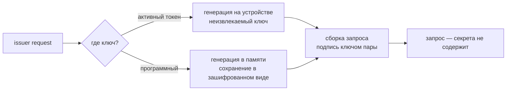

## ADDED Requirements

### Requirement: Запрос на сертификат одной операцией

Инструмент ДОЛЖЕН (MUST) поддерживать операцию, порождающую ключевую пару и собирающую запрос на
сертификат за один вызов. Открытый ключ запроса ДОЛЖЕН (MUST) браться из результата генерации,
а не подаваться отдельно: доказательство владения ключом становится верным по построению.

Подача открытого ключа отдельным файлом ДОЛЖНА (MUST) остаться доступной для случая, когда пара
уже существует. В этом режиме инструмент ДОЛЖЕН (MUST) до сборки запроса проверить, что поданный
открытый ключ соответствует ключу подписи, и отвергнуть расхождение — иначе ошибка обнаружится
только у выпускающего, через канал и с задержкой.

Запрос НЕ ДОЛЖЕН (MUST NOT) содержать запрошенных расширений, влияющих на права: скоуп задаёт
выпускающий, и запрос, оформленный как заявка на права, создаёт ложное ожидание у инженера.

#### Scenario: Запрос с генерацией ключа
- **WHEN** инженер запускает операцию запроса, не имея ключевой пары
- **THEN** пара порождается, запрос собирается и подписывается ключом этой же пары; отдельный файл открытого ключа не требуется

#### Scenario: Открытый ключ не соответствует ключу подписи
- **WHEN** открытый ключ подан отдельно и не соответствует ключу, которым подписывается запрос
- **THEN** сборка отвергается до подписи, с указанием расхождения

### Requirement: Генерация ключа на активном токене

Генерация ключевой пары на активном токене ДОЛЖНА (MUST) выполняться с атрибутами, делающими
закрытый ключ неизвлекаемым и непрочитываемым, и постоянным объектом токена.

Фактически установленные атрибуты ДОЛЖНЫ (MUST) проверяться чтением после генерации. Успешный
код возврата НЕ ДОЛЖЕН (MUST NOT) считаться доказательством того, что шаблон применён: провайдеры
токенов известны тем, что сообщают об успехе операции, выполнив её не полностью. Ключ, у которого
фактический атрибут извлекаемости не соответствует запрошенному, ДОЛЖЕН (MUST) отвергаться с
указанием фактического значения — до того, как на него будет выпущено удостоверение.

Идентификатор ключа ДОЛЖЕН (MUST) назначаться так, чтобы выданный сертификат мог быть записан с
тем же идентификатором: поиск закрытого ключа на входе идёт по идентификатору сертификата
(см. [token-pkcs11](../../../../specs/token-pkcs11/spec.md)).

Существующий ключ с тем же идентификатором или меткой НЕ ДОЛЖЕН (MUST NOT) перезаписываться без
явного подтверждения: на токене может лежать действующий ключ.

#### Scenario: Генерация неизвлекаемого ключа
- **WHEN** инженер порождает пару на активном токене
- **THEN** атрибуты запрашиваются такими, что закрытый ключ неизвлекаем, и фактические значения перечитываются с устройства

#### Scenario: Токен проигнорировал шаблон
- **WHEN** после генерации фактический атрибут извлекаемости не соответствует запрошенному
- **THEN** операция завершается ошибкой с указанием фактического значения; запрос на сертификат не собирается

#### Scenario: Токен без криптографических механизмов
- **WHEN** генерация запрошена на устройстве с пустым списком механизмов
- **THEN** операция отвергается с указанием, что устройство пригодно только как носитель контейнера

#### Scenario: Ключ с таким идентификатором уже есть
- **WHEN** на токене уже существует ключ с запрошенным идентификатором или меткой
- **THEN** генерация выполняется только после явного подтверждения

### Requirement: Хранение программного ключа между запросом и приёмом

Программный закрытый ключ ДОЛЖЕН (MUST) сохраняться между запросом и приёмом **только в
зашифрованном виде** — это касается процессов с носителем-флешкой и пассивным токеном. Пароль
запрашивается лестницей источников секрета. Ключ хранится до момента сборки контейнера под
паролем, запрошенным лестницей источников секрета
(см. [issuer-signing](../../../issuer-secret-input/specs/issuer-signing/spec.md)). Незашифрованный
закрытый ключ НЕ ДОЛЖЕН (MUST NOT) записываться на диск ни в каком виде, включая временные файлы.

Файл ключа ДОЛЖЕН (MUST) создаваться с правами, закрытыми для группы и остальных; при
несоответствии прав существующего файла операция приёма ДОЛЖНА (MUST) отвергаться до чтения
содержимого.

#### Scenario: Ключ между двумя операциями
- **WHEN** инженер выполнил запрос и ожидает выпуска
- **THEN** его закрытый ключ лежит зашифрованным, с правами, закрытыми для группы и остальных

#### Scenario: Права файла ключа ослаблены
- **WHEN** файл ключа доступен группе или остальным
- **THEN** операция приёма отвергается до чтения содержимого, с указанием фактических прав

### Requirement: Приём и проверка выданного

Инструмент ДОЛЖЕН (MUST) поддерживать операцию приёма выданного удостоверения, выполняющую до
размещения на носителе проверки:

- сертификат соответствует имеющемуся закрытому ключу;
- цепочка сходится до корня парка;
- срок действия не истёк и уже наступил;
- присутствует хотя бы одна роль;
- версия профиля поддерживается;
- присутствуют обязательные стандартные расширения, без которых удостоверение не пригодно.

Проверки ДОЛЖНЫ (MUST) выполняться тем же разделяемым кодом разбора и валидации, которым
пользуется проверка на устройстве, — иначе согласованность двух половин продукта не следует из
корректности каждой.

Привязка к устройству НЕ ДОЛЖНА (MUST NOT) считаться проверенной: инженер работает не на том
устройстве, для которого выпущено удостоверение. Значение привязки ДОЛЖНО (MUST) показываться, а
при явно заданном ожидаемом значении — сверяться с ним. Отсутствие такой сверки НЕ ДОЛЖНО
(MUST NOT) отображаться как успешный результат проверки.

Непрошедшая проверка ДОЛЖНА (MUST) прерывать операцию до записи чего-либо на носитель: непригодное
удостоверение не должно оказаться на носителе и доехать до объекта.

#### Scenario: Удостоверение пригодно
- **WHEN** инженер принимает выданное удостоверение и все проверки проходят
- **THEN** удостоверение размещается на носителе, а привязка к устройству показана как непроверенная

#### Scenario: Отсутствует обязательное расширение
- **WHEN** в удостоверении нет расширения, без которого оно не пригодно для входа
- **THEN** операция прерывается с указанием отсутствующего расширения; на носитель ничего не записано

#### Scenario: Сертификат не соответствует ключу
- **WHEN** выданный сертификат содержит открытый ключ, не соответствующий имеющемуся закрытому
- **THEN** операция прерывается: удостоверение выпущено не на этот ключ

#### Scenario: Ожидаемая привязка задана явно
- **WHEN** инженер передал ожидаемое значение привязки к устройству
- **THEN** выполняется сверка, и расхождение прерывает операцию

### Requirement: Размещение выданного на носителе

После успешной проверки инструмент ДОЛЖЕН (MUST) разместить удостоверение на носителе способом,
соответствующим процессу:

- активный токен — сертификат объектом сертификата с тем же идентификатором, что у ключа;
- флешка — сборка контейнера и раскладка по путям, которые ищет проверка на устройстве
  (см. [credential-packaging](../../../issuer-key-generation/specs/credential-packaging/spec.md));
- пассивный токен — запись контейнера приватным объектом данных с верификацией записи чтением
  (см. [token-data-carrier](../../../pkcs12-token-carrier/specs/token-data-carrier/spec.md)).

После размещения ДОЛЖНА (MUST) выполняться проверка чтением с носителя: артефакт читается
обратно и сверяется с исходным.

#### Scenario: Запись сертификата на активный токен
- **WHEN** удостоверение принимается на активный токен
- **THEN** сертификат записывается с идентификатором ключа, после чего перечитывается и сверяется

#### Scenario: Носитель не принял артефакт целиком
- **WHEN** обратное чтение с носителя не совпало с исходным артефактом
- **THEN** операция завершается ошибкой, а носитель помечается как непригодный для этого удостоверения

### Requirement: Сторона инженера не имеет прав выпуска

Операции стороны инженера НЕ ДОЛЖНЫ (MUST NOT) обращаться к ключу подписи CA и НЕ ДОЛЖНЫ
(MUST NOT) требовать доступа к нему. Инструмент, запущенный инженером, ДОЛЖЕН (MUST) быть
полностью работоспособен на рабочем месте, где ключа выпускающего нет и быть не может.

Совмещение операций обеих сторон в одном исполняемом файле НЕ ДОЛЖНО (MUST NOT) означать
совмещения полномочий: разделение обеспечивается владением ключом подписи, а не составом команд.

#### Scenario: Запрос на рабочем месте без ключа выпускающего
- **WHEN** инженер выполняет запрос и приём на машине, где нет ни ключа CA, ни доступа к нему
- **THEN** обе операции выполняются полностью
