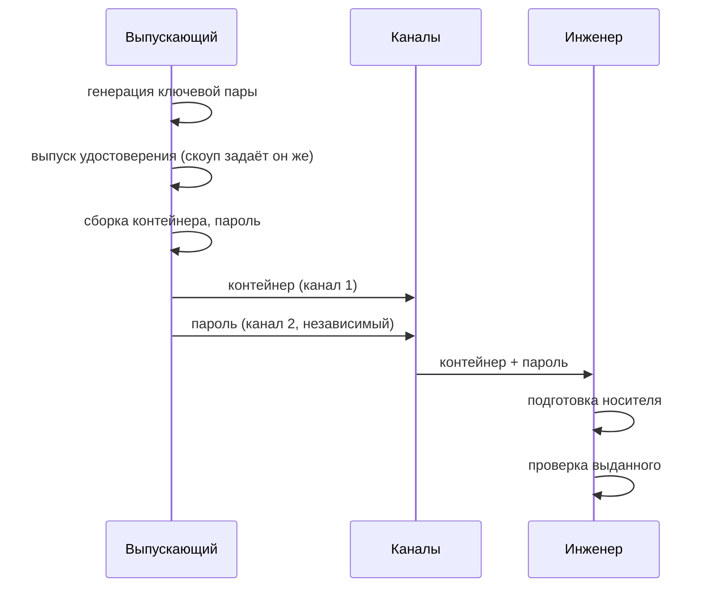
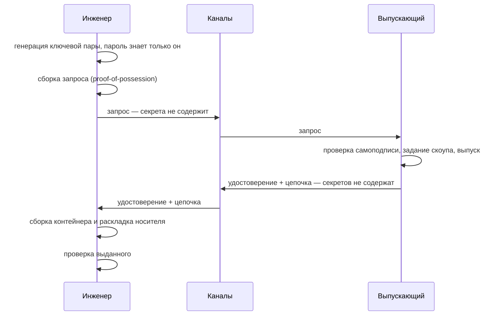
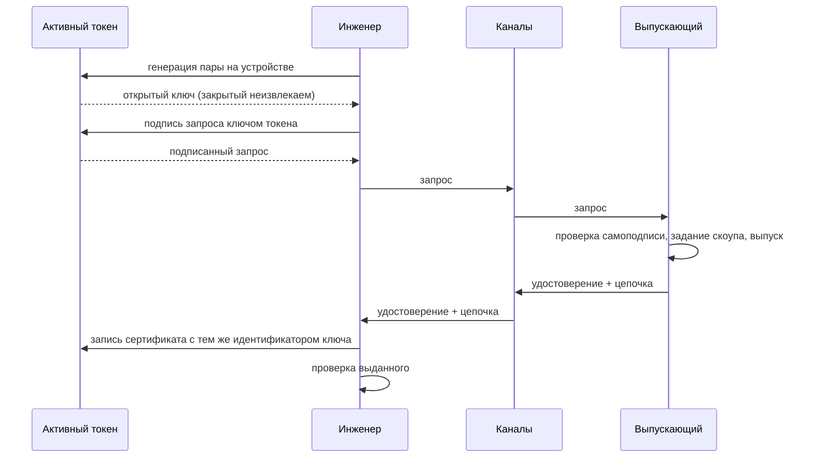

## Context

Спека `cert-issuance` описывает, как собирается и подписывается сертификат; `usb-media-pkcs12`,
`token-pkcs11` и `token-data-carrier` — как носитель читается на входе. Между ними лежит
непокрытая область: последовательность действий двух людей — выпускающего и инженера, — в
результате которой удостоверение оказывается на носителе и работает.

Эта область сегодня существует только в устной практике и в разрозненных примерах документации.
Change фиксирует её нормативно и даёт материал для страниц документации.

## Goals / Non-Goals

**Goals:**

- Назвать поддерживаемые процессы и их различия в терминах, по которым делается выбор.
- Отделить свойства, обеспечиваемые кодом, от свойств, обеспечиваемых организационно.
- Дать документации основу: диаграммы потоков, таблицу носителей, таблицу артефактов.
- Дать заказчику, проходящему оценку соответствия, привязку процессов к мерам — в корректных
  формулировках.

**Non-Goals:**

- Реализация инструментов. Её несут `issuer-secret-input`, `issuer-key-generation`,
  `engineer-issuance-tooling`.
- Выбор процесса за заказчика. Спека описывает пять, а не назначает один правильный.
- Заявления о соответствии продукта стандартам — см. раздел «Соответствие мерам».

## Decisions

### Решение 1: классификация по месту рождения ключа, а не по носителю

Интуитивная классификация — «флешка / токен / активный токен» — ставит в один ряд признаки
разной природы. Носитель определяет физический доступ, место рождения ключа — модель доверия.
Из-за этого «токен» в разговоре с заказчиком звучит как решение проблемы утечки ключа, хотя для
пассивного токена это неверно: ключ там такой же извлекаемый, как на флешке.

Поэтому основной признак — место рождения ключа, носитель вторичен. Отсюда же следует, что П3/П4 не
получают отдельных диаграмм потока: они совпадают с П1/П2 всюду, кроме последнего шага.

### Решение 2: П4 остаётся в списке, хотя выгоды почти не даёт

Комбинация «ключ у инженера + пассивный токен» вырожденная: токен не добавляет ничего, кроме
PIN поверх контейнера, а ключ всё равно рождается на рабочем месте инженера. Соблазн исключить
её был; отвергнут, потому что парк с уже закупленными пассивными токенами и требованием «ключ
не покидает инженера» — реальное сочетание, и молчание спеки не отменит его, а лишь оставит без
описания. В документации П4 подаётся как П2 с носителем из П3, без отдельной страницы.

### Решение 3: проверка выданного — обязательный шаг процесса, а не удобство

Сегодня непригодное удостоверение (нет `clientAuth`, не сходится цепочка, истёк срок, роль не
та) обнаруживается на экране входа. Инженер в этот момент стоит у устройства, часто без сети и
без выпускающего. Требование выносит обнаружение на рабочее место, где ошибка исправляется
повторным выпуском за минуты.

Ограничение честное: `host_binding` на стороне инженера непроверяем — он не на том устройстве.
Спека прямо запрещает выдавать отсутствие этой проверки за успешную, иначе шаг создаст ложную
уверенность ровно в том измерении, где ошибка наиболее вероятна.

### Решение 4: раскладка носителя — часть выпуска

Пути `certs/user.p12` и `certs/chain.pem` сегодня живут в документации как инструкция человеку.
Инструкция, выполняемая руками, — источник отказов, которые выглядят как отказы продукта.
Инструмент, который кладёт артефакты сам, устраняет целый класс обращений в поддержку.

Ручная раскладка остаётся допустимой: у части заказчиков подготовка носителей встроена в
собственные процессы. Но спека называет её непроверяемой — это разные уровни гарантии, и
смешивать их в описании нельзя.

## Соответствие мерам

Формулировки этого раздела ДОЛЖНЫ использоваться без изменений: продукт не «соответствует»
стандартам. Оценку соответствия проходит организация; продукт поддерживает реализацию отдельных
мер и даёт свидетельства для оценщика.

**ГОСТ Р 57580.1-2017** (обозначения мер и уровни сверены с официальным изданием):

| Мера | Содержание | Какой процесс поддерживает |
| --- | --- | --- |
| РД.17, РД.18 | запрет хранения и передачи аутентификационных данных в открытом виде (техническая мера на всех трёх уровнях) | П2, П4, П5 — по каналам не передаётся ни одного секрета; П1, П3 требуют компенсации организационными мерами по разделению каналов |
| РД.28 | учёт выдачи носителей аутентификации | журнал выпусков со сцепленной хеш-цепочкой — во всех процессах |
| РД.4 | многофакторная аутентификация эксплуатирующего персонала | П5 (аппаратный токен); П1–П4 — фактор владения носителем плюс знание пароля или PIN |
| УЗП.13 | прекращение доступа по истечении срока | срок действия в самом удостоверении, во всех процессах |
| РД.29 | прекращение доступа при компрометации | отзыв через список отзыва плюс короткий срок, во всех процессах |

**ГОСТ Р 57580.4-2022:** мера ВПУ.12.1 — авторизация и регистрация операций технического
обслуживания и аутентификация выполняющих их субъектов — относится к сценарию обслуживания
целиком; процессы выпуска обеспечивают её часть, отвечающую за выдачу и учёт удостоверений.

**PCI DSS 4.0:** требование 8.4.2 (многофакторная аутентификация для всего доступа в среду
данных держателей карт) поддерживается П5 и, с оговоркой о характере второго фактора, П1–П4.
Требование 8.2.2 допускает общие учётные записи при подтверждении личности до предоставления
доступа и атрибуции действий — механика ролевых учётных записей с персонифицированным
удостоверением ложится в эту формулировку.

**Требования ФСТЭК России** (управление средствами аутентификации — выдача, блокирование,
уничтожение): привязка НЕ ВЫВЕРЕНА по первоисточнику и в документацию до сверки не выносится.
Задача на сверку — в `tasks.md`.

## Risks / Trade-offs

- **Спека описывает целевое состояние, а инструментов ещё нет** → страницы документации пишутся
  последними, после трёх сопутствующих change'ей; порядок закреплён задачами.
- **Раздел о соответствии мерам легко превращается в обещание** → формулировки зафиксированы
  здесь и переносятся в документацию дословно; непроверенная привязка к требованиям ФСТЭК
  помечена и не публикуется.
- **Пять процессов выглядят как пять equally valid вариантов** → таблица различий ставит
  извлекаемость ключа и число передаваемых секретов на первое место, а не носитель.
- **П4 в списке может читаться как рекомендация** → в документации подаётся как частный случай
  П2, без отдельной страницы.

## Диаграммы потоков (основа для документации)

### П1 — ключ у выпускающего, флешка

Свойства: закрытый ключ известен выпускающему и пересекает границу; неотказуемость недостижима;
от инженера не требуется ничего, кроме получения двух артефактов.

### П2 — ключ у инженера, флешка

Свойства: закрытый ключ не покидает рабочее место инженера; по каналам не передаётся ни одного
секрета; неотказуемость достижима; от инженера требуется работающий инструмент.

### П5 — ключ на активном токене

Свойства: закрытый ключ не существует вне токена ни в один момент; контейнера и пароля нет,
только PIN; потеря носителя не означает утечки ключа.

### П3 и П4

Совпадают с П1 и П2 соответственно всюду, кроме последнего шага: вместо раздела USB-носителя
контейнер записывается приватным объектом данных на пассивный токен с обязательной верификацией
записи чтением. Секретов становится два — PIN токена и пароль контейнера; в интерфейсах и
инструкциях они ДОЛЖНЫ называться по-разному.

## Open Questions

1. Нужна ли отдельная страница документации для П4 или достаточно раздела внутри страницы П2 —
   решается при написании страниц.
2. Привязка к требованиям ФСТЭК России — после сверки по первоисточнику.
3. Нужен ли машиночитаемый формат карты соответствия мерам (для передачи оценщику), или
   достаточно страницы документации.
