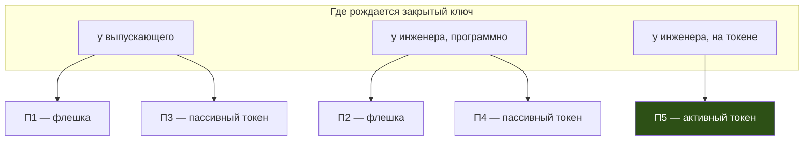

## ADDED Requirements

### Requirement: Пять поддерживаемых процессов выпуска

Продукт ДОЛЖЕН (MUST) поддерживать пять процессов выпуска удостоверения инженера. Процесс
определяется двумя независимыми признаками: где рождается закрытый ключ и на каком носителе
удостоверение доезжает до устройства.

| Процесс | Ключ рождается | Носитель | Ключ извлекаем |
| --- | --- | --- | --- |
| П1 | у выпускающего | раздел USB-носителя | да |
| П2 | у инженера, программно | раздел USB-носителя | да |
| П3 | у выпускающего | объект данных на пассивном токене | да |
| П4 | у инженера, программно | объект данных на пассивном токене | да |
| П5 | у инженера, на активном токене | объекты на активном токене | **нет** |

Признак «где рождается ключ» ДОЛЖЕН (MUST) считаться определяющим для свойств процесса:
он задаёт, сколько секретов передаётся между сторонами и возможна ли неотказуемость. Признак
«носитель» определяет только то, кто может добраться до удостоверения физически.

Процессы П1–П4 ДОЛЖНЫ (MUST) описываться как процессы с извлекаемым ключом: защита в них
эквивалентна «носитель плюс пароль», а не аппаратной защите ключа. Только П5 ДОЛЖЕН (MUST)
подаваться как процесс, в котором закрытый ключ не существует вне устройства.

#### Scenario: Выбор процесса для парка
- **WHEN** внедренец выбирает процесс выпуска для парка устройств
- **THEN** документация даёт ему сравнение по признаку «где рождается ключ» — числу передаваемых секретов, возможности неотказуемости и последствиям компрометации выпускающего, — а не по удобству носителя

#### Scenario: Описание процесса с извлекаемым ключом
- **WHEN** любой из процессов П1–П4 описывается в документации или коммерческих материалах
- **THEN** извлекаемость ключа названа явно; формулировки, подразумевающие аппаратную защиту ключа, не применяются

### Requirement: Неподдерживаемые комбинации

Комбинации признаков, не вошедшие в пять процессов, НЕ ДОЛЖНЫ (MUST NOT) предлагаться как
рабочие, а инструменты НЕ ДОЛЖНЫ (MUST NOT) создавать видимость их поддержки.

- Ключ, рождённый у выпускающего, на **активном** токене: технически достижим импортом, но
  уничтожает единственное свойство, ради которого активный токен покупается, — ключ, никогда
  не покидавший устройство. Инструменты выпуска НЕ ДОЛЖНЫ (MUST NOT) предлагать импорт
  закрытого ключа на токен.
- Ключ, рождённый на **пассивном** токене: невозможен физически — устройство отвергает импорт
  закрытого ключа и не имеет криптографических механизмов (`C_GetMechanismList` пуст).
  Попытка ДОЛЖНА (MUST) давать диагностику, называющую причину, а не общую ошибку PKCS#11.

#### Scenario: Попытка сгенерировать ключ на пассивном токене
- **WHEN** инженер запускает генерацию ключа на токене, не имеющем криптографических механизмов
- **THEN** операция отвергается с указанием, что устройство пригодно только как носитель контейнера, и со ссылкой на процессы П3/П4

### Requirement: Классификация передаваемых артефактов

Каждый артефакт, пересекающий границу между сторонами, ДОЛЖЕН (MUST) быть отнесён к одному из
двух классов, и класс ДОЛЖЕН (MUST) быть назван в документации рядом с каждым шагом передачи.

| Артефакт | Содержит секрет | Требование к каналу |
| --- | --- | --- |
| Запрос на сертификат (CSR) | нет | целостность; конфиденциальность не требуется |
| Выпущенный сертификат | нет | целостность; конфиденциальность не требуется |
| Цепочка доверия, список отзыва | нет | целостность |
| Контейнер PKCS#12 | **да** — закрытый ключ | конфиденциальность и целостность |
| Пароль контейнера, PIN | **да** | канал, отличный от канала контейнера |

Процесс, в котором закрытый ключ или пароль передаётся между сторонами (П1, П3), ДОЛЖЕН (MUST)
требовать двух независимых каналов: контейнер и пароль к нему НЕ ДОЛЖНЫ (MUST NOT) доставляться
одним каналом. Процессы П2, П4, П5 ДОЛЖНЫ (MUST) описываться как процессы, в которых по каналам
не передаётся ни одного секрета.

#### Scenario: Доставка контейнера и пароля
- **WHEN** удостоверение выпущено процессом П1 или П3
- **THEN** контейнер и пароль к нему доставляются инженеру разными каналами; документация не предлагает варианта с одним каналом

#### Scenario: Перехват канала в процессе без секретов
- **WHEN** в процессе П2, П4 или П5 перехвачен любой из передаваемых артефактов
- **THEN** закрытый ключ инженера не скомпрометирован — перехваченное не содержит секретов

### Requirement: Скоуп задаёт выпускающий во всех процессах

Скоуп удостоверения ДОЛЖЕН (MUST) задаваться выпускающим во всех пяти процессах — привязка к
устройству, роли, потолок уровня целостности, срок действия, рамки делегирования.
Данные, пришедшие от инженера (субъект и запрошенные расширения CSR), НЕ ДОЛЖНЫ (MUST NOT)
влиять на состав расширений выпускаемого сертификата; они допустимы только как предзаполнение
форм с явной пометкой источника (см. [cert-issuance](../../../../specs/cert-issuance/spec.md)).

Из этого следует, что выбор процесса НЕ ДОЛЖЕН (MUST NOT) подаваться как решение о том, кто
управляет правами: права во всех процессах назначает выпускающий, различается только владение
ключом.

#### Scenario: CSR с запрошенными расширениями
- **WHEN** инженер прислал запрос, в котором запрошены роли или привязки
- **THEN** в выпущенное удостоверение попадает только то, что задал выпускающий; запрошенное показано как запрошенное и не применено

### Requirement: Раскладка носителя как часть выпуска

Инструмент, готовящий носитель, ДОЛЖЕН (MUST) размещать артефакты ровно там, где их ищет
проверка на устройстве, а не оставлять раскладку на инструкцию оператору:

- раздел USB-носителя: контейнер по пути из `pkcs12_path_pattern` (по умолчанию
  `certs/user.p12`), цепочка — `certs/chain.pem`
  (см. [usb-media-pkcs12](../../../../specs/usb-media-pkcs12/spec.md));
- пассивный токен: контейнер приватным объектом данных с обязательной верификацией записи
  чтением (см. [token-data-carrier](../../../pkcs12-token-carrier/specs/token-data-carrier/spec.md));
- активный токен: сертификат объектом `CKO_CERTIFICATE` с тем же `CKA_ID`, что у ключа,
  которым подписан запрос, — иначе поиск ключа по сертификату на входе не сойдётся
  (см. [token-pkcs11](../../../../specs/token-pkcs11/spec.md)).

Раскладка, выполненная вручную сторонним инструментом, ДОЛЖНА (MUST) считаться допустимой, но
непроверяемой: требования этой спеки в таком случае обеспечиваются организационно.

#### Scenario: Носитель подготовлен нашим инструментом
- **WHEN** носитель подготовлен штатной операцией подготовки
- **THEN** артефакты лежат по путям, которые ищет проверка на устройстве, и вход не требует правки конфигурации

### Requirement: Проверка выданного до выезда на объект

Процесс выпуска ДОЛЖЕН (MUST) включать шаг проверки выданного удостоверения на стороне
получателя — до того, как инженер уедет к устройству. Проверка ДОЛЖНА (MUST) охватывать:
соответствие сертификата имеющемуся закрытому ключу, сходимость цепочки до корня парка,
непросроченность, наличие хотя бы одной роли, версию профиля, а также стандартные расширения,
без которых удостоверение не пригодно (`keyUsage`, `extendedKeyUsage`).

Привязка к устройству (`host_binding`) на стороне инженера проверяема НЕ ДОЛЖНА (MUST NOT)
считаться: инженер работает не на том устройстве, для которого выпущено удостоверение.
Инструмент ДОЛЖЕН (MUST) показывать значение привязки и, если ожидаемое значение задано явно,
сверять с ним — но отсутствие такой сверки НЕ ДОЛЖНО (MUST NOT) трактоваться как успешная
проверка.

Без этого шага непригодное удостоверение обнаруживается на экране входа — в момент, когда
исправить его некому и нечем.

#### Scenario: Удостоверение без обязательного расширения
- **WHEN** проверка на стороне получателя обнаруживает отсутствие `clientAuth` или `digitalSignature`
- **THEN** удостоверение помечается непригодным с указанием отсутствующего расширения, до выезда на объект

#### Scenario: Привязка к другому устройству
- **WHEN** проверка выполняется на рабочем месте инженера
- **THEN** значение `host_binding` показывается, но не выдаётся за проверенное; при явно заданном ожидаемом значении выполняется сверка

### Requirement: Учёт выдачи

Каждая выдача удостоверения ДОЛЖНА (MUST) попадать в журнал выпусков со сцепленной хеш-цепочкой
(см. [issuance-journal](../../../../specs/issuance-journal/spec.md)) независимо от процесса.
Процесс, в котором ключ рождается у инженера, НЕ ДОЛЖЕН (MUST NOT) быть исключением: выпускающий
подписал удостоверение, значит запись о выдаче принадлежит ему.

Журнал ДОЛЖЕН (MUST) позволять ответить, кому, когда, с какими рамками и на какой носитель было
выдано удостоверение, — не обращаясь к самим носителям.

#### Scenario: Выдача по запросу инженера
- **WHEN** удостоверение выпущено по присланному запросу
- **THEN** запись о выдаче появляется в журнале выпускающего наравне с выдачей, где ключ породил он сам
