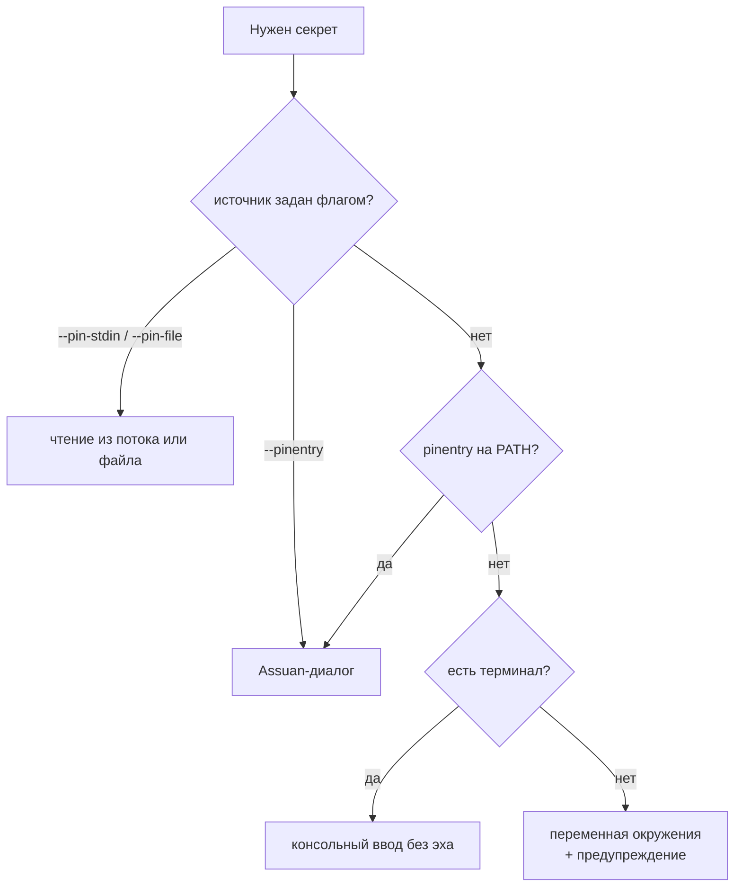

## ADDED Requirements

### Requirement: Лестница источников секрета

Секреты бэкендов подписи ДОЛЖНЫ (MUST) запрашиваться по фиксированной лестнице источников —
это касается PIN токена для PKCS#11 и пароля ключа для файлового бэкенда. Порядок убывания
приоритета:

1. источник, заданный явно флагом: pinentry-совместимый диалог (`--pinentry`) либо
   неинтерактивный источник (`--pin-stdin` / `--pin-file` и симметричные для пароля ключа);
2. pinentry-совместимый диалог, найденный на `PATH`;
3. **консольный ввод без эха**, если процесс подключён к терминалу;
4. переменные окружения `TESSERA_ISSUER_PIN` / `TESSERA_ISSUER_KEY_PASSPHRASE`.

Явно заданный источник ДОЛЖЕН (MUST) использоваться без обращения к остальным: иначе
неинтерактивный запуск с заданным источником упёрся бы в интерактивное приглашение. Два явно
заданных источника одновременно ДОЛЖНЫ (MUST) отвергаться на разборе аргументов как
взаимоисключающие, а не разрешаться приоритетом.

Отсутствие `pinentry` НЕ ДОЛЖНО (MUST NOT) приводить к тому, что единственным доступным
источником оказывается переменная окружения: на любой платформе, где есть терминал, работает
шаг 3.

Использование переменной окружения ДОЛЖНО (MUST) сопровождаться локализованным предупреждением
в stderr, называющим причину: значение видно в окружении дочерних процессов и попадает в дампы.

Секрет, полученный любым источником, ДОЛЖЕН (MUST) обрабатываться одинаково: жить в
`SecretString`, затираться после использования, не попадать в логи, журнал выпусков и аргументы
командной строки.

Границы затирания ДОЛЖНЫ (MUST) быть названы там, где они есть, а не подразумеваться
выполненными. Стандартный ввод читается через буфер стандартной библиотеки, живущий в статике до
конца процесса и не затираемый; там, где дескриптор можно переоткрыть и прочитать своим
затираемым буфером, ДОЛЖЕН (MUST) использоваться этот путь, а где нельзя — остаток в памяти
реален, и утверждать обратное НЕ ДОПУСКАЕТСЯ (MUST NOT). Источники «файл» и «диалог» такой
оговорки не имеют.

#### Scenario: Секрет из стандартного ввода
- **WHEN** секрет читается из стандартного ввода на платформе, где дескриптор переоткрывается
- **THEN** чтение идёт своим затираемым буфером, минуя буфер стандартной библиотеки; там, где переоткрытие недоступно, ограничение названо в документации и не выдаётся за отсутствующее

#### Scenario: pinentry отсутствует, терминал есть
- **WHEN** ни один pinentry-совместимый диалог не найден, а процесс подключён к терминалу
- **THEN** секрет запрашивается вводом с отключённым эхом; переменная окружения не требуется

#### Scenario: pinentry отсутствует, терминала нет
- **WHEN** процесс запущен без терминала и без `--pin-stdin`/`--pin-file`
- **THEN** используется переменная окружения, а в stderr печатается предупреждение о её видимости для дочерних процессов; при её отсутствии возвращается типизированная ошибка, называющая все доступные источники

#### Scenario: Секрет из файла
- **WHEN** задан `--pin-file` с путём к файлу
- **THEN** содержимое читается, обрезается завершающий перевод строки, буфер затирается после использования; при правах файла, дающих доступ группе или остальным, операция отвергается до чтения содержимого

#### Scenario: Путь подменён между проверкой и чтением
- **WHEN** файл секрета лежит в каталоге, доступном на запись посторонним, и путь переставляется на другой файл после проверки прав
- **THEN** прочитан будет ровно тот файл, к которому применялась проверка: проверка выполняется на открытом дескрипторе, а не на пути

#### Scenario: Платформа без модели прав файла
- **WHEN** секрет читается из файла на платформе, где права файла в проверяемом виде не выражены
- **THEN** файл принимается, а в stderr печатается предупреждение о том, что проверка не выполнялась — отсутствие жалобы не выдаётся за пройденную проверку

#### Scenario: Явный источник при доступном pinentry
- **WHEN** задан `--pin-file`, а на `PATH` есть pinentry
- **THEN** секрет читается из файла; интерактивное приглашение не показывается

#### Scenario: Два явных источника
- **WHEN** заданы одновременно `--pinentry` и `--pin-file`
- **THEN** запуск отвергается на разборе аргументов как взаимоисключающая комбинация

#### Scenario: Секрет не попадает в argv
- **WHEN** используется любой источник из лестницы
- **THEN** значение секрета отсутствует в аргументах командной строки процесса — флага, принимающего секрет значением, не существует

### Requirement: Сторонний диалог ввода как опция, а не условие работы

Поддержка pinentry-совместимых диалогов ДОЛЖНА (MUST) сохраняться для сред, где ввод секрета
обязан идти через отдельный доверенный диалог. Такой диалог НЕ ДОЛЖЕН (MUST NOT) поставляться в
составе продукта и НЕ ДОЛЖЕН (MUST NOT) быть условием работы штатного сценария на какой-либо
платформе.

#### Scenario: Организация использует собственный диалог ввода
- **WHEN** оператор задаёт `--pinentry` с путём к своему Assuan-совместимому диалогу
- **THEN** секрет запрашивается им; никаких других требований к среде не предъявляется

## MODIFIED Requirements

### Requirement: Кроссплатформенность стороны выпуска

CLI `issuer` ДОЛЖЕН (MUST) работать на Linux, macOS и Windows:
платформо-специфичные механизмы (путь PKCS#11-модуля, права файлов, запрос секрета) ДОЛЖНЫ
(MUST) быть абстрагированы, а инварианты безопасности (проверки рамок до подписи, обращение с
секретами бэкенда) ДОЛЖНЫ (MUST) сохраняться на каждой платформе. Enforcement-сторона (агент
Tessera на устройствах) остаётся Linux-only и данным требованием не затрагивается.

Кроссплатформенность ДОЛЖНА (MUST) означать сохранение инвариантов, а не только успешную
сборку бинаря: штатный интерактивный сценарий на каждой из трёх платформ ДОЛЖЕН (MUST) быть
доступен без установки стороннего программного обеспечения. Платформа, на которой единственным
доступным источником секрета оказывается переменная окружения, НЕ ДОЛЖНА (MUST NOT) считаться
поддержанной.

#### Scenario: Выпуск с macOS/Windows рабочего места
- **WHEN** диспетчер запускает CLI `issuer` на macOS или Windows с PKCS#11-модулем своего токена
- **THEN** цикл выпуска работает идентично Linux: те же проверки, те же бэкенды, тот же формат артефактов

#### Scenario: Чистая система без GnuPG
- **WHEN** `issuer` запускается на macOS или Windows, где не установлены ни GnuPG, ни Gpg4win, ни GPG Suite
- **THEN** PIN и пароль ключа запрашиваются интерактивно средствами самого инструмента; установка стороннего программного обеспечения не требуется
